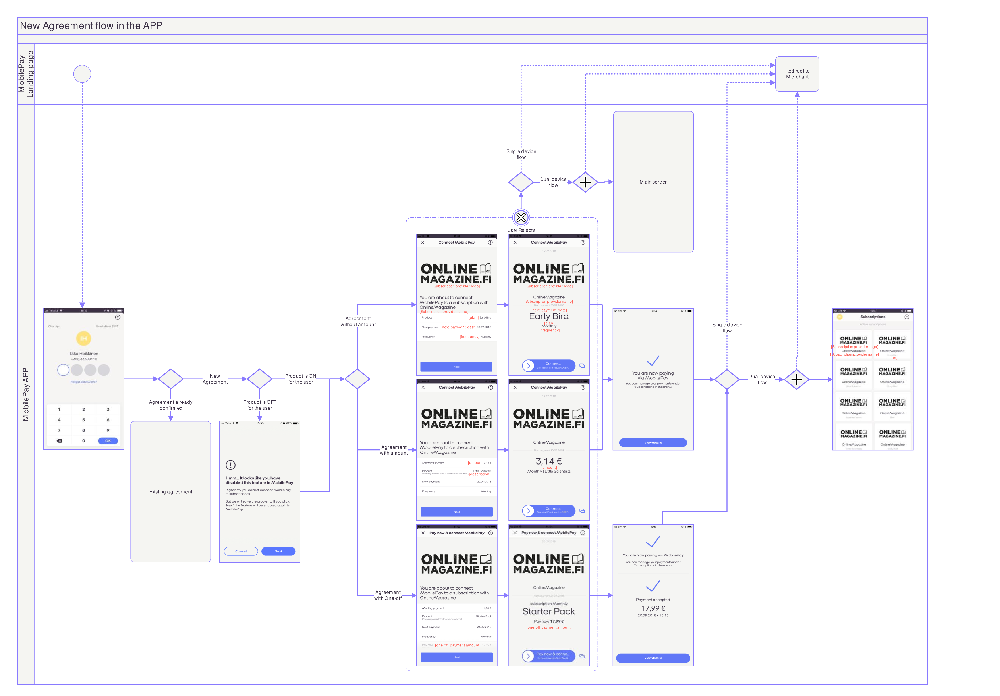
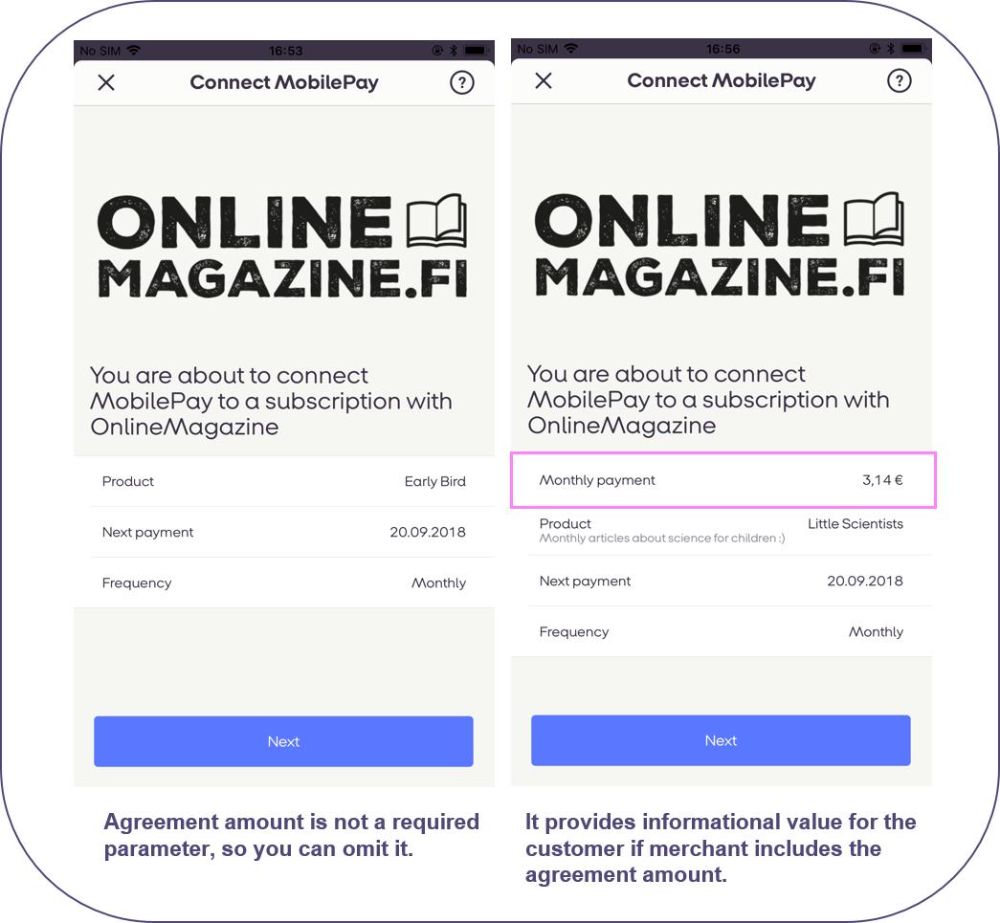
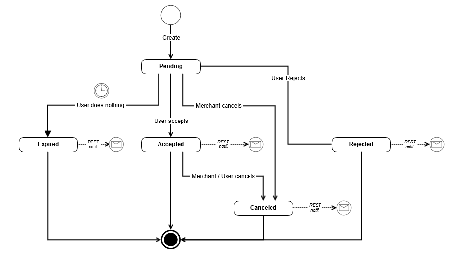
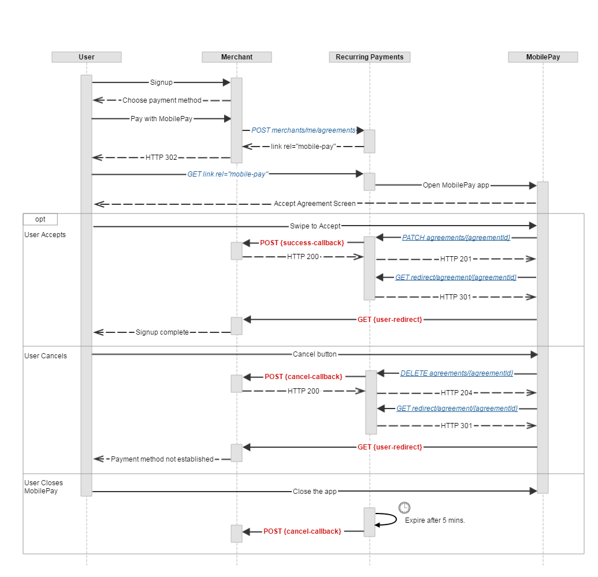
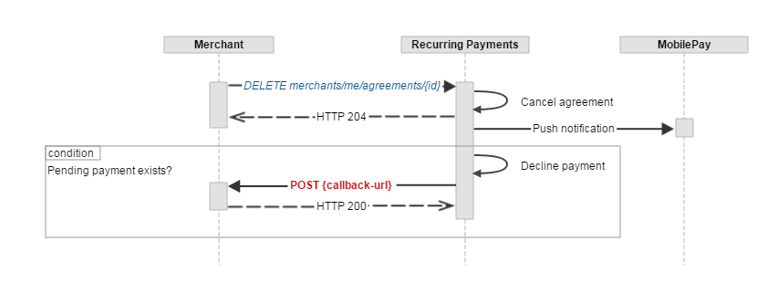
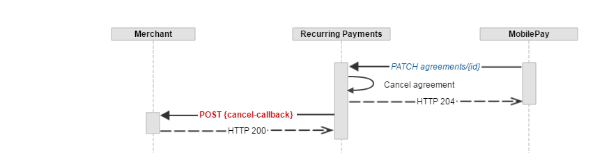
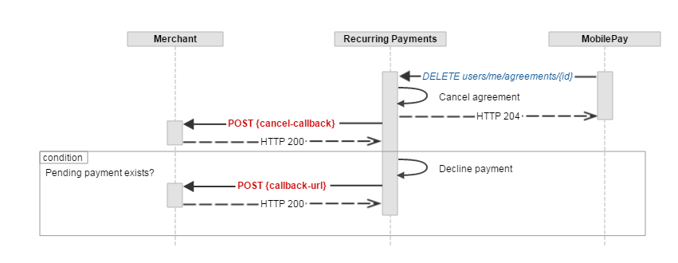

## <a name="agreements"></a>Agreements

Once the user is given to choose the payment method on the merchant's signup flow, an additional "*Pay with MobilePay*" button should be shown for the user to be able to click on. When user clicks on this button, merchant's back-end system must call the `POST /api/providers/{providerId}/agreements` endpoint in order to create a *Pending* Subscription **Agreement**, which can only be activated by the MobilePay user through the app. 

#### <a name="requests"></a>Create agreement request
```json
{
  "external_id": "AGGR00068",
  "amount": "10",
  "currency": "DKK",
  "description": "Monthly subscription",
  "next_payment_date": "2017-03-09",
  "frequency": 12,
  "links": [
    {
      "rel": "user-redirect",
      "href": "https://example.com/1b08e244-4aea-4988-99d6-1bd22c6a5b2c"
    },
    {
      "rel": "success-callback",
      "href": "https://example.com/1b08e244-4aea-4988-99d6-1bd22c6a5b2c"
    },
    {
      "rel": "cancel-callback",
      "href": "https://example.com/1b08e244-4aea-4988-99d6-1bd22c6a5b2c"
    }
  ],
  "country_code": "DK",
  "plan": "Basic",
  "expiration_timeout_minutes": 5,
  "mobile_phone_number": "4511100118",
  "retention_period_hours": 0,
  "disable_notification_management": false,
}
```

`mobile_phone_number` is not required. Neither for agreement creation, or one-off creation. If you choose to add it, the phone number will be prefilled on our landing page. So that the user will not have to type the phone number on the landing page, which makes it more convenient for the user, if you add `mobile_phone_number`.

The *Pending* **Agreement**, if not activated, will expire within the value, provided in the `expiration_timeout_minutes`.

#### <a name="agreements_paramters"></a>Request parameters

|Parameter             |Type        |Required  |Description                                                      |Valid values|
|:---------------------|:-----------|:---------|:----------------------------------------------------------------|:-----------|
|**amount**            |number(0.00)|          |*__Agreement__ amount, which will be displayed for the user in the MobilePay app.*|>= 0.00, decimals separated with a dot.|
|**currency**          |string(3)   |required |*The __Agreement__ currency code, that will be displayed for the use in the MobilePay app. Currency and country_code must match a valid pair of: DKK->DK, EUR->FI.*|DKK, EUR|
|**country_code**      |string(2)   |required |*Country code, which will be used to differentiate between MobilePay DK and FI apps.*|DK, FI|
|**plan**              |string(30)  |required |*Short __Agreement__ information text, that will be displayed on the __Agreement__ screen. (examples: "Basic" / "Premium").*||
|**description**       |string(60)  |          |*Additional information provided by the merchant to the user, that will be displayed on the __Agreement__ screen.*||
|**next_payment_date** |date        |          |*The date of the first scheduled __Payment Request__. This will be displayed on the __Agreement__ creation screen and on the __Agreement__ details screen if first payment date > current date.*|ISO date format: yyyy-MM-dd|
|**frequency**         |int         |          |*Frequency of __Payment Requests__. This value will be used to divide the amount of days in a year to get a frequency in days (e.g. 365 / 12 = 30.4 - approx. every month, 365 - daily and 0 -flexible.)*|1, 2, 4, 12, 26, 52, 365, 0|
|**external_id**       |string      |          |*__Agreement__ identifier on the merchant's and integrators side. This will be included in the request body of the success / cancel callback.  The external_id should be unique to the agreement. Two different agreements should not have the same external_id*||
|**expiration_timeout_minutes**|int |required |*Agreement expiration timeout in minutes.*|Min: 1, max: 20160 (2 weeks)|
|**retention_period_hours**|int||*Before retention period has passed User will not be able to Cancel an agreement*|Min: 0(default), max: 24 hours|
|**disable_notification_management**|boolean||*Prevents User from disabling PUSH notifications*|Default **false**|
|**links**             |string      |required |*Link relation of the __Agreement__ creation sequence. Must contain 3 values for user redirect, success callback and cancel-callback links.*||
|**links[].rel**       |string      |required |*Link relation type.*|user-redirect, success-callback, cancel-callback|
|**links[].href**      |string      |required |*Link relation hyperlink reference.*|https://&lt;merchant's url&gt;|

<a name="agreements_response"></a>
The response of `POST /api/providers/{providerId}/agreements` contains two values: a unique *id* of the newly created *Pending* **Agreement** and a link *rel* = *mobile-pay*.

```json
{
  "id": "1b08e244-4aea-4988-99d6-1bd22c6a5b2c",
  "links": [
    {
      "rel": "mobile-pay",
      "href": "https://<mobile-pay-landing-page>/?flow=agreement&id=1b08e244-4aea-4988-99d6-1bd22c6a5b2c&redirectUrl=https%3a%2f%2fwww.example.com%2fredirect&countryCode=DK&mobile=4511100118"
    }
  ]
}
```
 
* The *id* value can be used on the merchant's back-end system to map a Subscription agreement with a specific user on the merchant's side, and subsequently to create new **Payment Requests** on behalf of the user who confirmed the agreement in MobilePay. 
* The link *rel = mobile-pay* value contains the hyperlink reference address, which is structured in the following way: _https://&lt;mobile-pay-landing-page&gt;/?**id**=318a0bf9-9039-400c-b5ff-6ec717da2971&**countryCode**=DK_. (The link is not accessible in sandbox, only in production) The _id_ property is of type **guid** and uniquely identifies the pending Subscription **Agreement** for the app to get the details and subsequently do an accept request. The _countryCode_ property is used to differentiate between DK, NO and FI apps.

The link can be used in two ways:

1. Redirect the user automatically using the HTTP response **302** or **303**. Once the user is redirected, the MobilePay app will be opened to activate the *Pending* **Agreement**. In this case, it is recommended to set the *expiration_timeout_minutes* value to 5 minutes.
2. E-mail the generated link to the user. Once the user clicks on the link, the MobilePay app will be opened to activate the *Pending* **Agreement**. In this case, it is recommended to set the `expiration_timeout_minutes` to a higher value (10080 - a week, 20160 - two weeks). Note, that the link will be valid only until the user accepts the agreement or a timeout occurs.

#### Update existing Agreement Request

Use the `PATCH /api/merchants/me/agreements/{agreementId}` endpoint to change agreement request parameters. Its request must match the rules of [RFC 6902 JSON Patch standards](https://tools.ietf.org/html/rfc6902).

- Available operations: **replace**
- Available properties: **amount**, **plan**, **description**, **next_payment_date**, **frequency**, **external_id**, **success-callback**, **cancel-callback**

```json
[
    {
        "value": "10.01",
        "path": "/amount",
        "op": "replace"
    }
]
```

#### New agreement creation in landing page

[](assets/images/RecurringPayments_Agreement_landing_page.png)

#### New agreement creation in APP

[](assets/images/RecurringPayments_Agreement_app.png)

#### Agreement screen with and without amount parameter 
[](assets/images/Agreementamount.png)


#### <a name="agreements_callback"></a>Callbacks

When the **Agreement's** status changes from *Pending* we will do a callback to the merchant's system (see the sequence diagram below).

The table below shows possible *status*, *status_text* and *status_code* values depending on the **Agreement** status changes.

|New Status|Condition|URL| Callback *status* | Callback *status_text* |Callback *status_code*|
|----------|---------|---|-------------------|------------------------|----------------------|
|Accepted  |_User swiped to accept the Agreement_        |*success-callback* |Active  | |0|
|Rejected  |_User rejected agreement in the APP_              |*cancel-callback*  |Rejected|Agreement rejected by user|40000|
|Expired   |_User did not do anything during the agreement timeout period._|*cancel-callback*  |Expired |Pending agreement expired|40001|
|Canceled  |_User canceled an Active agreement_          |*cancel-callback*  |Canceled|Agreement canceled by user|40002|
|Canceled  |_Merchant canceled an Active or Pending agreement_      |*cancel-callback*  |Canceled|Agreement canceled by merchant|40003|
|Canceled  |_System canceled an Active agreement because user was Deleted_ |*cancel-callback*  |Canceled|Agreement canceled by system|40004|

##### <a name="agreements_state-diagram"></a>Agreement state diagram


##### <a name="agreements_callback-properties"></a>Other callback properties

|Name            |Type        |Description                                           |Format|
|----------------|------------|------------------------------------------------------|------|
|**agreement_id**|guid        |Subscription agreement ID on the MobilePay side.||
|**external_id** |string      |Agreement ID on the merchant's side                   ||
|**timestamp**   |datetime    |Timestamp when the status change occurred.            |ISO 8601 UTC date and time format: YYYY-MM-DDThh:mm:ssZ|

##### <a name="agreements_callback-request"></a>Agreement callback request example

```json
{
    "agreement_id" : "63679ab7-cc49-4f75-80a7-86217fc105ea",
    "status" : "Canceled",
    "status_text" : "Canceled by user",
    "status_code" : "40000",
    "external_id" : "SF0000568",
    "timestamp" : "2016-09-29T09:50:39Z"
}
```
##### <a name="user-redirect"></a>user-redirect

When the **Agreement** activation is complete or canceled, the user will be navigated to the link *rel = user-redirect* to finalize the signup.

*rel = user-redirect*  should be a webpage, that awaits the callbacks and then takes appropriate action, depending on if the agreement was accepted or not. Based on the callback, you will redirect the user to the right place. Most merchants navigate the customer to a self-service overview, where the agreement is pending, and once the merchant receives the callback, then the merchant can update the status. Most merchants have a general page, that says “thank you for your order/support”, and then it informs about the next step. It is triggered immediately after purchase, letting customers know that their order and agreement has been received and created

Merchants can add their internal order ID to the *rel = user-redirect*  when they create the agreement. For example https://www.merchantwebsite.com/ourcallback?order_id=<internal order id here> 
This way, the merchant knows, which order the *rel = user-redirect*  should handle. It is therefore a prerequisite that the merchant has an internal order ID on their side. By including the internal order ID to the *rel = user-redirect*, the merchant also has a back-up solution, in case the end customer is using incognito, as incognito makes session management, tracking and cookie storage more complex. The *rel = user-redirect* does not need to be whitelisted by MobilePay. 


#### <a name="agreements_creation-diagram"></a>Agreement creation sequence diagram



#### <a name="agreements_cancel-diagram"></a>When merchant cancels agreement - sequence diagram 



#### <a name="agreements_cancel-pending-diagram"></a>When user cancels a Pending agreement during signup - sequence diagram



#### <a name="agreements_cancel-active-diagram"></a>When user cancels an Active agreement - sequence diagram



* * *
