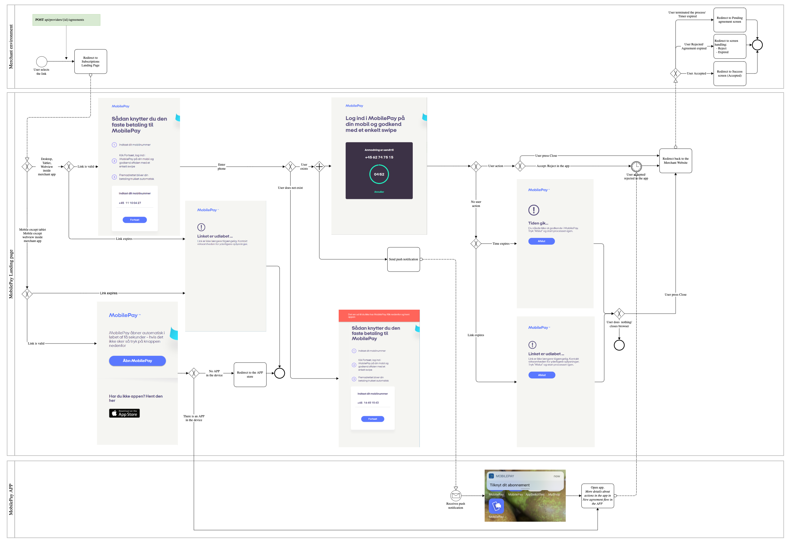
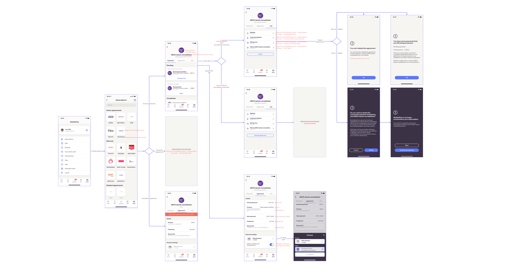
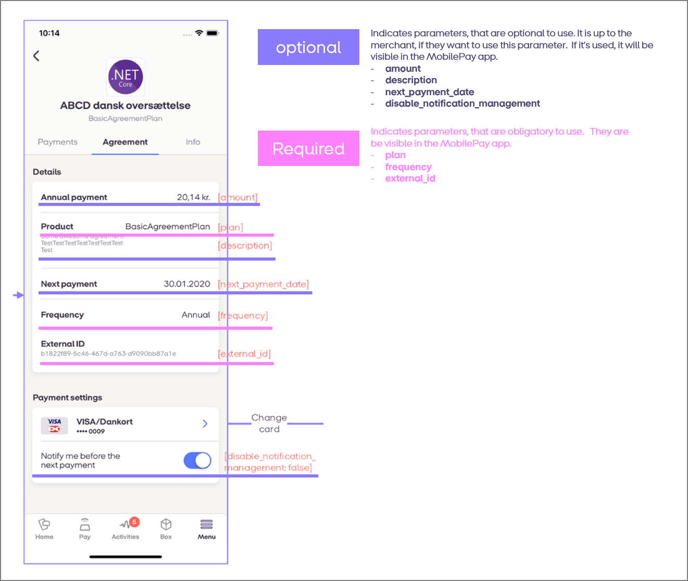
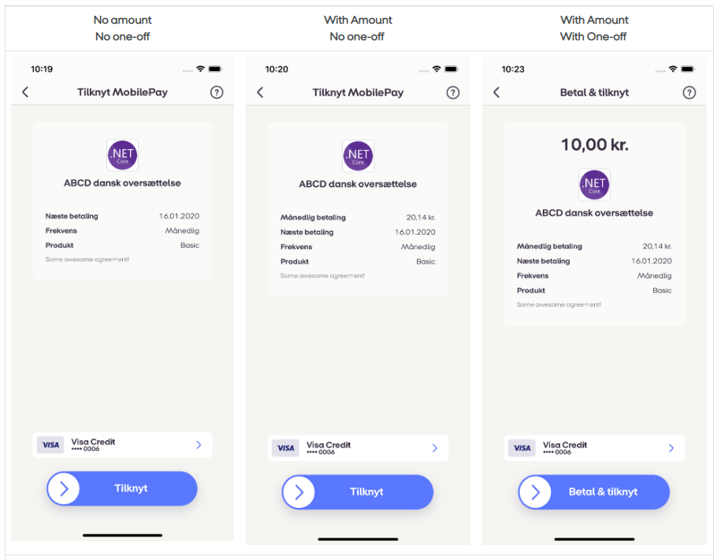
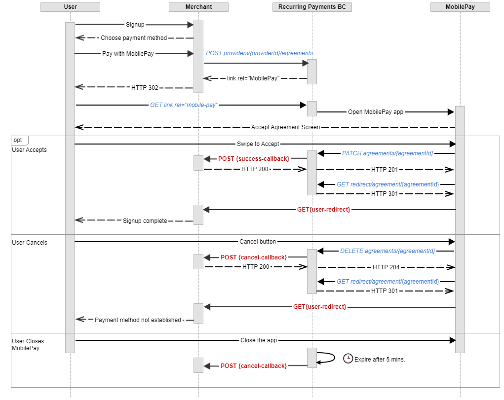

## <a name="agreements"></a>Agreements

An agreement is used to provide subscription service to sell to Customers.

MobilePay Subscriptions is a flexible service, that allows merchant to tailor the user experience to their needs by using normal agreements, agreement with an initial one-off payment, agreements with a period where the price is lower than usual, and existing agreements where the customer wants to buy an add-on. 

Once the user is given to choose the payment method on the merchant's signup flow, an "*Pay with MobilePay*" button should be shown for the user to be able to click on. The MobilePay button must adhere to our branding guidelines [here](https://developer.mobilepay.dk/design).  When user clicks on this button, merchant's back-end system must call the `POST /api/providers/{providerId}/agreements` endpoint in order to create a *Pending* Subscription **Agreement**, which can only be activated by the MobilePay user through the app. After agreement confirmation, user is redirected to merchant success page. If user did not manage to confirm agreement, the customer sees a timeout screen if they are on dual device. If they are on app, nothing is displayed.  

When the user has accepted the agreement in the MobilePay app, then the Merchant can charge Subscription payments `POST /api/providers/{providerId}/paymentrequests` and One-Off payments `POST /api/providers/{providerId}/agreements/{agreementId}/oneoffpayments`.  


#### <a name="requests"></a>Create agreement request
```json
{
  "external_id": "AGGR00068",
  "amount": "10",
  "currency": "DKK",
  "description": "Monthly subscription",
  "next_payment_date": "2017-03-09",
  "frequency": 12,
  "links": [
    {
      "rel": "user-redirect",
      "href": "https://example.com/1b08e244-4aea-4988-99d6-1bd22c6a5b2c"
    },
    {
      "rel": "success-callback",
      "href": "https://example.com/1b08e244-4aea-4988-99d6-1bd22c6a5b2c"
    },
    {
      "rel": "cancel-callback",
      "href": "https://example.com/1b08e244-4aea-4988-99d6-1bd22c6a5b2c"
    },
    {
      "rel": "cancel-redirect",
      "href": "https://example.com/1b08e244-4aea-4988-99d6-1bd22c6a5b2c"
    }
  ],
  "country_code": "DK",
  "plan": "Basic",
  "expiration_timeout_minutes": 5,
  "mobile_phone_number": "4511100118",
  "retention_period_hours": 0,
  "disable_notification_management": false,
  "notifications_on": true
}
```

`mobile_phone_number` is not required. Neither for agreement creation, or one-off creation. If you choose to add it, the phone number will be prefilled on our landing page. So that the user will not have to type the phone number on the landing page, which makes it more convenient for the user, if you add `mobile_phone_number`. We cannot enclose any phone number updates (if any) to the Merchant. We do not notify the merchant if the prefilled number was used / not used.

#### <a name="cancel_redirect"></a> <code>cancel-redirect</code> 
By making it possible for customers to cancel the agreement in merchants own environment, merchant can get more control of their possible leaving customers. 

The cancel-redirect is not mandatory, and the Merchant can only use cancel-redirect if they have a self-service environment where a cancel button is visible. The Merchant should ensure that the customer can easily cancel the agreement on their own self-service environment. 

How is this implemented?

For new agreements, use endpoint `POST /api/providers/{providerId}/agreements` with cancel-redirect link. A new link allows agreement to be cancelled in merchant own environmnet. Merchant should ensure easy access to information and support.
For existing agreements: use endpoint `PATCH /api/providers/{providerId}/agreements{agreementId}`   endpoint to change agreement request parameters


The *Pending* **Agreement**, if not activated, will expire within the value, provided in the `expiration_timeout_minutes`.

#### <a name="agreements_paramters"></a>Request parameters for Create agreement request

Please note: You should consider which parameter in the table below should be used. Not all parameters are required, but the user will see **amount**, **plan** and **description** , **next_payment_date**  in the Agreement screen, if you choose to use those parameters. For example: if you have a campaign where the subscription is cheaper in the beginning, users will be confused by how it appears in the MobilePay app, as it might look like the full price period starts immediately, if you enter the full price in **amount**  

|Parameter             |Type        |Required  |Description                                                      |Valid values|
|----------------------|------------|----------|-----------------------------------------------------------------|------------|
|**amount**      |number(0.00)        |   |**Agreement**  amount, which will be displayed on the  **Agreement**  creation screen and on the  **Agreement**  details screen .|>= 0.00, decimals separated with a dot.|
|**currency**            |string(3)| required |The  **Agreement**  currency code, that will be displayed for the use in the MobilePay app. Currency and country_code must match a valid pair of: DKK->DK, EUR->FI.|DKK, EUR|
|**country_code**          |string(2)| required |Country code, which will be used to differentiate between MobilePay DK and FI apps.|DK, FI|
|**plan** |string(30) |required          |Short  **Agreement**  information text, that will be displayed on the  **Agreement**  screen in the app. (examples: "Basic" / "Premium").| |
|**description**       |string(60)      |  |Additional information provided by the merchant to the user, that will be displayed on the  **Agreement**  screen in the app.||
|**next_payment_date**       |date  |   |The date of the first scheduled  **Payment Request**. If used, this will be displayed on the  **Agreement**  creation screen and on the  **Agreement**  details screen if first payment date > current date.|ISO date format: yyyy-MM-dd|
|**frequency** |int  |  |Frequency of **Payment Requests**. This value will be used to divide the amount of days in a year to get a frequency in days (e.g. 365 / 12 = 30.4 - approx. every month, 365 - daily and 0 -flexible.). If you don't fill out the frequency, the default value will be Flexible, which will be displayed for the user in the MobilePay app|1, 2, 4, 12, 26, 52, 365, 0|
|**external_id** |string  |  |**Agreement**  identifier on the merchant's and integrators side, which will be displayed for the user in the MobilePay app. When the user sends an e-mail from the app, the external_id is in the subject field. external_id will be included in the request body of the success / cancel callback. The external_id should be unique to the agreement. Two different agreements should not have the same external_id|MinLength 1. MaxLength 64 |
|**expiration_timeout_minutes** |int  |required  |Agreement expiration timeout in minutes.|Min: 1, max: 181440 (18 weeks)|
|**mobile_phone_number** |string  |  |User's phone number. Used to prefill user data in dual device agreement signing flow in the landing page.|Standard phone number format:  45xxxxxxxx|
|**retention_period_hours** |int  |  |Before retention period has passed User will not be able to Cancel an agreement|Min: 0(default), max: 24 hours|
|**disable_notification_management** |boolean  |  |If true user will not be presented with notification parameter, therefore will not be able to enable notifications. If false push parameter will be visible in signed agreements and push will be turned on by default. Parameter controls just push message which is sent 1 day in advance before recurring payment execution.*|Default **false**|
|**notifications_on** |boolean  |  |If true notifications will be turned on by default for the agreement. If **disable_notification_management** is set to true, notifications cannot be turned on. _This field is supported only by MobilePay app 5.0.0+_ | Default **true** |
|**links** |string  | required |Link relation of the  **Agreement**  creation sequence. Must contain 3 values for user redirect, success callback and cancel-callback links.| |
|**links[].rel** |string  |required  |Link relation type|user-redirect, success-callback, cancel-callback, cancel-redirect|
|**links[].href** |string  | required |Link relation hyperlink reference.|https://<merchant's url>|


After new payment is created, agreement’s NextPaymentDate property will be updated to the earliest date from these proporties:
  * NextPaymentDate (agreement)
  * NextPaymentDate (payment)
  * DueDate (payment)


* * *

#### <a name="agreements_response"></a> Agreements response

The response of `POST /api/providers/{providerId}/agreements` contains two values: a unique *id* of the newly created *Pending* **Agreement** and a link *rel* = *mobile-pay*.

```json
{
  "id": "1b08e244-4aea-4988-99d6-1bd22c6a5b2c",
  "links": [
    {
      "rel": "mobile-pay",
      "href": "https://<mobile-pay-landing-page>/?flow=agreement&id=1b08e244-4aea-4988-99d6-1bd22c6a5b2c&redirectUrl=https%3a%2f%2fwww.example.com%2fredirect&countryCode=DK&mobile=4511100118"
    }
  ]
}
```
 
* The *id* value can be used on the merchant's back-end system to map a Subscription agreement with a specific user on the merchant's side, and subsequently to create new **Payment Requests** on behalf of the user who confirmed the agreement in MobilePay. 
* The link *rel = mobile-pay* value contains the hyperlink reference address, which is structured in the following way: _https://&lt;mobile-pay-landing-page&gt;/?**id**=318a0bf9-9039-400c-b5ff-6ec717da2971&**countryCode**=DK_. (The link is not accessible in sandbox, only in production) The _id_ property is of type **guid** and uniquely identifies the pending Subscription **Agreement** for the app to get the details and subsequently do an accept request. The _countryCode_ property is used to differentiate between DK and FI apps.

The link can be used in two ways:

1. Redirect the user automatically using the HTTP response **302** or **303**. Once the user is redirected, the MobilePay app will be opened to activate the *Pending* **Agreement**. In this case, it is recommended to set the *expiration_timeout_minutes* value to 5 minutes.
2. E-mail the generated link to the user. Once the user clicks on the link, the MobilePay app will be opened to activate the *Pending* **Agreement**. In this case, it is recommended to set the `expiration_timeout_minutes` to a higher value (10080 - a week, 20160 - two weeks). Note, that the link will be valid only until the user accepts the agreement or a timeout occurs.

#### Update existing Agreement Request

It is the merchant's responsibility to manage and update the agreements, and to use the API to make sure everything is in sync.


Use the `PATCH /api/providers/{providerId}/agreements/{agreementId}` endpoint to change agreement request parameters. Its request must match the rules of [RFC 6902 JSON Patch standards](https://tools.ietf.org/html/rfc6902).  

- Available operations: **replace**
- Available properties: **amount**, **plan**, **description**, **next_payment_date**, **frequency**, **external_id**, **success-callback**, **cancel-callback**, **cancel-redirect**, **disable_notification_management**

```json
[
    {
        "value": "10.01",
        "path": "/amount",
        "op": "replace"
    }
]
```

For example: The customer has created Streaming Premium+ on started on the 1 January 2021, which costs 100kr. 
On the 1st of March 2021, the customer decides to upgrade to Streaming Premium+ which costs 150kr. The Merchant should then update **amount** and **plan** parameters to reflect those changes.  

Setting **disable_notification_management** to **true** will disable notification management and turn off notifications for the agreement.

#### New agreement creation in landing page

[](assets/images/SUBS_New_Agreement_WEB_Flow.png)

### The landing page

The MobilePay landing page is mandatory. It provides a consistent and recognizable user experience, that helps guide the user through the MobilePay payment flow. Our data shows, that it gives a higher success rate and lower drop-off, because the users get a recognisable user experience seen as they know the MobilePay payment flow.  


#### New agreement creation in APP

[](assets/images/new_agreements_4.png)


#### Existing Deleted agreement

[](assets/images/Existing_Deleted_agreements_v3.png)


 

### Agreement screen required and optional parameters
The purple parameters below are visible in the MobilePay app on the **Agreement screen** if they are used by the merchant. They are optional, and should only be used, if the merchant finds that they provide informative value to the customer.   

[](assets/images/Requiredparametersfinal.png)

 
| Parameter| UX Recommendation|
|------|-------------|
| amount| MobilePay recommends you include the amount, if the customer pays a fixed amount every month. However, omit this parameter if the customer pays a varied amount. **Example**: Netflix  charges the same amount, for example 99kr every month. Netflix could include the amount. Whereas an electricity provider charges a varied amount, dependent on the customers usage of electricity. It would not make sense for the Electricity Provider to include the amount. |
| description         | Additional information provided by the merchant to the user. It is up to the merchant what the information should contain, as long as it is within 60 characters  |
| next_payment_date| Information on when the customer should pay next time. Do not use next_payment_date, unless you know the concrete date for next_payment_date |
| disable_notification_management| Merchant can set if their customer should be able to manage push notifications for an agreement or not. If the merchant choses so (true), then the push notification is not displayed when signing new agreement and when browsing agreement information. If merchant leaves parameter as false, then push parameter will be visible in signed agreements and push will be turned on by default. Parameter controls just push message which is sent 1 day in advance before recurring payment execution.   |


 
#### Agreement screen with and without amount parameter 
[](assets/images/Appscreen.png)

#### <a name="agreements_callback"></a>Callbacks

When the **Agreement's** status changes from *Pending* we will do a callback to the merchant's system (see the sequence diagram below).

The table below shows possible *status*, *status_text* and *status_code* values depending on the **Agreement** status changes.

|New Status|Condition|URL| Callback *status* | Callback *status_text* |Callback *status_code*|
|----------|---------|---|-------------------|------------------------|----------------------|
|Accepted  |_User swiped to accept the Agreement_        |*success-callback* |Active  | |0|
|Rejected  |_User rejected agreement in the APP_              |*cancel-callback*  |Rejected|Agreement rejected by user|40000|
|Expired   |_User did not do anything during the agreement timeout period._|*cancel-callback*  |Expired |Pending agreement expired|40001|
|Canceled  |_User canceled an Active agreement_          |*cancel-callback*  |Canceled|Agreement canceled by user|40002|
|Canceled  |_Merchant canceled an Active or Pending agreement_      |*cancel-callback*  |Canceled|Agreement canceled by merchant|40003|
|Canceled  |_System canceled an Active agreement because user was Deleted_ |*cancel-callback*  |Canceled|Agreement canceled by system|40004|


You do not get a callback that tells you specifically if/when the user closes the landing page with the timer.

If there should be a pause in an agreement, like a temporary stop of a subscription: Simply do not create any charges during the pause.  You might want to update the **description** field of the agreement so the user can see that the subscription is paused in MobilePay. The endpoint `DELETE /api/providers/{providerId}/agreements/{agreementId}` will cancel the agreement, so we recommend that the merchant only uses that endpoint if the customer clearly notifies the merchant that they want to cancel a subscription or service. Cancelled agreements can not be reactivated. 

##### <a name="agreements_state-diagram"></a>Agreement state diagram


##### <a name="agreements_callback-properties"></a>Other callback properties

|Name            |Type        |Description                                           |Format|
|----------------|------------|------------------------------------------------------|------|
|**agreement_id**|guid        |Subscription agreement ID on the MobilePay side.||
|**external_id** |string      |Agreement ID on the merchant's side                   ||
|**timestamp**   |datetime    |Timestamp when the status change occurred.            |ISO 8601 UTC date and time format: YYYY-MM-DDThh:mm:ssZ|

##### <a name="agreements_callback-request"></a>Agreement callback request example

```json
{
    "agreement_id" : "63679ab7-cc49-4f75-80a7-86217fc105ea",
    "status" : "Canceled",
    "status_text" : "Canceled by user",
    "status_code" : "40000",
    "external_id" : "SF0000568",
    "timestamp" : "2020-01-01T12:34:56+00:00"
}
```
## <a name="user-redirect"></a>user-redirect

When the **Agreement** activation is complete or canceled, the user will be navigated to the link *rel = user-redirect* to finalize the signup.
Please ensure that your usage of user-redirect is well implemented at the merchant side. When the Agreement activation is completed or canceled, the user will be navigated to the link rel = user-redirect to finalize the signup. 

*rel = user-redirect*  should be a webpage, that awaits the callbacks and then takes appropriate action, depending on if the agreement was accepted or not. Based on the callback, you will redirect the user to the right place. Most merchants navigate the customer to a self-service overview, where the agreement is pending, and once the merchant receives the callback, then the merchant can update the status. Most merchants have a general page, that says “thank you for your order/support”, and then it informs about the next step. It is triggered immediately after purchase, letting customers know that their order and agreement has been received and created

Merchants can add their internal order ID to the *rel = user-redirect*  when they create the agreement. For example https://www.merchantwebsite.com/ourcallback?order_id=<internal order id here> 
This way, the merchant knows, which order the *rel = user-redirect*  should handle. It is therefore a prerequisite that the merchant has an internal order ID on their side. By including the internal order ID to the *rel = user-redirect*, the merchant also has a back-up solution, in case the end customer is using incognito, as incognito makes session management, tracking and cookie storage more complex. The *rel = user-redirect* does not need to be whitelisted by MobilePay. 
  
Please note:  user-redirect is primarily for the visual user experiance. The merchant should be aware of the fact that the user might close the browser,  the internet might fail etc. There are cases where the user and browser interrupt the flow, and MobilePay can't control these cases. 

 MobilePay doesn't do logging on the user-redirect, since part of the data is in in the app and part of the data is in landing page, hence it would be a very complicated set up. ​ All proper data comunication and logging and monitoring should be done thorugh callbacks and GET calls.  

#### <a name="agreements_creation-diagram"></a>Agreement creation sequence diagram



#### <a name="agreements_cancel-diagram"></a>When merchant cancels agreement - sequence diagram 


#### <a name="agreements_cancel-pending-diagram"></a>When user cancels a Pending agreement during signup - sequence diagram


#### <a name="agreements_cancel-active-diagram"></a>When user cancels an Active agreement - sequence diagram

<div class="note">
<b>Note</b>: If <code>cancel-redirect</code> url is set on an agreement, then this flow is not relevant, because agreement cancellation is not possible in MobilePay app. 

</div>


* * *
