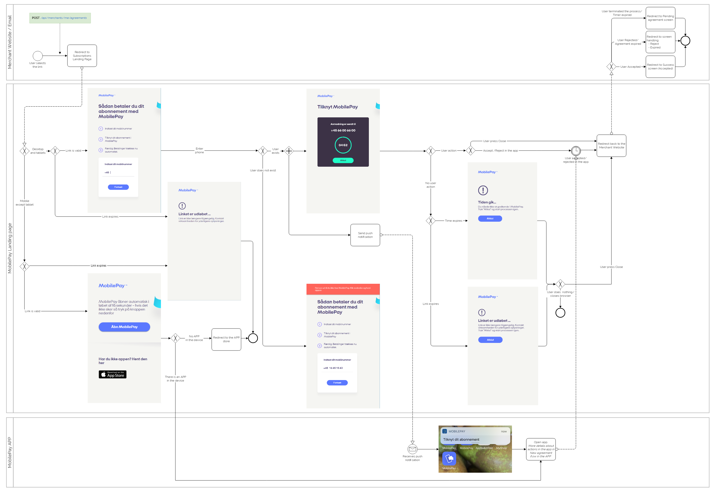
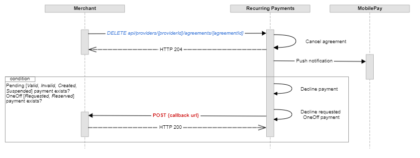

## <a name="agreements"></a>Agreements

Once the user is given to choose the payment method on the merchant's signup flow, an additional "*Pay with MobilePay*" button should be shown for the user to be able to click on. When user clicks on this button, merchant's back-end system must call the `POST /api/providers/{providerId}/agreements` endpoint in order to create a *Pending* Subscription **Agreement**, which can only be activated by the MobilePay user through the app. 

#### <a name="requests"></a>Create agreement request
```json
{
  "external_id": "AGGR00068",
  "amount": "10",
  "currency": "DKK",
  "description": "Monthly subscription",
  "next_payment_date": "2017-03-09",
  "frequency": 12,
  "links": [
    {
      "rel": "user-redirect",
      "href": "https://example.com/1b08e244-4aea-4988-99d6-1bd22c6a5b2c"
    },
    {
      "rel": "success-callback",
      "href": "https://example.com/1b08e244-4aea-4988-99d6-1bd22c6a5b2c"
    },
    {
      "rel": "cancel-callback",
      "href": "https://example.com/1b08e244-4aea-4988-99d6-1bd22c6a5b2c"
    }
  ],
  "country_code": "DK",
  "plan": "Basic",
  "expiration_timeout_minutes": 5,
  "mobile_phone_number": "4511100118",
  "retention_period_hours": 0,
  "disable_notification_management": false,
}
```

Mobile_phone_number is not required. Neither for agreement creation, or one-off creation. If you choose to add it, the phone number will be prefilled on our landing page. So that the user will not have to type the phone number on the landing page, which makes it more convenient for the user, if you add mobile_phone_number.


The *Pending* **Agreement**, if not activated, will expire within the value, provided in the _expiration_timeout_minutes_.

#### <a name="agreements_paramters"></a>Request parameters

|Parameter             |Type        |Required  |Description                                                      |Valid values|
|:---------------------|:-----------|:---------|:----------------------------------------------------------------|:-----------|
|**amount**            |number(0.00)|          |*__Agreement__ amount, which will be displayed for the user in the MobilePay app.*|>= 0.00, decimals separated with a dot.|
|**currency**          |string(3)   |required |*The __Agreement__ currency code, that will be displayed for the use in the MobilePay app. Currency and country_code must match a valid pair of: DKK->DK, EUR->FI.*|DKK, EUR|
|**country_code**      |string(2)   |required |*Country code, which will be used to differentiate between MobilePay DK and FI apps.*|DK, FI|
|**plan**              |string(30)  |required |*Short __Agreement__ information text, that will be displayed on the __Agreement__ screen. (examples: "Basic" / "Premium").*||
|**description**       |string(60)  |          |*Additional information provided by the merchant to the user, that will be displayed on the __Agreement__ screen.*||
|**next_payment_date** |date        |          |*The date of the first scheduled __Payment Request__. This will be displayed on the __Agreement__ creation screen and on the __Agreement__ details screen if first payment date > current date.*|ISO date format: yyyy-MM-dd|
|**frequency**         |int         |required |*Frequency of __Payment Requests__. This value will be used to divide the amount of days in a year to get a frequency in days (e.g. 365 / 12 = 30.4 - approx. every month, 365 - daily and 0 -flexible.)*|1, 2, 4, 12, 26, 52, 365, 0|
|**external_id**       |string      |          |*__Agreement__ identifier on the merchant's and integrators side. This will be included in the request body of the success / cancel callback.  The external_id should be unique to the agreement. Two different agreements should not have the same external_id*||
|**expiration_timeout_minutes**|int |required |*Agreement expiration timeout in minutes.*|Min: 5, max: 20160 (2 weeks)|
|**retention_period_hours**|int||*Before retention period has passed User will not be able to Cancel an agreement*|Min: 0(default), max: 24 hours|
|**disable_notification_management**|boolean||*Prevents User from disabling PUSH notifications*|Default **false**|
|**links**             |string      |required |*Link relation of the __Agreement__ creation sequence. Must contain 3 values for user redirect, success callback and cancel-callback links.*||
|**links[].rel**       |string      |required |*Link relation type.*|user-redirect, success-callback, cancel-callback|
|**links[].href**      |string      |required |*Link relation hyperlink reference.*|https://&lt;merchant's url&gt;|

<a name="agreements_response"></a>
The response of `POST /api/providers/{providerId}/agreements` contains two values: a unique *id* of the newly created *Pending* **Agreement** and a link *rel* = *mobile-pay*.

```json
{
  "id": "1b08e244-4aea-4988-99d6-1bd22c6a5b2c",
  "links": [
    {
      "rel": "mobile-pay",
      "href": "https://<mobile-pay-landing-page>/?flow=agreement&id=1b08e244-4aea-4988-99d6-1bd22c6a5b2c&redirectUrl=https%3a%2f%2fwww.example.com%2fredirect&countryCode=DK&mobile=4511100118"
    }
  ]
}
```
 
* The *id* value can be used on the merchant's back-end system to map a Subscription agreement with a specific user on the merchant's side, and subsequently to create new **Payment Requests** on behalf of the user who confirmed the agreement in MobilePay. 
* The link *rel = mobile-pay* value contains the hyperlink reference address, which is structured in the following way: _https://&lt;mobile-pay-landing-page&gt;/?**id**=318a0bf9-9039-400c-b5ff-6ec717da2971&**countryCode**=DK_. (The link is not accessible in sandbox, only in production) The _id_ property is of type **guid** and uniquely identifies the pending Subscription **Agreement** for the app to get the details and subsequently do an accept request. The _countryCode_ property is used to differentiate between DK, NO and FI apps.

The link can be used in two ways:

1. Redirect the user automatically using the HTTP response **302** or **303**. Once the user is redirected, the MobilePay app will be opened to activate the *Pending* **Agreement**. In this case, it is recommended to set the *expiration_timeout_minutes* value to 5 minutes.
2. E-mail the generated link to the user. Once the user clicks on the link, the MobilePay app will be opened to activate the *Pending* **Agreement**. In this case, it is recommended to set the *expiration_timeout_minutes* to a higher value (10080 - a week, 20160 - two weeks). Note, that the link will be valid only until the user accepts the agreement or a timeout occurs.

#### Update existing Agreement Request

Use the `PATCH /api/merchants/me/agreements/{agreementId}` endpoint to change agreement request parameters. Its request must match the rules of [RFC 6902 JSON Patch standards](https://tools.ietf.org/html/rfc6902).

- Available operations: **replace**
- Available properties: **amount**, **plan**, **description**, **next_payment_date**, **frequency**, **external_id**, **success-callback**, **cancel-callback**

```json
[
    {
        "value": "10.01",
        "path": "/amount",
        "op": "replace"
    }
]
```

#### New agreement creation in landing page

[](assets/images/RecurringPayments_Agreement_landing_page.png)

#### New agreement creation in APP

[](assets/images/RecurringPayments_Agreement_app.png)

#### <a name="agreements_callback"></a>Callbacks

When the **Agreement's** status changes from *Pending* we will do a callback to the merchant's system (see the sequence diagram below).

The table below shows possible *status*, *status_text* and *status_code* values depending on the **Agreement** status changes.

|New Status|Condition|URL| Callback *status* | Callback *status_text* |Callback *status_code*|
|----------|---------|---|-------------------|------------------------|----------------------|
|Accepted  |_User swiped to accept the Agreement_        |*success-callback* |Active  | |0|
|Rejected  |_User rejected agreement in the APP_              |*cancel-callback*  |Rejected|Agreement rejected by user|40000|
|Expired   |_User did not do anything during the agreement timeout period._|*cancel-callback*  |Expired |Pending agreement expired|40001|
|Canceled  |_User canceled an Active agreement_          |*cancel-callback*  |Canceled|Agreement canceled by user|40002|
|Canceled  |_Merchant canceled an Active or Pending agreement_      |*cancel-callback*  |Canceled|Agreement canceled by merchant|40003|
|Canceled  |_System canceled an Active agreement because user was Deleted_ |*cancel-callback*  |Canceled|Agreement canceled by system|40004|

##### <a name="agreements_state-diagram"></a>Agreement state diagram


##### <a name="agreements_callback-properties"></a>Other callback properties

|Name            |Type        |Description                                           |Format|
|----------------|------------|------------------------------------------------------|------|
|**agreement_id**|guid        |Subscription agreement ID on the MobilePay side.||
|**external_id** |string      |Agreement ID on the merchant's side                   ||
|**timestamp**   |datetime    |Timestamp when the status change occurred.            |ISO 8601 UTC date and time format: YYYY-MM-DDThh:mm:ssZ|

##### <a name="agreements_callback-request"></a>Agreement callback request example

```json
{
    "agreement_id" : "63679ab7-cc49-4f75-80a7-86217fc105ea",
    "status" : "Canceled",
    "status_text" : "Canceled by user",
    "status_code" : "40000",
    "external_id" : "SF0000568",
    "timestamp" : "2016-09-29T09:50:39Z"
}
```

##### <a name="agreements_callback-response-propterties"></a>Agreement callback response properties

|Name               |Description|
|-------------------|-----------|
|**agreement_id**   |Subscription agreement ID on the MobilePay side.|
|**status_code**    |Status code on merchant's system|
|**status_text**    |Description of the status.|
|**transaction_id** |Unique identifier of the transaction on the merchant's system.|

*status_code* can have the following values:
* 0 - success (*HTTP response 200 - OK*)
* 1xxx - validation error (*HTTP response 400 - Bad Request*) 
* 2xxx - business error  (*HTTP response 400 - Bad Request*)
* 3xxx - technical error  (*HTTP response 500 - Internal Server Error*)

The callback response properties are optional.
In case of technical errors (HTTP response is not 2xx), we will try to re-POST the callback.

##### <a name="agreements_callback-response-example"></a>Agreement callback response example
```json
{
    "agreement_id" : "63679ab7-cc49-4f75-80a7-86217fc105ea",
    "status_code" : "3000",
    "status_text" : "Server is down",
    "transaction_id" : "63679ab7-cc49-4f75-80a7-86217fc105ea"
}
```

When the **Agreement** activation is complete or canceled, the user will be navigated to the link *rel = user-redirect* to finalize the signup.

#### <a name="agreements_creation-diagram"></a>Agreement creation sequence diagram


#### <a name="agreements_cancel-diagram"></a>When merchant cancels agreement - sequence diagram



#### <a name="agreements_cancel-pending-diagram"></a>When user cancels a Pending agreement during signup - sequence diagram


#### <a name="agreements_cancel-active-diagram"></a>When user cancels an Active agreement - sequence diagram


* * *

## <a name="overview"></a> Overview 

Billing your customers has never been easier before. This document explains how to make a technical integration to the MobilePay Subscription product. The audience for this document is either technical integrators acting on behalf of merchants. You can find more information on our <a href="https://developer.mobilepay.dk/subscriptions-main">Developer Portal</a>.

Our MobilePay Subscriptions REST api enables you to:

1. Establish and manage **Agreements** between you, the **Merchant**, and MobilePay **Users**.
2. Create monthly **Subscription Payments** in relation to an established **Agreement** and get notified about the status via REST callbacks. **Subscription Payments** are requested 8 days before the actual booking date - no manual user confirmation required!

Related links:
- You can read more about the product [here](https://developer.mobilepay.dk/subscriptions-main).
- Billing your customers with MobilePay Subscriptions is easy using our [API](https://developer.mobilepay.dk/product).
- More information about integration steps is [here](https://developer.mobilepay.dk/subscriptions-getting-started).

### QuickStart: follow our QuickStart to start building your integration

- More information about integration steps are [here](https://developer.mobilepay.dk/invoice-getting-started)
- Pick an OpenID Connect library: we recommend <a href="https://github.com/IdentityModel/IdentityModel.OidcClient2">Certified C#/NetStandard OpenID Connect Client Library for native mobile/desktop Applications</a> 
- Read the FAQ's for Subscriptions <a href="https://developer.mobilepay.dk/faq/subscriptions">here</a>
- Read the FAQ's for OpenID Connect <a href="https://developer.mobilepay.dk/faq/integrator">here</a>
- Integration is based on common standard OpenID Connect. You can find more [here](https://developer.mobilepay.dk/products/openid). 
- You can find links to the official Hybrid Flow [here](https://openid.net/specs/openid-connect-core-1_0.html#HybridFlowAuth).   
- See the video tutorial here [here](https://developer.mobilepay.dk/products/openid/video)

### <a name="overview_onboarding"></a>Merchant onboarding

You enroll to the Subscriptions Production via <a href="https://mobilepay.dk/da-dk/Pages/mobilepay.aspx">www.MobilePay.dk</a> or the MobilePay Business Administration portal. Then you get access to the MobilePay Sandbox environment, where you can test the technical integration. The environment is located on <a href="https://sandbox-developer.mobilepay.dk/">The Developer Portal </a> 

## <a name="general-notes_authentication"></a>Authentication 

### <a name="openid-connect"></a>OpenID Connect
When the merchant is onboarded, he has a user in MobilePay that is able to manage which products the merchant wishes to use. Not all merchants have the technical capabilities to make integrations to MobilePay, instead they may need to go through applications whith these capabilities.  The OpenID Connect protocol is a simple identity layer on top of the OAuth 2.0 protocol. 

[](assets/images/OpenIdflowWithFIandAuthorize.png)

      
**Client:**
In order for this to work, the merchant must grant consent to an application(__Client__) with these capabilities.
The client is the application that is attempting to get access to the user's account.  The client needs to get consent from the user before it can do so. This consent is granted through mechanism in the [OpenID Connect](http://openid.net/connect/) protocol suite. <br />
Integrators are the same as __Clients__ in the OAuth 2.0 protocol. The first thing that must be done as a __Client__ is to go and register [here](https://www.mobilepay.dk/da-dk/Erhverv/Pages/MobilePay-integrator.aspx). Once this is done the __Client__ must initiate the [hybrid flow](http://openid.net/specs/openid-connect-core-1_0.html#HybridFlowAuth) specified in OpenID connect. For __Subscriptions__ product the __Client__ must request consent from the merchant using the `subscriptions` scope.  Scopes are like permissions or delegated rights that the Resource Owner wishes the client to be able to do on their behalf. You also need to specify `offline_access` scope, in order to get the refresh token. The authorization server in sandbox is located [here](https://api.sandbox.mobilepay.dk/merchant-authentication-openidconnect).<br />
If the merchant grants consent, an authorization code is returned which the __Client__ must exchange for an id token, an access token and a refresh token. The refresh token is used to refresh ended sessions without asking for merchant consent again. This means that if the __Client__ receives an answer from the api gateway saying that the access token is invalid, the refresh token is exchanged for a new access token and refresh token. <br /> <br />
An example of how to use OpenID connect in C# can be found [here](https://github.com/MobilePayDev/MobilePay-Invoice/tree/master/ClientExamples).

When user clicks on this button, merchant must do back-end call to   
[`"/authorize"`](https://developer.mobilepay.dk/products/openid/authorizeo) endpoint for initiating  authentication flow. You need to wait for the response by listening on the redirect URI and get the Authorization Code. Our system will re-direct the merchant back to your system also using the redirect URL. 
 
In short - The flow is described in the following 4 steps:

Step 1: Call /connect/authorize to initiate user login and consent

Step 2: Wait for the response by listening on the redirect URI and get the authorization code 

Step 3: Exchange the authorization code for tokens using /connect/token

Step 4: Keep the session alive by using the refresh token

### OpenID configuration endpoints 
Find the configuration links below:

|Environment | Links |
|------------|-------|
|Sandbox    | Denmark <a href="https://sandprod-admin.mobilepay.dk/account/.well-known/openid-configuration">https://sandprod-admin.mobilepay.dk/account/.well-known/openid-configuration</a> <br> Finland <a href="https://sandprod-admin.mobilepay.fi/account/.well-known/openid-configuration">https://sandprod-admin.mobilepay.fi/account/.well-known/openid-configuration</a> |
|Production  | Denmark <a href="https://admin.mobilepay.dk/account/.well-known/openid-configuration">https://admin.mobilepay.dk/account/.well-known/openid-configuration</a> <br> Finland <a href="https://admin.mobilepay.fi/account/.well-known/openid-configuration">https://admin.mobilepay.fi/account/.well-known/openid-configuration</a>|


In order to authenticate to the API, all requests to the API must contain at least three authentication headers:
1. `x-ibm-client-id`
2. `x-ibm-client-secret`  
3. `Authorization` 

```console
$ curl --header "Authorization: Bearer <token>" --header 'x-ibm-client-id: client-id' --header 'x-ibm-client-secret: client-secret' --url https://<mobile-pay-root>/api/merchants/me/resource
```
### <a name="openid-flow"></a>OpenID flow


      

### <a name="openid-connect-libraries"></a>Implementing OpenID Connect protocol

Although the protocol is not that complicated, there is no need to implement it yourself! There are many OpenID Connect certified libraries for different platforms, so you just have to chose the one, that suits you best [from this list](http://openid.net/developers/certified/#RPLibs).

## <a name="agreements"></a>Agreements

Once the user is given to choose the payment method on the merchant's signup flow, an additional "*Pay with MobilePay*" button should be shown for the user to be able to click on. When user clicks on this button, merchant's back-end system must call the `POST /api/providers/{providerId}/agreements` endpoint in order to create a *Pending* Subscription **Agreement**, which can only be activated by the MobilePay user through the app. 

```json
{
  "external_id": "AGGR00068",
  "amount": "10",
  "currency": "DKK",
  "description": "Monthly subscription",
  "next_payment_date": "2017-03-09",
  "frequency": 12,
  "links": [
    {
      "rel": "user-redirect",
      "href": "https://example.com/1b08e244-4aea-4988-99d6-1bd22c6a5b2c"
    },
    {
      "rel": "success-callback",
      "href": "https://example.com/1b08e244-4aea-4988-99d6-1bd22c6a5b2c"
    },
    {
      "rel": "cancel-callback",
      "href": "https://example.com/1b08e244-4aea-4988-99d6-1bd22c6a5b2c"
    }
  ],
  "country_code": "DK",
  "plan": "Basic",
  "expiration_timeout_minutes": 5,
  "mobile_phone_number": "4511100118",
  "retention_period_hours": 0,
  "disable_notification_management": false,
}
```

Mobile_phone_number is not required. Neither for agreement creation, or one-off creation. If you choose to add it, the phone number will be prefilled on our landing page. So that the user will not have to type the phone number on the landing page, which makes it more convenient for the user, if you add mobile_phone_number.


The *Pending* **Agreement**, if not activated, will expire within the value, provided in the _expiration_timeout_minutes_.

#### <a name="agreements_paramters"></a>Request parameters

|Parameter             |Type        |Required  |Description                                                      |Valid values|
|:---------------------|:-----------|:---------|:----------------------------------------------------------------|:-----------|
|**amount**            |number(0.00)|          |*__Agreement__ amount, which will be displayed for the user in the MobilePay app.*|>= 0.00, decimals separated with a dot.|
|**currency**          |string(3)   |required |*The __Agreement__ currency code, that will be displayed for the use in the MobilePay app. Currency and country_code must match a valid pair of: DKK->DK, EUR->FI.*|DKK, EUR|
|**country_code**      |string(2)   |required |*Country code, which will be used to differentiate between MobilePay DK and FI apps.*|DK, FI|
|**plan**              |string(30)  |required |*Short __Agreement__ information text, that will be displayed on the __Agreement__ screen. (examples: "Basic" / "Premium").*||
|**description**       |string(60)  |          |*Additional information provided by the merchant to the user, that will be displayed on the __Agreement__ screen.*||
|**next_payment_date** |date        |          |*The date of the first scheduled __Payment Request__. This will be displayed on the __Agreement__ creation screen and on the __Agreement__ details screen if first payment date > current date.*|ISO date format: yyyy-MM-dd|
|**frequency**         |int         |required |*Frequency of __Payment Requests__. This value will be used to divide the amount of days in a year to get a frequency in days (e.g. 365 / 12 = 30.4 - approx. every month, 365 - daily and 0 -flexible.)*|1, 2, 4, 12, 26, 52, 365, 0|
|**external_id**       |string      |          |*__Agreement__ identifier on the merchant's and integrators side. This will be included in the request body of the success / cancel callback.  The external_id should be unique to the agreement. Two different agreements should not have the same external_id*||
|**expiration_timeout_minutes**|int |required |*Agreement expiration timeout in minutes.*|Min: 5, max: 20160 (2 weeks)|
|**retention_period_hours**|int||*Before retention period has passed User will not be able to Cancel an agreement*|Min: 0(default), max: 24 hours|
|**disable_notification_management**|boolean||*Prevents User from disabling PUSH notifications*|Default **false**|
|**links**             |string      |required |*Link relation of the __Agreement__ creation sequence. Must contain 3 values for user redirect, success callback and cancel-callback links.*||
|**links[].rel**       |string      |required |*Link relation type.*|user-redirect, success-callback, cancel-callback|
|**links[].href**      |string      |required |*Link relation hyperlink reference.*|https://&lt;merchant's url&gt;|

<a name="agreements_response"></a>
The response of `POST /api/providers/{providerId}/agreements` contains two values: a unique *id* of the newly created *Pending* **Agreement** and a link *rel* = *mobile-pay*.

```json
{
  "id": "1b08e244-4aea-4988-99d6-1bd22c6a5b2c",
  "links": [
    {
      "rel": "mobile-pay",
      "href": "https://<mobile-pay-landing-page>/?flow=agreement&id=1b08e244-4aea-4988-99d6-1bd22c6a5b2c&redirectUrl=https%3a%2f%2fwww.example.com%2fredirect&countryCode=DK&mobile=4511100118"
    }
  ]
}
```
 
* The *id* value can be used on the merchant's back-end system to map a Subscription agreement with a specific user on the merchant's side, and subsequently to create new **Payment Requests** on behalf of the user who confirmed the agreement in MobilePay. 
* The link *rel = mobile-pay* value contains the hyperlink reference address, which is structured in the following way: _https://&lt;mobile-pay-landing-page&gt;/?**id**=318a0bf9-9039-400c-b5ff-6ec717da2971&**countryCode**=DK_. (The link is not accessible in sandbox, only in production) The _id_ property is of type **guid** and uniquely identifies the pending Subscription **Agreement** for the app to get the details and subsequently do an accept request. The _countryCode_ property is used to differentiate between DK, NO and FI apps.

The link can be used in two ways:

1. Redirect the user automatically using the HTTP response **302** or **303**. Once the user is redirected, the MobilePay app will be opened to activate the *Pending* **Agreement**. In this case, it is recommended to set the *expiration_timeout_minutes* value to 5 minutes.
2. E-mail the generated link to the user. Once the user clicks on the link, the MobilePay app will be opened to activate the *Pending* **Agreement**. In this case, it is recommended to set the *expiration_timeout_minutes* to a higher value (10080 - a week, 20160 - two weeks). Note, that the link will be valid only until the user accepts the agreement or a timeout occurs.

#### Update existing Agreement Request

Use the `PATCH /api/merchants/me/agreements/{agreementId}` endpoint to change agreement request parameters. Its request must match the rules of [RFC 6902 JSON Patch standards](https://tools.ietf.org/html/rfc6902).

- Available operations: **replace**
- Available properties: **amount**, **plan**, **description**, **next_payment_date**, **frequency**, **external_id**, **success-callback**, **cancel-callback**

```json
[
    {
        "value": "10.01",
        "path": "/amount",
        "op": "replace"
    }
]
```

#### New agreement creation in landing page

[](assets/images/RecurringPayments_Agreement_landing_page.png)

#### New agreement creation in APP

[](assets/images/RecurringPayments_Agreement_app.png)

#### <a name="agreements_callback"></a>Callbacks

When the **Agreement's** status changes from *Pending* we will do a callback to the merchant's system (see the sequence diagram below).

The table below shows possible *status*, *status_text* and *status_code* values depending on the **Agreement** status changes.

|New Status|Condition|URL| Callback *status* | Callback *status_text* |Callback *status_code*|
|----------|---------|---|-------------------|------------------------|----------------------|
|Accepted  |_User swiped to accept the Agreement_        |*success-callback* |Active  | |0|
|Rejected  |_User rejected agreement in the APP_              |*cancel-callback*  |Rejected|Agreement rejected by user|40000|
|Expired   |_User did not do anything during the agreement timeout period._|*cancel-callback*  |Expired |Pending agreement expired|40001|
|Canceled  |_User canceled an Active agreement_          |*cancel-callback*  |Canceled|Agreement canceled by user|40002|
|Canceled  |_Merchant canceled an Active or Pending agreement_      |*cancel-callback*  |Canceled|Agreement canceled by merchant|40003|
|Canceled  |_System canceled an Active agreement because user was Deleted_ |*cancel-callback*  |Canceled|Agreement canceled by system|40004|

##### <a name="agreements_state-diagram"></a>Agreement state diagram


##### <a name="agreements_callback-properties"></a>Other callback properties

|Name            |Type        |Description                                           |Format|
|----------------|------------|------------------------------------------------------|------|
|**agreement_id**|guid        |Subscription agreement ID on the MobilePay side.||
|**external_id** |string      |Agreement ID on the merchant's side                   ||
|**timestamp**   |datetime    |Timestamp when the status change occurred.            |ISO 8601 UTC date and time format: YYYY-MM-DDThh:mm:ssZ|

##### <a name="agreements_callback-request"></a>Agreement callback request example

```json
{
    "agreement_id" : "63679ab7-cc49-4f75-80a7-86217fc105ea",
    "status" : "Canceled",
    "status_text" : "Canceled by user",
    "status_code" : "40000",
    "external_id" : "SF0000568",
    "timestamp" : "2016-09-29T09:50:39Z"
}
```

##### <a name="agreements_callback-response-propterties"></a>Agreement callback response properties

|Name               |Description|
|-------------------|-----------|
|**agreement_id**   |Subscription agreement ID on the MobilePay side.|
|**status_code**    |Status code on merchant's system|
|**status_text**    |Description of the status.|
|**transaction_id** |Unique identifier of the transaction on the merchant's system.|

*status_code* can have the following values:
* 0 - success (*HTTP response 200 - OK*)
* 1xxx - validation error (*HTTP response 400 - Bad Request*) 
* 2xxx - business error  (*HTTP response 400 - Bad Request*)
* 3xxx - technical error  (*HTTP response 500 - Internal Server Error*)

The callback response properties are optional.
In case of technical errors (HTTP response is not 2xx), we will try to re-POST the callback.

##### <a name="agreements_callback-response-example"></a>Agreement callback response example
```json
{
    "agreement_id" : "63679ab7-cc49-4f75-80a7-86217fc105ea",
    "status_code" : "3000",
    "status_text" : "Server is down",
    "transaction_id" : "63679ab7-cc49-4f75-80a7-86217fc105ea"
}
```

When the **Agreement** activation is complete or canceled, the user will be navigated to the link *rel = user-redirect* to finalize the signup.

#### <a name="agreements_creation-diagram"></a>Agreement creation sequence diagram


#### <a name="agreements_cancel-diagram"></a>When merchant cancels agreement - sequence diagram


#### <a name="agreements_cancel-pending-diagram"></a>When user cancels a Pending agreement during signup - sequence diagram


#### <a name="agreements_cancel-active-diagram"></a>When user cancels an Active agreement - sequence diagram


* * *