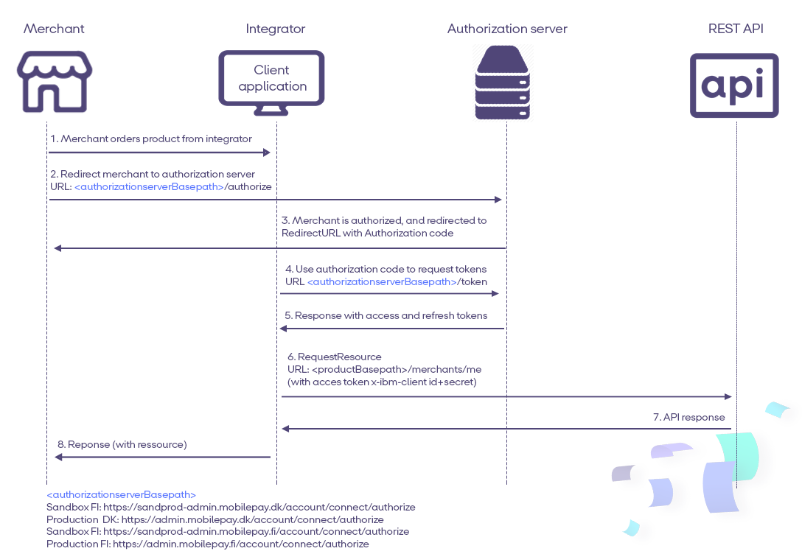
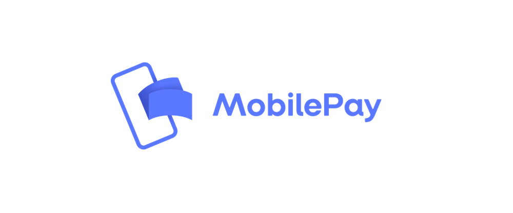

## <a name="general-notes_authentication"></a>Authentication 


### Authorization


# <a name="client_onboarding"></a>**Onboarding a Subscriptions client**

1. **Read API documentation.** You will find it in the  [APIs menu](https://sandbox-developer.mobilepay.dk/product).  

2.  **Log-in on the developer portal.** Go to [Sandbox developer portal](https://sandbox-developer.mobilepay.dk/) and log in with your credentials.

 3.  **Create an app in the developer portal.** Go to My Apps > Create new App to register a new application. You need to supply the `x-ibm-client-id` when calling APIs. You should always store the `x-ibm-client-id` in a secure location, and never reveal it publicly.  More details about the usage of `x-ibm-client-id` below in the authentication section. 

4.  **Subscribe the app to APIs.**  Go to [APIs](https://sandbox-developer.mobilepay.dk/product) and subscribe to the following APIs:
-  Subscriptions
-  Subscriptions User Simulation
 
 5.  **Receive OAuth  Credentials via zip file.** The Credentials will be used when calling the token endpoint (described below) to generate an access token. The zip file will be sent via e-mail. The zip file is locked with a password. DeveloperSupport will provide the password via text message to ensure the password protected file and the password is not transmitted together. You will also receive a testuser to  [Sandbox MobilePay Portal](https://sandprod-admin.mobilepay.dk/)   

Now you are ready to move on to the authentication section below.  

### <a name="openid-connect"></a>OpenID Connect
When the merchant is onboarded via  [Production MobilePay Portal](https://admin.mobilepay.dk/), and has ordered Subscriptions, then you can continue with OIDC.  

[](assets/images/OpenIdflowWithFIandAuthorize.png)

      
**5 steps**

There are many OpenID Connect certified libraries for different platforms, so you have to chose the one, that suits you best [from this list](http://openid.net/developers/certified/#RPLibs). we recommend <a href="https://github.com/IdentityModel/IdentityModel.OidcClient2">Certified C#/NetStandard OpenID Connect Client Library for native mobile/desktop Applications</a> 
In short - The flow is described in the following 5 steps:

[Step 1: Call /connect/authorize to initiate user login and consent](https://developer.mobilepay.dk/developersupport/openid/authorize/) 

The Merchant must grant consent through mechanism in the [OpenID Connect](http://openid.net/connect/) protocol suite. The [Hybrid Flow](http://openid.net/specs/openid-connect-core-1_0.html#HybridFlowAuth) should be initiated. For __Subscriptions__ product the Client must request consent from the merchant using the `subscriptions` scope. You also need to specify `offline_access` scope, in order to get the refresh token. When user clicks on this button, merchant must do back-end call to  [`"/authorize"`](https://developer.mobilepay.dk/developersupport/openid/authorize/) endpoint for initiating  authentication flow. You need to wait for the response by listening on the redirect URI and get the Authorization Code. Our system will re-direct the merchant back to your system also using the redirect URL. 

[Step 2: Wait for the response by listening on the redirect URI and get the authorization code](https://developer.mobilepay.dk/developersupport/openid/getcode/) 

[Step 3: Exchange the authorization code for tokens using /connect/token](https://developer.mobilepay.dk/developersupport/openid/gettokens/) 

[Step 4: Keep the session alive by using the refresh token](https://developer.mobilepay.dk/developersupport/openid/getrefreshtokens/) 


[Step 5: Follow Best Practice](https://developer.mobilepay.dk/developersupport/openid/bestpractice/) 

 
An example of how to use OpenID connect in C# can be found [here](https://github.com/MobilePayDev/MobilePay-Subscriptions/tree/master/docs/ClientExamples).


# <a name="openid-connect-libraries"></a>Implementing OpenID Connect  
The MobilePay API Gateway is ensuring the authentication of all Subscriptions API requests. All API requests must be made over HTTPS. Calls made over plain HTTP will fail. API requests without authentication will also fail.

To be able to use and connect to the API there are few requirements. In order to authenticate to the API, all requests to the API must contain at least three authentication headers:
1. `x-ibm-client-id`
2. `x-ibm-client-secret`  
3. `Authorization` 

Creating an app in MobilePay Developer Portal will create a `x-ibm-client-id` and `x-ibm-client-secret` that should be used in all calls to the MobilePay Subscriptions API  


```console
$ curl --header "Authorization: Bearer <token>" --header 'x-ibm-client-id: client-id' --header 'x-ibm-client-secret: client-secret' --url https://<mobile-pay-root>/api/merchants/me/resource
```


# Glossary of OIDC terms 

| Term | Description |
|------|-------------|
| Access Token | A token which is retrieved by the Client after a successful access authorization flow. The access token is used by the API to authenticate Clients.   |
| Authorization Code         |  A short-lived code that is exchanged for an Access Token. A Client makes a Token Request by presenting its Authorization Grant (in the form of an Authorization Code) to the Token Endpoint using the grant_type value authorization_code.|
| Client | Client is used interchangeably for the application that calls the MobilePay API. |
| Client Credentials | According to ([RFC 6749](https://tools.ietf.org/html/rfc6749)), a client ID is required when you make an authorization request to an authorization server. They should be used, when during the OpenID flow (when getting/renewing access token), for example in /authorize and /token calls. Client ID and Client Secret for Authorization server will be provided in a password protected zip sent by [developer@mobilepay.dk](mailto:developer@mobilepay.dk)  |
| form_post        |   `response_mode=form_post` sends the token response as a form post. Authorization Response parameters are encoded as HTML form values that are auto-submitted in the User Agent, and thus are transmitted via the HTTP POST method to the Client, with the result parameters being encoded in the body using the application/x-www-form-urlencoded format.  |
| fragment        |   Parameters are encoded in the URL fragment added to the `redirect_uri` when redirecting back to the client. We recommend using `response_mode=form_post`, to ensure the most secure transfer of tokens to your application. |
| response_mode       |   an Authorization Request parameter that informs the Authorization Server of the mechanism to be used for returning Authorization Response parameters from the Authorization_endpoint.|
| redirect_uri       |    MobilePay will redirect users to a registered  `redirect_uri`, in order to prevent redirection attacks where an authorization code or access token can be obtained by an attacker. The  `redirect_uri`  must be an https endpoint to prevent tokens from being intercepted during the authorization process. |
| Refresh Token       |   Consent is agreed between the Resource Owner (customer) and the Client (TPP). It includes what data may be shared, what services may be performed on the Resource Owner's behalf|
| response_mode       |   an Authorization Request parameter that informs the Authorization Server of the mechanism to be used for returning Authorization Response parameters from the Authorization_endpoint.|
| state       |   We require the OAuth 2.0 `state` parameter on all requests to the /authorize endpoint in order to prevent cross-site request forgery (CSRF). he OAuth 2.0 specification [requires](https://tools.ietf.org/html/rfc6749#section-10.12) that clients protect their redirect URIs against CSRF by sending a value in the authorize request that binds the request to the user-agent's authenticated state.|


 
 

### OpenID configuration endpoints 
Find the configuration links below:

|Environment | Links |
|------------|-------|
|Sandbox    | Denmark <a href="https://sandprod-admin.mobilepay.dk/account/.well-known/openid-configuration">https://sandprod-admin.mobilepay.dk/account/.well-known/openid-configuration</a> <br> Finland <a href="https://sandprod-admin.mobilepay.fi/account/.well-known/openid-configuration">https://sandprod-admin.mobilepay.fi/account/.well-known/openid-configuration</a> |
|Production  | Denmark <a href="https://admin.mobilepay.dk/account/.well-known/openid-configuration">https://admin.mobilepay.dk/account/.well-known/openid-configuration</a> <br> Finland <a href="https://admin.mobilepay.fi/account/.well-known/openid-configuration">https://admin.mobilepay.fi/account/.well-known/openid-configuration</a>|


      
#### QuickStart: follow our QuickStart to start building your integration

- More information about integration steps are  [here](https://developer.mobilepay.dk/subscriptions-main)
- FAQ's for OpenID Connect <a href="https://developer.mobilepay.dk/faq/oidc">here</a>
- Integration is based on common standard OpenID Connect. You can find more [here](https://developer.mobilepay.dk/developersupport/openid/). 
- Video tutorial [here](https://developer.mobilepay.dk/developersupport/openid/tutorial)


## <a name="communication_security"></a> TLS - Communication Security 

The MobilePay Subscriptions API uses TLS for communication security and data integrity (secure channel between the client and the 
backend). The API currently uses TLS 1.2. It is the integrator's responsibility to plan for an upgrade to TLS 1.3, when
TLS 1.2 is deprecated. 

## <a name="ip_address"></a> IP Address 
Currently, our network utilizes the global IP range 212.93.32.0/19.
As an external party, you might need to modify your firewall rules to allow traffic from  212.93.32.0/19 and 185.218.228.0/22 . Otherwise our traffic may be blocked, and our services stop working.

[](assets/images/Preview-MP-logo-and-type-horizontal-blue.png)
