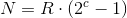

## <a name="general-notes"></a> General notes 

MobilePay Subscriptions is a full-fledged HTTPS REST api using JSON as request/response communication media.

All dates and time-stamps use the ISO 8601 format: date format - `YYYY-MM-DD`, date-time format - `YYYY-MM-DDTHH:mm:ssZ`.

Amounts are enquoted with double quotation marks using `0.00` format, decimals separated with a dot.

When doing `POST`, `PATCH` or `PUT` requests, `Content-Type: application/json` HTTP header must be provided.

```console 
$ curl --request POST --header 'Content-Type: application/json' --url https://<mobile-pay-root>/resource --data '{}'
```

#### <a name="general-notes_errors"></a>Errors

You might encounter the following HTTP errors:

1. `400 - Bad Request` , if request data is invalid.
>    
    ```json
    {
        "error": "BadRequest",
        "error_description": {
            "message": "request.Name is required",
            "error_type": "InputError",
            "correlation_id": "f4b02597-32cc-420f-a468-942307e89a97"
        }
    }
    ```
2. `404 - Not Found` with no response body, if the resource (agreement or payment) is not found.

3. `412 - Precondition Failed` , if business validation rule was violated.
>    
    ```json
    {
        "error": "PreconditionFailed",
        "error_description": {
            "message": "Duplicate payment.",
            "error_type": "PreconditionError",
            "correlation_id": "f4b02597-32cc-420f-a468-942307e89a97"
        }
    }
    ```
4. `500 - Internal Server Error` , if something really bad has happened.
>    
    ```json
    {
        "error": "InternalServerError",
        "error_description": {
            "message": "An error occurred, please try again or contact the administrator.",
            "error_type": "ServerError",
            "correlation_id": "f4b02597-32cc-420f-a468-942307e89a97"
        }
    }
    ```

#### <a name="general-notes_correlation"></a>REST request correlation

_CorrelationId_ is an optional _[Guid](https://en.wikipedia.org/wiki/Globally_unique_identifier)_ header value which can be used to link requests on your back-end system to MobilePay Subscriptions business transaction for a more convenient debugging.

```console
$ curl --header 'CorrelationId: 37b8450b-579b-489d-8698-c7800c65934c' --url https://<mobile-pay-root>/api/merchants/me/agreements
```

#### <a name="general-notes_callback-authentication"></a>REST callback authentication

Use one of these endpoints to set REST callback authentication scheme and credentials:
* `PUT /api/providers/{providerId}/auth/oauth2` - set OAuth2 scheme which conforms to RFC 6749 [section 4.4.](https://tools.ietf.org/html/rfc6749#section-4.4).
* `PUT /api/providers/{providerId}/auth/basic` - set Basic auth scheme using username and password.
* `PUT /api/providers/{providerId}/auth/apikey` - set a value which will be set to the _Authorization_ header. API key must conform to the token68 specification as defined in RFC 7235 [section2.1.](https://tools.ietf.org/html/rfc7235#section-2.1).

#### <a name="general-notes_callback-retries"></a>REST callback retries

Once the payment or agreement changes state, a callback will be done to the callback address, which is configurable via `PATCH /api/providers/{providerId}` with path value `/payment_status_callback_url`.

In case the REST callback failed, 8 retries will be made using the [exponential back-off algorithm](https://en.wikipedia.org/wiki/Exponential_backoff), where N - next retry time, c - retry attempt number, R - second retry time in seconds (1st retry is an exception and is done after 5 seconds):



* 1st retry – 5 seconds
* 2nd retry – 10 minutes after 1st retry
* 3rd retry – 30 minutes after 2nd retry
* 4th retry – 1h 10 minutes after 3rd retry
* 5th retry – 2h 30 minutes after 4th retry
* 6th retry – 5h 10 minutes after 5th retry
* 7th retry – 10h 30 minutes after 6th retry
* 8th retry – 21h 10 minutes after 7th retry

* * *
