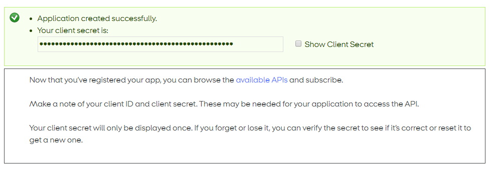

##  Get started

 1. **Read API documentation**. You'll find it in the  [APIs menu](https://developer.mobilepay.dk/product). *The API documentation provides insight into the structure of the API and will help you determine the best approach for integration as well as provide details on typical use cases.*

 2. **Log-in** Go to  [sandbox-developer.mobilepay.dk](https://sandbox-developer.mobilepay.dk/ "Sandbox developer portal") and log in with your credentials.

 3. **Create app** - My Apps > Create new App to register a new application. IMPORTANT: _Please make a note of your Client Secret as you will only see this once! You need to supply the `x-ibm-client-id` and `x-ibm-client-secret` when calling the api. You should always store the `x-ibm-client-id` in a secure location, and never reveal it publicly. If you suspect that the secret key has been compromised, you may reset it immediately by clicking the link on the application details page._

 4. **Subscribe to APIs.**  To implement MobilePay Subscriptions, go to  [APIs](https://sandbox-developer.mobilepay.dk/product)  and subscribe to the following APIs:
-  Subscriptions
-  Subscriptions User Simulation

### Step 3 - Authentication

----------

Once you have obtained credentials via zip file, set a redirect URI and received test data, you can start implementing the OpenID Connect flow. Read more about OpenID Connect and the process
