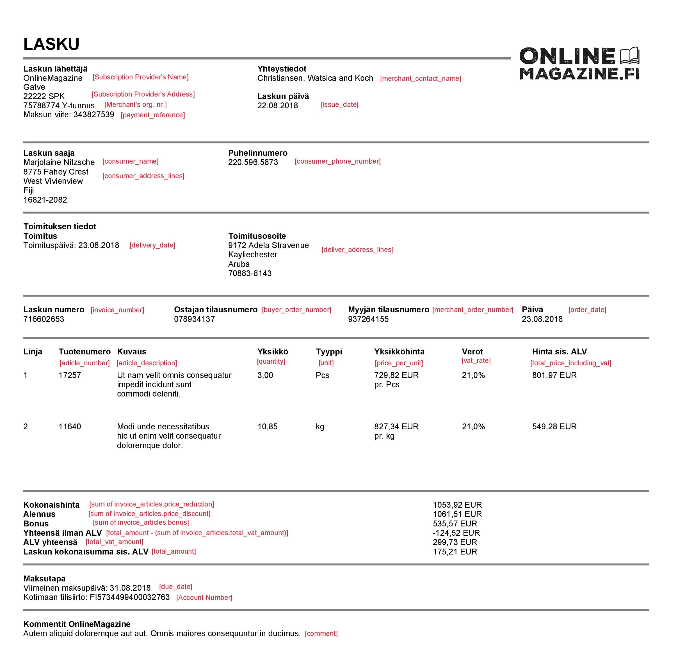

## <a name="overview"></a> Overview 

Billing your customers has never been easier before. This document explains how to make a technical integration to the MobilePay Subscription product. The audience for this document is either technical integrators acting on behalf of merchants. You can find more information on our <a href="https://developer.mobilepay.dk/subscriptions-main">Developer Portal</a>.

Our MobilePay Subscriptions REST api enables you to:

1. Establish and manage **Agreements** between you, the **Merchant**, and MobilePay **Users**.
2. Create monthly **Subscription Payments** in relation to an established **Agreement** and get notified about the status via REST callbacks. **Subscription Payments** are requested 8 days before the actual booking date - no manual user confirmation required!

Related links:
- You can read more about the product [here](https://developer.mobilepay.dk/subscriptions-main).
- Billing your customers with MobilePay Subscriptions is easy using our [API](https://developer.mobilepay.dk/product).
- More information about integration steps is [here](https://developer.mobilepay.dk/subscriptions-getting-started).

### QuickStart: follow our QuickStart to start building your integration

- More information about integration steps are [here](https://developer.mobilepay.dk/invoice-getting-started)
- Pick an OpenID Connect library: we recommend <a href="https://github.com/IdentityModel/IdentityModel.OidcClient2">Certified C#/NetStandard OpenID Connect Client Library for native mobile/desktop Applications</a> 
- Read the FAQ's for Subscriptions <a href="https://developer.mobilepay.dk/faq/subscriptions">here</a>
- Read the FAQ's for OpenID Connect <a href="https://developer.mobilepay.dk/faq/integrator">here</a>
- Integration is based on common standard OpenID Connect. You can find more [here](https://developer.mobilepay.dk/products/openid). 
- You can find links to the official Hybrid Flow [here](https://openid.net/specs/openid-connect-core-1_0.html#HybridFlowAuth).   
- See the video tutorial here [here](https://developer.mobilepay.dk/products/openid/video)

### <a name="overview_onboarding"></a>Merchant onboarding

You enroll to the Subscriptions Production via <a href="https://mobilepay.dk/da-dk/Pages/mobilepay.aspx">www.MobilePay.dk</a> or the MobilePay Business Administration portal. Then you get access to the MobilePay Sandbox environment, where you can test the technical integration. The environment is located on <a href="https://sandbox-developer.mobilepay.dk/">The Developer Portal </a> 

## <a name="general-notes_authentication"></a>Authentication 

### <a name="openid-connect"></a>OpenID Connect
When the merchant is onboarded, he has a user in MobilePay that is able to manage which products the merchant wishes to use. Not all merchants have the technical capabilities to make integrations to MobilePay, instead they may need to go through applications whith these capabilities.  The OpenID Connect protocol is a simple identity layer on top of the OAuth 2.0 protocol. 

[](assets/images/OpenIdflowWithFIandAuthorize.png)

      
**Client:**
In order for this to work, the merchant must grant consent to an application(__Client__) with these capabilities.
The client is the application that is attempting to get access to the user's account.  The client needs to get consent from the user before it can do so. This consent is granted through mechanism in the [OpenID Connect](http://openid.net/connect/) protocol suite. <br />
Integrators are the same as __Clients__ in the OAuth 2.0 protocol. The first thing that must be done as a __Client__ is to go and register [here](https://www.mobilepay.dk/da-dk/Erhverv/Pages/MobilePay-integrator.aspx). Once this is done the __Client__ must initiate the [hybrid flow](http://openid.net/specs/openid-connect-core-1_0.html#HybridFlowAuth) specified in OpenID connect. For __Subscriptions__ product the __Client__ must request consent from the merchant using the `subscriptions` scope.  Scopes are like permissions or delegated rights that the Resource Owner wishes the client to be able to do on their behalf. You also need to specify `offline_access` scope, in order to get the refresh token. The authorization server in sandbox is located [here](https://api.sandbox.mobilepay.dk/merchant-authentication-openidconnect).<br />
If the merchant grants consent, an authorization code is returned which the __Client__ must exchange for an id token, an access token and a refresh token. The refresh token is used to refresh ended sessions without asking for merchant consent again. This means that if the __Client__ receives an answer from the api gateway saying that the access token is invalid, the refresh token is exchanged for a new access token and refresh token. <br /> <br />
An example of how to use OpenID connect in C# can be found [here](https://github.com/MobilePayDev/MobilePay-Invoice/tree/master/ClientExamples).

When user clicks on this button, merchant must do back-end call to   
[`"/authorize"`](https://developer.mobilepay.dk/products/openid/authorizeo) endpoint for initiating  authentication flow. You need to wait for the response by listening on the redirect URI and get the Authorization Code. Our system will re-direct the merchant back to your system also using the redirect URL. 
 
In short - The flow is described in the following 4 steps:

Step 1: Call /connect/authorize to initiate user login and consent

Step 2: Wait for the response by listening on the redirect URI and get the authorization code 

Step 3: Exchange the authorization code for tokens using /connect/token

Step 4: Keep the session alive by using the refresh token

### OpenID configuration endpoints 
Find the configuration links below:

|Environment | Links |
|------------|-------|
|Sandbox    | Denmark <a href="https://sandprod-admin.mobilepay.dk/account/.well-known/openid-configuration">https://sandprod-admin.mobilepay.dk/account/.well-known/openid-configuration</a> <br> Finland <a href="https://sandprod-admin.mobilepay.fi/account/.well-known/openid-configuration">https://sandprod-admin.mobilepay.fi/account/.well-known/openid-configuration</a> |
|Production  | Denmark <a href="https://admin.mobilepay.dk/account/.well-known/openid-configuration">https://admin.mobilepay.dk/account/.well-known/openid-configuration</a> <br> Finland <a href="https://admin.mobilepay.fi/account/.well-known/openid-configuration">https://admin.mobilepay.fi/account/.well-known/openid-configuration</a>|


In order to authenticate to the API, all requests to the API must contain at least three authentication headers:
1. `x-ibm-client-id`
2. `x-ibm-client-secret`  
3. `Authorization` 

```console
$ curl --header "Authorization: Bearer <token>" --header 'x-ibm-client-id: client-id' --header 'x-ibm-client-secret: client-secret' --url https://<mobile-pay-root>/api/merchants/me/resource
```
### <a name="openid-flow"></a>OpenID flow


      

### <a name="openid-connect-libraries"></a>Implementing OpenID Connect protocol

Although the protocol is not that complicated, there is no need to implement it yourself! There are many OpenID Connect certified libraries for different platforms, so you just have to chose the one, that suits you best [from this list](http://openid.net/developers/certified/#RPLibs).


## <a name="invoices"></a>Invoices

### <a name="payment"/> Add invoice details to subscription payment

You can now add invoice details to your payment. These will be shown to the user in the MobilePay app. Also we will generate a PDF file that will also be accessible to the user from the MobilePay.

All you need to do is attach an [invoice object](#invoice_object) to the property (which is optional) of current payment object.

```
POST /api/providers/{providerId}/paymentrequests
```

```json
[
    {
        "agreement_id": "fda31b3c-794e-4148-ac00-77b957a7d47f",
        "amount": "10.99",
        "due_date": "2017-03-09",
        "next_payment_date": "2017-04-09",
        "external_id": "PMT000023",
        "description": "Monthly payment"
        "invoice": {
            "consumer_name": "John Johnson",
            "consumer_phone_number": "+4544667788",
            "total_amount": 10,
            "total_vat_amount": 10,
            "issue_date": "2018-08-22",
            "invoice_number": "58652",
            "order_date": "2018-08-22",
            "due_date": "2018-08-22",
            "consumer_address_lines": [
                "Paradisæblevej 13",
                "CC-1234 Andeby",
                "Wonderland"
            ],
            "invoice_articles": [
                "article_number": "456",
                "article_description": "Lorem ipsum dolor sit amet",
                "vat_rate": 25,
                "total_vat_amount": 25
                "total_price_including_vat": 25,
                "unit": "pcs",
                "quantity": 6,
                "price_per_unit": 60,
                "price_reduction": 1.2,
                "price_discount": 2,
                "bonus": 5
            ],
            "merchant_contact_name": "Some Company",
            "delivery_address_lines": [
                "Østerbrogade 120",
                "CC-1234 Andeb"
            ],
            "payment_reference": "ABCD1234",
            "delivery_date": "2018-08-22",
            "merchant_order_number": "ABCD1234",
            "buyer_order_number": "ABCD1234",
            "comment": "Lorem ipsum dolor sit amet, eros faucibus aliqua erat aliquam odio vitae."
        }
    }
]
```

### <a name="oopexistingagreement"/> Add invoice details to one-off payment on an existing agreement.

You can also add invoice details to a one-off payment. They will be shown to the user in the MobilePay app. Also we will generate a PDF file that will also be accessible to the user from the MobilePay.

All you need to do is attach an [invoice object](#invoice_object) to the property (which is optional) of current one-off payment object.

```
POST /api/providers/{providerId}/agreements/{agreementId}/oneoffpayments
```

```json
{
    "amount": "80",
    "external_id": "OOP00348",
    "description": "Pay now for additional goods",
    "links": [
        {
            "rel": "user-redirect",
            "href": "https://example.com/1b08e244-4aea-4988-99d6-1bd22c6a5b2c"
        }
    ],
    "invoice": {
        "consumer_name": "John Johnson",
        "consumer_phone_number": "+4544667788",
        "total_amount": 10,
        "total_vat_amount": 10,
        "issue_date": "2018-08-22",
        "invoice_number": "58652",
        "order_date": "2018-08-22",
        "due_date": "2018-08-22",
        "consumer_address_lines": [
            "Paradisæblevej 13",
            "CC-1234 Andeby",
            "Wonderland"
        ],
        "invoice_articles": [
            "article_number": "456",
            "article_description": "Lorem ipsum dolor sit amet",
            "vat_rate": 25,
            "total_vat_amount": 25
            "total_price_including_vat": 25,
            "unit": "pcs",
            "quantity": 6,
            "price_per_unit": 60,
            "price_reduction": 1.2,
            "price_discount": 2,
            "bonus": 5
        ],
        "merchant_contact_name": "Some Company",
        "delivery_address_lines": [
            "Østerbrogade 120",
            "CC-1234 Andeb"
        ],
        "payment_reference": "ABCD1234",
        "delivery_date": "2018-08-22",
        "merchant_order_number": "ABCD1234",
        "buyer_order_number": "ABCD1234",
        "comment": "Lorem ipsum dolor sit amet, eros faucibus aliqua erat aliquam odio vitae."
    }
}
```

### <a name="oopnewagreement"/> Add invoice details to one-off payment with a new agreement.

You can also add invoice details to a one-off payment when creating a new agreement. They will be shown to the user in the MobilePay app. Also we will generate a PDF file that will also be accessible to the user from the MobilePay.

All you need to do is attach an invoice object to the property `one_off_payment` (which is optional) of an agreement object.

```
POST /api/providers/{providerId}/agreements
```

```json
{
  "external_id": "AGGR00068",
  "amount": "10",
  "currency": "DKK",
  "description": "Monthly subscription",
  "next_payment_date": "2017-03-09",
  "frequency": 12,
  "links": [
    {
      "rel": "user-redirect",
      "href": "https://example.com/1b08e244-4aea-4988-99d6-1bd22c6a5b2c"
    },
    {
      "rel": "success-callback",
      "href": "https://example.com/1b08e244-4aea-4988-99d6-1bd22c6a5b2c"
    },
    {
      "rel": "cancel-callback",
      "href": "https://example.com/1b08e244-4aea-4988-99d6-1bd22c6a5b2c"
    }
  ],
  "country_code": "DK",
  "plan": "Basic",
  "expiration_timeout_minutes": 5,
  "mobile_phone_number": "4511100118",
  "one_off_payment": 
    {
      "amount": "80",
      "external_id": "OOP00348",
      "description": "Down payment for our services",
      "invoice": {
        "consumer_name": "John Johnson",
        "consumer_phone_number": "+4544667788",
        "total_amount": 10,
        "total_vat_amount": 10,
        "issue_date": "2018-08-22",
        "invoice_number": "58652",
        "order_date": "2018-08-22",
        "due_date": "2018-08-22",
        "consumer_address_lines": [
            "Paradisæblevej 13",
            "CC-1234 Andeby",
            "Wonderland"
        ],
        "invoice_articles": [
            "article_number": "456",
            "article_description": "Lorem ipsum dolor sit amet",
            "vat_rate": 25,
            "total_vat_amount": 25
            "total_price_including_vat": 25,
            "unit": "pcs",
            "quantity": 6,
            "price_per_unit": 60,
            "price_reduction": 1.2,
            "price_discount": 2,
            "bonus": 5
        ],
        "merchant_contact_name": "Some Company",
        "delivery_address_lines": [
            "Østerbrogade 120",
            "CC-1234 Andeb"
        ],
        "payment_reference": "ABCD1234",
        "delivery_date": "2018-08-22",
        "merchant_order_number": "ABCD1234",
        "buyer_order_number": "ABCD1234",
        "comment": "Lorem ipsum dolor sit amet, eros faucibus aliqua erat aliquam odio vitae."
    }
  }
}
```

### <a name="invoice_object"/> Invoice object 

|Parameter|Sub Parameter|Type|Description|
|---------|-------------|----|-----------|
|`consumer_name`||`string`|**Required.** Full name of the user. We validate it using|
|`consumer_phone_number`||`string`|**Required.** Mobile phone number of the MobilePay user. Should start with a '+' sign and country phone code. <br/> E.g +4512345678 or +35812345678|                                                           |
|`total_amount`||`decimal`|**Required.** The requested amount to be paid. <br/> >0.00, decimals separated with a dot.|
|`total_vat_amount`||`decimal`|**Required.** VAT amount. >0.00, decimals separated with a dot.|
|`issue_date`||`date`|**Required.** Issue date of invoice. ISO date format: `YYYY-MM-DD`|
|`invoice_number`||`string`|**Required.** Invoice number.|
|`order_date`||`date`|**Required.** Order date of invoice. ISO date format: `YYYY-MM-DD`|
|`due_date`||`date`|**Required.** Payment due date. Must be between today and 400 days ahead, otherwise the request will be declined. ISO date format: `YYYY-MM-DD`|
|`consumer_address_lines`||`string[]`|**At least one is required.** Address of consumer receiving the invoice.|
|`invoice_articles`||`array`|**At least one is required.**|
||`article_number`|`string`|**Required.** Article Number, e.g. 123456ABC|
||`article_description`|`string`|**Required.** Article Description.|
||`vat_rate`|`decimal`|**Required.** VAT Rate of article.|
||`total_vat_amount`|`decimal`|**Required.** Total VAT amount of article.|
||`total_price_including_vat`|`decimal`|**Required.** Total price of article including VAT.|
||`unit`|`string`|**Required.** Unit, e.g. Pcs, Coli.|
||`quantity`|`decimal`|**Required.** Quantity of article.|
||`price_per_unit`|`decimal`|**Required.** Price per unit.|
||`price_reduction`|`decimal`|Price reduction.|
||`price_discount`|`decimal`|Price discount.|
||`bonus`|`decimal`|Bonus of article.|
|`merchant_contact_name`||`string`|Contact name for the individual who issued the invoice.|
|`delivery_address_lines`||`string[]`|Delivery address.|
|`payment_reference`||`string(60)`|Reference used on the payment to do reconciliation. If not filled, invoice number will be used as reference.|
|`delivery_date`||`date`|Delivery date of invoice. ISO date format: `YYYY-MM-DD`|
|`merchant_order_number`||`string`|The merchant order number for the invoice used internally by the merchant.|
|`buyer_order_number`||`string`|The buyer order number for the invoice used externally by the merchant.|
|`comment`||`string`|Additional information to the consumer.|

<strong>Note:</strong> All <code>decimal</code> values should be >0 and decimals (no more than 2 digits) should be separated with a dot.


### <a name="pdfexamples"/> PDF invoice examples

These are the examples of how your data will look like to user in the MobilePay, when it is generated to PDF file.

Danish example:
[](assets/images/InvoicesExamples/InvoiceExampleDK.jpg)

Finnish example:
[](assets/images/InvoicesExamples/InvoiceExampleFI.jpg)
