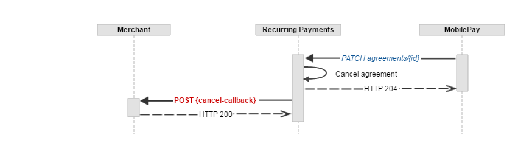
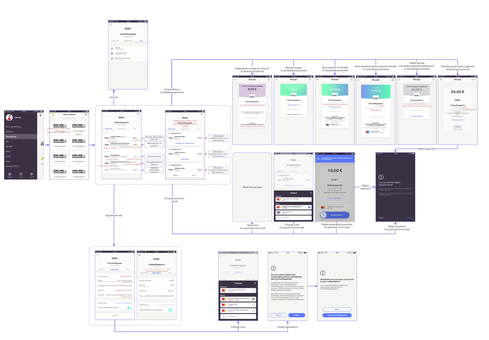
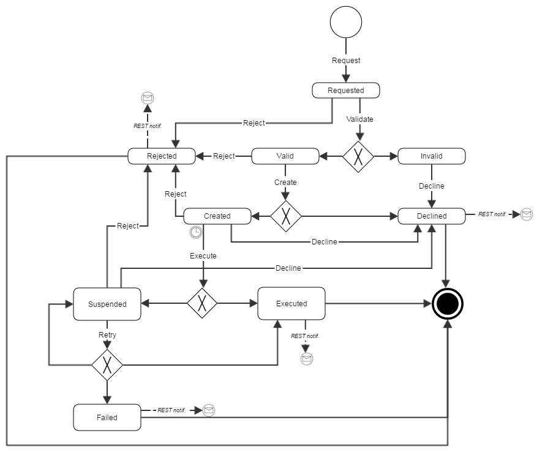

## <a name="overview"></a>Overview

Billing your customers has never been easier before. Our MobilePay Subscriptions REST api enables you to:

1. Establish and manage **Agreements** between you, the **Merchant**, and MobilePay **Users**.
2. Create monthly **Subscription Payments** in relation to an established **Agreement** and get notified about the status via REST callbacks. **Subscription Payments** are requested 8 days before the actual booking date - no manual user confirmation required!

### Where is Subscription Payments available ?

Here are the countries where you can sign up and receive **Subscription Payments**:
- Denmark
- Norway
- Finland

## <a name="general-notes"></a>General notes 

MobilePay Subscriptions is a full-fledged HTTPS REST api using JSON as request/response communication media.

All dates and time-stamps use the ISO 8601 format: date format - `YYYY-MM-DD`, date-time format - `YYYY-MM-DDTHH:mm:ssZ`.

Amounts are enquoted with double quotation marks using `0.00` format, decimals separated with a dot.

When doing `POST`, `PATCH` or `PUT` requests, `Content-Type: application/json` HTTP header must be provided.

```console 
$ curl --request POST --header 'Content-Type: application/json' --url https://<mobile-pay-root>/resource --data '{}'
```

API version is set using the `api-version` query parameter.

```console 
$ curl --url https://<mobile-pay-root>/resource?api-version=1.1 --request POST --header 'Content-Type: application/json' --data '{}'
```

#### Authentication

All requests to the API must contain a client certificate and at least two authentication headers - `x-ibm-client-id` and `x-ibm-client-secret` in order to authenticate to the API.

```console
$ curl --cert /path/to/cert.pem --header 'x-ibm-client-id: client-id' --header 'x-ibm-client-secret: client-secret' --url https://<mobile-pay-root>/api/merchants/me/resource
```

##### <a name="client-certificate"></a>Client certificate for mutual SSL

In order to be authenticated to our REST services you have to provide a self-signed client certificate, which can be generated either using `makecert.exe` or `OpenSSL`. __Note, that the certificate is valid for 2 years and will have to be regenerated after it expires.__

Generate two certificates for Sandbox and Production environments:
>* Sandbox: set {environment} to Sandbox
>* Production: leave {environment} blank.

Send the generated *.cer (or *.crt, if you use OpenSSL) files to [help@mobilepay.dk](mailto:help@mobilepay.dk) and store the *.pfx file in a secure private key storage on your end.

##### Using makecert.exe to generate client certificate
```
makecert.exe ^
 -n "CN={your company name} - Recurring Payments - {environment}" ^
 -sky exchange ^
 -eku 1.3.6.1.5.5.7.3.2 ^
 -r ^
 -pe ^
 -a sha512 ^
 -len 2048 ^
 -m 24 ^
 -sv {environment}RecurringPayments{your company name}.pvk ^
 {environment}RecurringPayments{your company name}.cer
```

Export private key to pfx:
```
pvk2pfx.exe ^ 
 -pvk {environment}RecurringPayments{your company name}.pvk ^
 -spc {environment}RecurringPayments{your company name}.cer ^
 -pfx {environment}RecurringPayments{your company name}.pfx
```

##### Using OpenSSL to generate client certificate

```console
$ openssl req -x509 -nodes -sha512 -newkey rsa:2048 -keyout {environment}RecurringPayments{your company name}.pvk -out {environment}RecurringPayments{your company name}.crt -days 730
```
Enter `{your company name} - Recurring Payments - {environment}` for Common Name, when asked.

Export private key to pfx:
```console
$ openssl pkcs12 -export -in {environment}RecurringPayments{your company name}.crt -inkey {environment}RecurringPayments{your company name}.pvk -CSP "Microsoft Enhanced RSA and AES Cryptographic Provider" -out {environment}RecurringPayments{your company name}.pfx
```

#### Errors

You might encounter the following HTTP errors:

1. `400 - Bad Request` , if request data is invalid.
>    
    ```json
    {
        "error": "BadRequest",
        "error_description": {
            "message": "request.Name is required",
            "error_type": "InputError",
            "correlation_id": "f4b02597-32cc-420f-a468-942307e89a97"
        }
    }
    ```
2. `404 - Not Found` with no response body, if the resource (agreement or payment) is not found.

3. `412 - Precondition Failed` , if business validation rule was violated.
>    
    ```json
    {
        "error": "PreconditionFailed",
        "error_description": {
            "message": "Duplicate payment.",
            "error_type": "PreconditionError",
            "correlation_id": "f4b02597-32cc-420f-a468-942307e89a97"
        }
    }
    ```
4. `500 - Internal Server Error` , if something really bad has happened.
>    
    ```json
    {
        "error": "InternalServerError",
        "error_description": {
            "message": "An error occurred, please try again or contact the administrator.",
            "error_type": "ServerError",
            "correlation_id": "f4b02597-32cc-420f-a468-942307e89a97"
        }
    }
    ```

#### REST request correlation

_CorrelationId_ is an optional _[Guid](https://en.wikipedia.org/wiki/Globally_unique_identifier)_ header value which can be used to link requests on your back-end system to MobilePay Subscriptions business transaction for a more convenient debugging.

```console
$ curl --header 'CorrelationId: 37b8450b-579b-489d-8698-c7800c65934c' --url https://<mobile-pay-root>/api/merchants/me/agreements
```

#### REST callback authentication

Use one of these endpoints to set REST callback authentication scheme and credentials:
* `PUT /api/merchants/me/auth/oauth2` - set OAuth2 scheme which conforms to RFC 6749 [section 4.4.](https://tools.ietf.org/html/rfc6749#section-4.4).
* `PUT /api/merchants/me/auth/basic` - set Basic auth scheme using username and password.
* `PUT /api/merchants/me/auth/apikey` - set a value which will be set to the _Authorization_ header. API key must conform to the token68 specification as defined in RFC 7235 [section2.1.](https://tools.ietf.org/html/rfc7235#section-2.1).

#### REST callback retries

In case the REST callback failed, 8 retries will be made using the [exponential back-off algorithm](https://en.wikipedia.org/wiki/Exponential_backoff), where N - next retry time, c - retry attempt number, R - second retry time in seconds (1st retry is an exception and is done after 5 seconds):


* 1st retry – 5 seconds
* 2nd retry – 10 minutes after 1st retry
* 3rd retry – 30 minutes after 2nd retry
* 4th retry – 1h 10 minutes after 3rd retry
* 5th retry – 2h 30 minutes after 4th retry
* 6th retry – 5h 10 minutes after 5th retry
* 7th retry – 10h 30 minutes after 6th retry
* 8th retry – 21h 10 minutes after 7th retry

* * *

## <a name="agreements"></a>Agreements

Once the user is given to choose the payment method on the merchant's signup flow, an additional "*Pay with MobilePay*" button should be shown for the user to be able to click on. When user clicks on this button, merchant's back-end system must call the `POST /api/merchants/me/agreements` endpoint in order to create a *Pending* Subscription **Agreement**, which can only be activated by the MobilePay user through the app. 

```json
{
  "external_id": "AGGR00068",
  "amount": "10",
  "currency": "DKK",
  "description": "Monthly subscription",
  "next_payment_date": "2017-03-09",
  "frequency": 12,
  "links": [
    {
      "rel": "user-redirect",
      "href": "https://example.com/1b08e244-4aea-4988-99d6-1bd22c6a5b2c"
    },
    {
      "rel": "success-callback",
      "href": "https://example.com/1b08e244-4aea-4988-99d6-1bd22c6a5b2c"
    },
    {
      "rel": "cancel-callback",
      "href": "https://example.com/1b08e244-4aea-4988-99d6-1bd22c6a5b2c"
    }
  ],
  "country_code": "DK",
  "plan": "Basic",
  "expiration_timeout_minutes": 5,
  "mobile_phone_number": "4511100118"
}
```

The *Pending* **Agreement**, if not activated, will expire within the value, provided in the _expiration_timeout_minutes_.

#### Request parameters

|Parameter             |Type        |Required  |Description                                                      |Valid values|
|:---------------------|:-----------|:---------|:----------------------------------------------------------------|:-----------|
|**amount**            |number(0.00)|          |*__Agreement__ amount, which will be displayed for the user in the MobilePay app.*|>= 0.00, decimals separated with a dot.|
|**currency**          |string(3)   |required |*The __Agreement__ currency code, that will be displayed for the use in the MobilePay app. Currency and country_code must match a valid pair of: DKK->DK, NOK->NO, EUR->FI.*|DKK, NOK, EUR|
|**country_code**      |string(2)   |required |*Country code, which will be used to differentiate between MobilePay DK, NO and FI apps.*|DK, NO, FI|
|**plan**              |string(30)  |required |*Short __Agreement__ information text, that will be displayed on the __Agreement__ screen. (examples: "Basic" / "Premium").*||
|**description**       |string(60)  |          |*Additional information provided by the merchant to the user, that will be displayed on the __Agreement__ screen.*||
|**next_payment_date** |date        |          |*The date of the first scheduled __Payment Request__. This will be displayed on the __Agreement__ creation screen and on the __Agreement__ details screen if first payment date > current date.*|ISO date format: yyyy-MM-dd|
|**frequency**         |int         |required |*Frequency of __Payment Requests__. This value will be used to divide the amount of days in a year to get a frequency in days (e.g. 365 / 12 = 30.4 - approx. every month.)*|1, 2, 4, 12 or 26|
|**external_id**       |string      |required |*__Agreement__ identifier on the merchant's side. This will be included in the request body of the success / cancel callback.*||
|**expiration_timeout_minutes**|int |required |*Agreement expiration timeout in minutes.*|Min: 5, max: 20160 (2 weeks)|
|**links**             |string      |required |*Link relation of the __Agreement__ creation sequence. Must contain 3 values for user redirect, success callback and cancel-callback links.*||
|**links[].rel**       |string      |required |*Link relation type.*|user-redirect, success-callback, cancel-callback|
|**links[].href**      |string      |required |*Link relation hyperlink reference.*|https://&lt;merchant's url&gt;|


The response of `POST /api/merchants/me/agreements` contains two values: a unique *id* of the newly created *Pending* **Agreement** and a link *rel* = *mobile-pay*.

```json
{
  "id": "1b08e244-4aea-4988-99d6-1bd22c6a5b2c",
  "links": [
    {
      "rel": "mobile-pay",
      "href": "https://<mobile-pay-landing-page>/?flow=agreement&id=1b08e244-4aea-4988-99d6-1bd22c6a5b2c&redirectUrl=https%3a%2f%2fwww.example.com%2fredirect&countryCode=DK&mobile=4511100118"
    }
  ]
}
```
 
* The *id* value can be used on the merchant's back-end system to map a Subscription agreement with a specific user on the merchant's side, and subsequently to create new **Payment Requests** on behalf of the user who confirmed the agreement in MobilePay. 
* The link *rel = mobile-pay* value contains the hyperlink reference address, which is structured in the following way: _https://&lt;mobile-pay-landing-page&gt;/?**id**=318a0bf9-9039-400c-b5ff-6ec717da2971&**countryCode**=DK_. The _id_ property is of type **guid** and uniquely identifies the pending Subscription **Agreement** for the app to get the details and subsequently do an accept request. The _countryCode_ property is used to differentiate between DK, NO and FI apps.

The link can be used in two ways:

1. Redirect the user automatically using the HTTP response **302** or **303**. Once the user is redirected, the MobilePay app will be opened to activate the *Pending* **Agreement**. In this case, it is recommended to set the *expiration_timeout_minutes* value to 5 minutes.
2. E-mail the generated link to the user. Once the user clicks on the link, the MobilePay app will be opened to activate the *Pending* **Agreement**. In this case, it is recommended to set the *expiration_timeout_minutes* to a higher value (10080 - a week, 20160 - two weeks). Note, that the link will be valid only until the user accepts the agreement or a timeout occurs. 

#### Agreement creation

[](assets/images/RecurringPayments_DualDevice.png)
[](assets/images/RecurringPayments_SingleDevice.png)

#### Callbacks

When the **Agreement's** status changes from *Pending* we will do a callback to the merchant's system (see the sequence diagram below).

The table below shows possible *status*, *status_text* and *status_code* values depending on the **Agreement** status changes.

|New Status|Condition|URL| Callback *status* | Callback *status_text* |Callback *status_code*|
|----------|---------|---|-------------------|------------------------|----------------------|
|Accepted  |_User swiped to accept the Agreement_        |*success-callback* |Active  | |0|
|Rejected  |_User tapped the Cancel button during the signup_              |*cancel-callback*  |Rejected|Agreement rejected by user|40000|
|Expired   |_User did not do anything during the agreement timeout period._|*cancel-callback*  |Expired |Pending agreement expired|40001|
|Canceled  |_User canceled an Active agreement_          |*cancel-callback*  |Canceled|Agreement canceled by user|40002|
|Canceled  |_Merchant canceled an Active agreement_      |*cancel-callback*  |Canceled|Agreement canceled by merchant|40003|
|Canceled  |_System canceled an Active agreement because user was Deleted_ |*cancel-callback*  |Canceled|Agreement canceled by system|40004|

##### Agreement state diagram


##### Other callback properties

|Name            |Type        |Description                                           |Format|
|----------------|------------|------------------------------------------------------|------|
|**agreement_id**|guid        |Subscription agreement ID on the MobilePay side.||
|**external_id** |string      |Agreement ID on the merchant's side                   ||
|**timestamp**   |datetime    |Timestamp when the status change occurred.            |ISO 8601 UTC date and time format: YYYY-MM-DDThh:mm:ssZ|

##### Agreement callback request example

```json
{
    "agreement_id" : "63679ab7-cc49-4f75-80a7-86217fc105ea",
    "status" : "Canceled",
    "status_text" : "Canceled by user",
    "status_code" : "40000",
    "external_id" : "SF0000568",
    "timestamp" : "2016-09-29T09:50:39Z"
}
```

##### Agreement callback response properties

|Name               |Description|
|-------------------|-----------|
|**agreement_id**   |Subscription agreement ID on the MobilePay side.|
|**status_code**    |Status code on merchant's system|
|**status_text**    |Description of the status.|
|**transaction_id** |Unique identifier of the transaction on the merchant's system.|

*status_code* can have the following values:
* 0 - success (*HTTP response 200 - OK*)
* 1xxx - validation error (*HTTP response 400 - Bad Request*) 
* 2xxx - business error  (*HTTP response 400 - Bad Request*)
* 3xxx - technical error  (*HTTP response 500 - Internal Server Error*)

The callback response properties are optional.
In case of technical errors (HTTP response is not 2xx), we will try to re-POST the callback.

##### Agreement callback response example
```json
{
    "agreement_id" : "63679ab7-cc49-4f75-80a7-86217fc105ea",
    "status_code" : "3000",
    "status_text" : "Server is down",
    "transaction_id" : "63679ab7-cc49-4f75-80a7-86217fc105ea"
}
```

When the **Agreement** activation is complete or canceled, the user will be navigated to the link *rel = user-redirect* to finalize the signup.

#### Agreement creation sequence diagram


#### When merchant cancels agreement - sequence diagram


#### When user cancels a Pending agreement during signup - sequence diagram



#### When user cancels an Active agreement - sequence diagram


* * *

## <a name="subscription-payments"></a>Subscription Payments

When the **Agreement** between **Merchant** and MobilePay **User** is established, use the `POST /api/merchants/me/paymentrequests` endpoint to en-queue **Subscription Payments**. This service accepts a JSON array of individual **Subscription Payments** to be processed asynchronously. Notice that the **Subscription Payments** payload does not contain a currency code - this will be fetched from the **Agreement** using the provided *agreement_id*.

```json
[
    {
        "agreement_id": "fda31b3c-794e-4148-ac00-77b957a7d47f",
        "amount": "10.99",
        "due_date": "2017-03-09",
        "next_payment_date": "2017-04-09",
        "external_id": "PMT000023",
        "description": "Monthly payment"
    }
]
```

#### Request parameters

|Parameter             |Type        |Required  |Description                                                      |Valid values|
|----------------------|------------|----------|-----------------------------------------------------------------|------------|
|**agreement_id**      |guid        | required |*The Subscription __Agreement__ identifier that maps a __Merchant__ to a MobilePay __User__.*||
|**amount**            |number(0.00)| required |*The requested amount to be paid.*|>= 0.00, decimals separated with a dot.|
|**due_date**          |date        | required |*Payment due date. Must be at least 8 days in the future, otherwise the __Subscription Payment__ will be declined.*|ISO date format: yyyy-MM-dd|
|**next_payment_date** |date        |          |*Next __Subscription Payment's__ due date, to be shown to the user in the __Agreement__ details.*|ISO date format: yyyy-MM-dd|
|**external_id**       |string      | required |*The identifier of a specific payment in the external merchant's system.*||
|**description**       |string(60)  | required |*Additional information of the __Subscription Payment__.*||

The `POST /api/merchants/me/paymentrequests` service returns HTTP 202 - Accepted response if at least one payment is provided in the request payload.

The response body containts two lists:
* **pending_payments** - a map of newly generated Subscription payment ID and the external ID, that where accepted for processing and now are in a _Pending_ state.
* **rejected_payments** - a list of rejected payments. This can only occur if any of the mandatory fields are missing or do not conform to the format rule. Business logic validations are done asynchronously in the back-end (for example, checking if due-date conforms to 8 day rule).


##### HTTP 202 Response body example
```json
{
    "pending_payments": [{
            "payment_id": "263cfe92-9f8e-4829-8b96-14a5e53c9041",
            "external_id": "PMT000023"
        }
    ],
    "rejected_payments": [{
            "external_id": "PMT000023",
            "error_description": "The Amount field is required."
        }
    ]
}
```

#### Payment screens

[](assets/images/RecurringPayments_Details.png)

#### <a name="subscription-payments_callbacks"></a>Callbacks

Once the payment status changes from *Pending* to *Executed, Declined, Rejected* or *Failed*, a callback will be done to the callback address, which is configurable via `PATCH /api/merchants/me` with path value `/payment_status_callback_url`. 

```json
[
    {
        "value": "https://example.com",
        "path": "/payment_status_callback_url",
        "op": "replace"
    }
]
```

|New Status|Condition|When to expect|Callback *status*  | Callback *status_text* | Callback *status_code* |
|----------|---------|--------------|-------------------|------------------------|------------------------|
|Executed  |_The payment was successfully executed on the due-date_| After 03:15 in the morning of the due-date |Executed  | | 0 |
|Failed    |_Payment failed to execute during the due-date._| After 23:59 of the due-date |Failed    | | 50000 |
|Rejected  |_User rejected the Pending payment in MobilePay_       | Any time during the 8 day period when user is presented with the Pending payment in the MobilePay activity list. |Rejected  |Rejected by user.| 50001 | 
|Declined  |_Merchant declined the Pending payment via the API_       | Any time during the 8 day period when user is presented with the Pending payment in the MobilePay activity list. |Declined  |Declined by merchant.| 50002 | 
|Declined  |_**Agreement** is not in Active state._                | Right after the payment request was received. |Declined  |Declined by system: Agreement is not "Active" state.| 50003 | 
|Declined  |_If the **Agreement's** frequency period has not passed since the last *Pending* or *Executed* **Payment Request** for that Agreement. Monthly agreements have a 1 week tolerance level._| Right after the payment request was received. |Declined  |Declined by system: Another payment is already due.| 50004 | 
|Declined  |When the **Agreement** was canceled by merchant or by system | Any time during the 8 day period when user is presented with the Pending payment in the MobilePay activity list.  |Declined  |Declined by system: Agreement was canceled. | 50005 | 
|Rejected  |When the **Agreement** was canceled by user | Any time during the 8 day period when user is presented with the Pending payment in the MobilePay activity list.  |Rejected  |Declined by system: Agreement was canceled. | 50005 | 
|Declined  |A catch-all error code when payment was declined by core system.| Right after the payment request was received. |Declined  | Declined by system. | 50006 | 

##### Payment state diagram



##### Other callback properties

|Name            |Type        |Description                                           |Format|
|----------------|------------|------------------------------------------------------|------|
|**agreement_id**|guid        |Subscription agreement ID on the MobilePay side.||
|**payment_id**  |guid        |Subscription payment ID on the MobilePay side.  ||
|**amount**  	 |number(0.00)|Amount withdrawn from the MobilePay user.             ||
|**currency**  	 |string      |Amount currency (agreement's currency)                ||
|**payment_date**|date        |Date of the batch when the payment was executed.      |ISO 8601 UTC date: YYYY-MM-DD|
|**external_id** |string      |Payment ID on the merchant's side                   ||


##### Payment callback body example
```json
[
    {
        "agreement_id" : "1b08e244-4aea-4988-99d6-1bd22c6a5b2c",
        "payment_id" : "c710b883-6ed6-4506-9599-490ead89525a",
        "amount" : "10.20",
        "currency" : "DKK",
        "payment_date" : "2016-09-29",
        "status" : "Rejected",
        "status_text" : "Rejected by user.",
        "status_code" : "50001",
        "external_id" : "SFPMT134560"
    }
]
```

##### Payment callback response properties

An array containing the following properties.

|Name               |Description|
|-------------------|-----------|
|**payment_id**     |Subscription payment ID on the MobilePay side.|
|**status_code**    |Status code on merchant's system|
|**status_text**    |Description of the status.|
|**transaction_id** |Unique identifier of the transaction on the merchant's system.|

*status_code* can have the following values:
* 0 - success (*HTTP response 200 - OK*)
* 1xxx - validation error (*HTTP response 400 - Bad Request*) 
* 2xxx - business error  (*HTTP response 400 - Bad Request*)
* 3xxx - technical error  (*HTTP response 500 - Internal Server Error*)

The callback response properties are optional.
In case of technical errors (HTTP response is not 2xx), we will try to re-POST the callback.

##### Payment callback response example
```json
[
    {
        "payment_id" : "63679ab7-cc49-4f75-80a7-86217fc105ea",
        "status_code" : "3000",
        "status_text" : "Server is down.",
        "transaction_id" : "63679ab7-cc49-4f75-80a7-86217fc105ea"
    }
]
```

#### Update existing Payment Request

Use the `PATCH /api/merchants/me/paymentrequests/{paymentId}` endpoint to decrease the requested amount to be paid.

```json
[
    {
        "value": "10.01",
        "path": "/amount",
        "op": "replace"
    }
]
```

***
## <a name="oneoffpayments"></a>One-Off Payments

As of `1.1` version, you are able to:
* Create agreements with an initial payment.
* Request arbitrary one-off payments on an existing agreement. These must be manually confirmed by the user. 

#### Request One-Off Payment With a New Agreement

Add a `one_off_payment` property to the `POST /api/merchants/me/agreements?api-version=1.1` request payload if you want the agreement being activated only when the user is successfully charged an initial subscription amount.

```json
{
  "external_id": "AGGR00068",
  "amount": "10",
  "currency": "DKK",
  "description": "Monthly subscription",
  "next_payment_date": "2017-03-09",
  "frequency": 12,
  "links": [
    {
      "rel": "user-redirect",
      "href": "https://example.com/1b08e244-4aea-4988-99d6-1bd22c6a5b2c"
    },
    {
      "rel": "success-callback",
      "href": "https://example.com/1b08e244-4aea-4988-99d6-1bd22c6a5b2c"
    },
    {
      "rel": "cancel-callback",
      "href": "https://example.com/1b08e244-4aea-4988-99d6-1bd22c6a5b2c"
    }
  ],
  "country_code": "DK",
  "plan": "Basic",
  "expiration_timeout_minutes": 5,
  "mobile_phone_number": "4511100118",
  "one_off_payment": 
    {
      "amount": "80",
      "external_id": "OOP00348",
      "description": "Down payment for our services"
    }
}
```

*Newly added request parameters*

|Parameter                        |Type        |Required  |Description                                                      |Valid values|
|:--------------------------------|:-----------|:---------|:----------------------------------------------------------------|:-----------|
|**one_off_payment**              |object      |          |*__One-Off Payment__ details.*||
|**one_off_payment.amount**       |number(0.00)|required  |*__One-Off Payment__ amount, which will be displayed for the user in the MobilePay app.*|>= 0.00, decimals separated with a dot.|
|**one_off_payment.description**  |string(60)  |required  |*Additional information provided by the merchant to the user, that will be displayed on the __One-off Payment__ screen.*||
|**one_off_payment.external_id**  |string      |          |*__One-Off Payment__ identifier on the merchant's side. This will be included in the request body of the success / cancel callback.*||

In this case the response of `POST /api/merchants/me/agreements?api-version=1.1` will contain additional `one_off_payment_id` value - id of the newly requested **One-Off Payment**.

```json
{
  "id": "1b08e244-4aea-4988-99d6-1bd22c6a5b2c",
  "one_off_payment_id": "2a5dd31f-32c1-4517-925f-9c60ba19f8ca",
  "links": [
    {
      "rel": "mobile-pay",
      "href": "https://<mobile-pay-landing-page>/?flow=agreement&id=1b08e244-4aea-4988-99d6-1bd22c6a5b2c&redirectUrl=https%3a%2f%2fwww.example.com%2fredirect&countryCode=DK&mobile=4511100118"
    }
  ]
}
```

#### Request One-off Payment on an Existing Agreement

Use a `POST /api/merchants/me/agreements/{agreementId}/oneoffpayments?api-version=1.1` endpoint in order to charge your customer one time for extra services. 

```json
{
  "amount": "80",
  "external_id": "OOP00348",
  "description": "Pay now for additional goods",
  "mobile_phone_number": "4511100118",
  "links": [
    {
      "rel": "user-redirect",
      "href": "https://example.com/1b08e244-4aea-4988-99d6-1bd22c6a5b2c"
    }
  ]
}
```

__One-off Payment__ will expire in 1 day if it is not accepted or rejected by the user during that time.

##### Request parameters

|Parameter                     |Type      |Required  |Description                                                      |Valid values|
|:-----------------------------|:---------|:---------|:----------------------------------------------------------------|:-----------|
|**amount**       |number(0.00)|required  |*__One-off Payment__ amount, which will be displayed for the user in the MobilePay app.*|>= 0.00, decimals separated with a dot.|
|**description**  |string(60)  |required  |*Additional information provided by the merchant to the user, that will be displayed on the __One-off Payment__ screen.*||
|**external_id**  |string      |          |*__One-off Payment__ identifier on the merchant's side. This will be included in the request body of the success / cancel callback.*||
|**links**        |string      |required  |*Link relation of the __One-off Payment__ creation sequence. Must contain 1 value for user redirect.*||
|**links[].rel**  |string      |required  |*Link relation type.*|user-redirect|
|**links[].href** |string      |required  |*Link relation hyperlink reference.*|https://&lt;merchant's url&gt;|

The response of `POST /ap/merchants/me/agreements/{agreementId}/oneoffpayments?api-version=1.1` contains two values: a unique *id* of the newly requested **One-Off Payment** and a link *rel* = *mobile-pay*.

```json
{
  "id": "07b70fdd-a300-460d-9ba1-aee2c8bb4b63",
  "links": [
    {
      "rel": "mobile-pay",
      "href": "https://<mobile-pay-landing-page>/?flow=agreement&id=1b08e244-4aea-4988-99d6-1bd22c6a5b2c&oneOffPaymentId=07b70fdd-a300-460d-9ba1-aee2c8bb4b63&redirectUrl=https%3a%2f%2fwww.example.com%2fredirect&countryCode=DK&mobile=4511100118"
    }
  ]
}
```
 
* The *id* value can be used on the merchant's back-end system to map a one-off payment with a specific Subscription agreement on the merchant's side, and subsequently to capture a requested **One-Off Payment** when MobilePay user accepts it. 
* The link *rel = mobile-pay* hyperlink reference must be used to redirect the user automatically using an HTTP response 302 or 303. Once the user is redirected, the MobilePay app will be opened to confirm the __One-off Payment__.

##### Callbacks

Once the one-off payment status changes from *Requested* to *Reserved*, *Rejected* or *Expired*, a callback will be done to the callback address, which is configurable via `PATCH /api/merchants/me` with path value `/payment_status_callback_url`. The same way as with [callbacks](../#subscription-payments_callbacks) for regular payment requests.

|New Status|Condition|When to expect|Callback *status*  | Callback *status_text* | Callback *status_code* |
|----------|---------|--------------|-------------------|------------------------|------------------------|
|Reserved  |_The one-off payment was accepted by user and money is reserved for you on his card. You can now capture the money._| After user accepts the requested one-off payment. |Reserved| Payment successfully reserved. | 0 |
|Rejected  |_User rejected one-off payment request in MobilePay._ | Right after user rejects one-off payment. |Rejected  |Rejected by user.| 50001 |
|Expired   |_One-off payment was neither accepted, nor rejected by user._| 1 day after you requested one-off payment |Expired|Expired by system.| 50008 |

#### One-off payment state diagram


#### Capture Reserved One-Off Payment

When you receive a callback about successfully reserved payment, now it's time to capture your money. You can do that by making a call to `POST /api/merchants/me/agreements/{agreementId}/oneoffpayments/{paymentId}/capture?api-version=1.1` endpoint. If the HTTP response is `204 - No Content`, it means that the money was transfered to your account.

#### Cancel One-Off Payment Request/Reservation

In case you weren't able to deliver goods or any other problem occur, you can always cancel one-off payment until it's not captured or expired. You can do that by making a call to `DELETE /api/merchants/me/agreements/{agreementId}/oneoffpayments/{paymentId}?api-version=1.1` endpoint. If the HTTP response is '204 - No Content', it means that one-off payment request/reservation was canceled.

It is **mandatory** for the merchant to Capture/Cancel one-off payment if it was reserved on a customer account.

***
## <a name="refunds"></a>Refunds

As of 1.2 version, you are able to initiate:

**Full refund** - 100% of the amount paid is returned to the payer.<br />
**Partial refund** - An amount up to the net (the amount the merchant received) will be returned to the payer. Multiple partial refunds can be made.

#### Request a Refund
Use the `POST /api/merchants/me/agreements/{agreementId}/payments/{paymentId}/refunds` endpoint to request a **Refund**.

```json
{
    "amount": "10.99",
    "status_callback_url" : "https://example.com"
}
```

#### Request parameters

|Parameter             |Type        |Required  |Description                                                      |Valid values|
|----------------------|------------|----------|-----------------------------------------------------------------|------------|
|**amount**            |number(0.01)| required |*The requested amount to be returned.*|>= 0.01, decimals separated with a dot.|
|**status_callback_url**  |string| required |*Link relation hyperlink reference.*|https://&lt;merchant's url&gt;|


The `POST /api/merchants/me/agreements/{agreementId}/payments/{paymentId}/refunds` service returns HTTP 202 and the response contains single value: a unique *id* of the newly created **Refund**.

##### HTTP 202 Response body example
```json
{
    "id": "263cfe92-9f8e-4829-8b96-14a5e53c9041"
}
```

#### Callbacks

When the **Refund's** status changes from *Requested* we will do a callback to the callback address provided in request parameter `status_callback_url`.

##### Refund callback body example
```json
[
    {
        "refund_id" : "4bb9b33a-f34a-42e7-9143-d6eabd9aae1d",
        "agreement_id" : "1b08e244-4aea-4988-99d6-1bd22c6a5b2c",
        "payment_id" : "c710b883-6ed6-4506-9599-490ead89525a",
        "amount" : "10.99",
        "currency" : "DKK",
        "status" : "Refunded",
        "status_text" : null,
        "status_code" : 0
    }
]
```
##### Refund callback response example
```json
[
    {
        "refund_id" : "4bb9b33a-f34a-42e7-9143-d6eabd9aae1d",
        "agreement_id" : "1b08e244-4aea-4988-99d6-1bd22c6a5b2c",
        "payment_id" : "c710b883-6ed6-4506-9599-490ead89525a",
        "status_code" : "3000",
        "status_text" : "Server is down.",
        "transaction_id" : "63679ab7-cc49-4f75-80a7-86217fc105ea"
    }
]
```

Refund screens within mobile application:


> Refunds will work for payments from 2017-06-26
