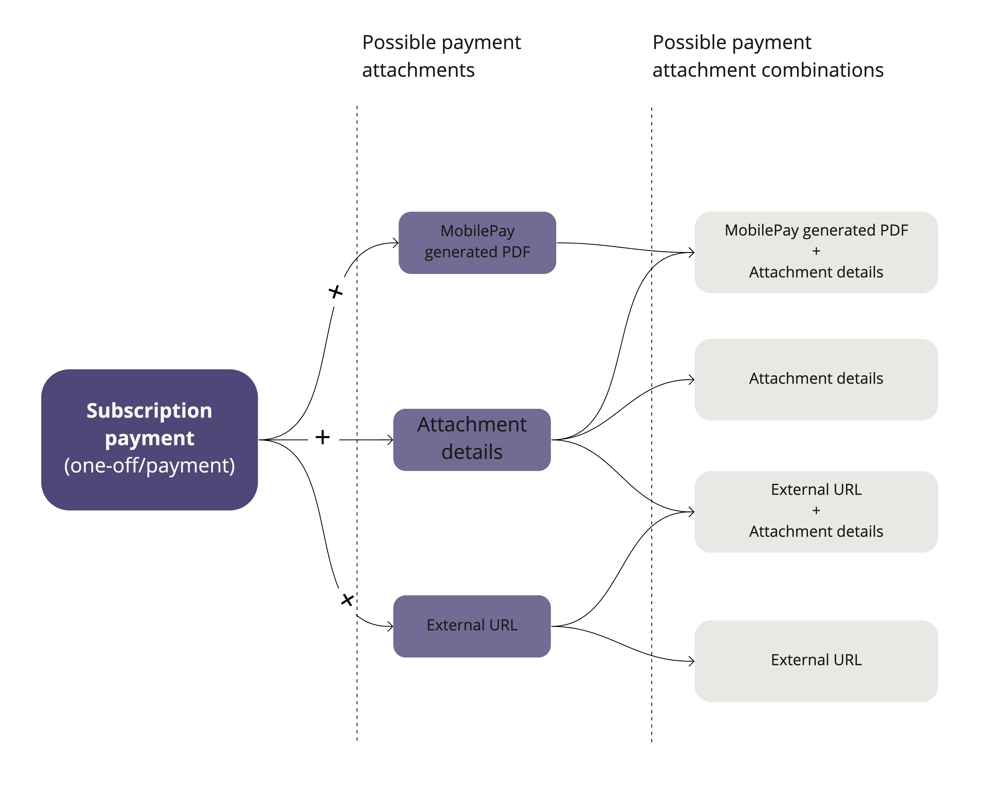
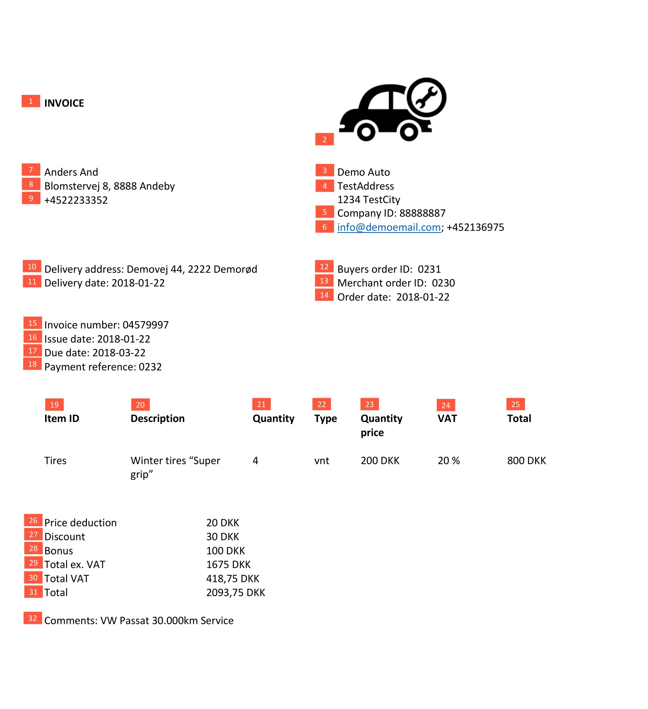

## <a name="attachments"></a>Payment attachments V2

The purpose of payment attachments V2 is to replace existing invoice PDF functionality and to offer more flexibility for the merchant. With this new functionality you will be able to choose how attachment will be presented to the user:
- External URL. Your own link to the payment document.
- Attachment details. Extra payment details.
- MobilePay generated PDF. PDF document generated from the attachment details.

[](assets/images/attachment_combinations.png)

The old way how we create invoice PDF attachments remains, but will be deprecated by the end of 2021.

### <a name="requests"></a>Create & Update 

Payment attachments on top of the payment can be created with a separate request:

`PUT /api/providers/{providerId}/payments/{paymentId}/attachment`
```json
{
    "external_attachment_url" : "https://example.com/link/to/e_g_invoice/12345/pdf",
    "generate_pdf" : false,
    "attachment_details" : {
        "document_title": "Company's Faktura",
        "hide_payment_point_address": false,
        "consumer_name": "John Johnson",
        "consumer_phone_number": "+4544667788",
        "total_amount": 10,
        "total_vat_amount": 10,
        "total_amount_ex_vat": 9,
        "issue_date": "2018-08-22",
        "invoice_number": "58652",
        "order_date": "2018-08-22",
        "due_date": "2018-08-22",
        "consumer_address_lines": [
            "Paradisæblevej 13",
            "CC-1234 Andeby",
            "Wonderland"
        ],
        "articles": [
            {
                "article_number": "456",
                "article_description": "Lorem ipsum dolor sit amet",
                "vat_rate": 25,
                "total_vat_amount": 25,
                "total_price_including_vat": 25,
                "unit": "pcs",
                "quantity": 6,
                "price_per_unit": 60
            }
        ],
        "price_reduction": 1.2,
        "price_discount": 2,
        "bonus": 5,
        "merchant_contact_name": "Some Company",
        "delivery_address_lines": [
            "Østerbrogade 120",
            "CC-1234 Andeb"
        ],
        "payment_reference": "ABCD1234",
        "delivery_date": "2018-08-22",
        "merchant_order_number": "ABCD1234",
        "buyer_order_number": "ABCD1234",
        "comment": "Lorem ipsum dolor sit amet, eros faucibus aliqua erat aliquam odio vitae."
    }
}
```

You are able to provide your own URL link to payment document by passing it as `external_attachment_url` value.
If you want MobilePay to generate PDF for you, you simply set `generate_pdf` to __true__ in the request and fill `attachment_datails` with values which will be used to generate the PDF file. 
You can also provide `attachment_details` without generating PDF file, details will be visible in MobilePay payment receipt and confirmation screens.

`generate_pdf` cannot be set to __true__ when `external_attachment_url` is provided. 

Every subsequent request will overwrite the previous one.


We reduced the amount of mandatory fields in `attachment_datails`:

|Parameter                   |Sub Parameter            |Type        |Description                                                                  |Requirement      |
|----------------------------|-------------------------|------------|-----------------------------------------------------------------------------|-----------------|
| document_title             |                           | string(60) | Used as document title in PDF document.                                     | Optional        |
| hide_payment_point_address |                           | boolean    | Hides payment point address. Default is __false__.                          | Optional        |
| consumer_name              |                           | string     | Full name of the user.                                                      | Optional        |
| consumer_phone_number      |                           | string     | Mobile phone number of MobilePay user.                                      | Optional        |
| total_amount               |                           | decimal    | The requested amount to be paid.                                            | Required        |
| total_vat_amount           |                           | decimal    | Total VAT amount.                                                           | Optional        |
| total_amount_ex_vat        |                           | decimal    | Total amount excluding VAT.                                                 | Optional        |
| issue_date                 |                           | date       | Issue date of the document.                                                 | Optional        |
| invoice_number             |                           | string     | Invoice number for invoice documents.                                       | Optional        |
| order_date                 |                           | date       | Order date.                                                                 | Optional        |
| due_date                   |                           | date       | Payment due date.                                                           | Optional        |
| consumer_address_lines     |                           | string[]   | Address of consumer receiving the document.                                 | Optional        |
| articles                   |                           | array      | __At least one array element is required.__                                 | Required        |
|                            | article_number            | string     | Article number, e.g.: 123456ABC.                                            | Optional        |
|                            | article_description       | string     | Article description.                                                        | Required        |
|                            | vat_rate                  | decimal    | VAT rate of an article.                                                     | Optional        |
|                            | total_vat_amount          | decimal    | Total VAT amount of an article.                                             | Optional        |
|                            | total_price_including_vat | decimal    | Total price of an article including VAT. Can be negative.                   | Required        |
|                            | unit                      | string     | Unit, e.g.: pcs, coli, kg, m.                                               | Optional        |
|                            | quantity                  | decimal    | Quantity of an article.                                                     | Optional        |
|                            | price_per_unit            | decimal    | Price per unit.                                                             | Optional        |
| price_reduction            |                           | decimal    | Price reduction.                                                            | Optional        |
| price_discount             |                           | decimal    | Price discount.                                                             | Optional        |
| bonus                      |                           | decimal    | Bonus.                                                                      | Optional        |
| merchant_contact_name      |                           | string     | Contact name of the individual who issued the document.                     | Optional        |
| delivery_address_lines     |                           | string[]   | Delivery address.                                                           | Optional        |
| payment_reference          |                           | string(60) | Any extra reference to be presented in the generated PDF file.              | Optional        |
| delivery_date              |                           | date       | Delivery date of the document.                                              | Optional        |
| merchant_order_number      |                           | string     | The merchant order number for the document used internally by the merchant. | Optional        |
| buyer_order_number         |                           | string     | The buyer order number for the document used internally by the merchant.    | Optional        |
| comment                    |                           | string     | Additonal information for the consumer. "\n" can be used for a line break, e.g.: "First line. \nSecond line." | Optional        |

### <a name="reviewdelete"></a>Review & Delete 

`GET /api/providers/{providerId}/payments/{paymentId}/attachment` to get the details of the payment attachment.


`GET /api/providers/{providerId}/payments/{paymentId}/attachment/pdf` to download PDF attachment(if it was created).


`DELETE /api/providers/{providerId}/payments/{paymentId}/attachment` to delete payment attachment.

### <a name="pdfexamples"/> PDF invoice examples

This is the example of how your data will look like to user in the MobilePay, when it is generated to PDF file.

[](assets/images/pdf.jpg)

| Marking from<br>an example | Mapping Subscriptions                                                   | EN                | DK                    | FI                   |
|----------------------------|-------------------------------------------------------------------------|-------------------|-----------------------|----------------------|
|                          1 | document_title                                                          | N/A               | N/A                   | N/A                  |
|                          2 | Subscription provider logo                                              | N/A               | N/A                   | N/A                  |
|                          3 | Subscription provider name                                              | N/A               | N/A                   | N/A                  |
|                          4 | Subscription provider address                                           | N/A               | N/A                   | N/A                  |
|                          5 | Merchant CVR                                                            | Company ID        | CVR                   | Y-tunnus             |
|                          6 | merchant_contact_name                                                   | N/A               | N/A                   | N/A                  |
|                          7 | consumer_name                                                           | N/A               | N/A                   | N/A                  |
|                          8 | consumer_address_lines                                                  | N/A               | N/A                   | N/A                  |
|                          9 | consumer_phone_number                                                   | N/A               | N/A                   | N/A                  |
|                         10 | delivery_address_lines                                                  | Delivery address  | Leveringsadresse      | Toimitusosoite       |
|                         11 | delivery_date                                                           | Delivery date     | Leveringsdato         | Toimituspäivä        |
|                         12 | buyer_order_number                                                      | Buyers order ID   | Købers ordrenummer    | Ostajan tilausnumero |
|                         13 | merchant_order_number                                                   | Merchant order ID | Sælgers ordrenummmer  | Myyjän tilausnumero  |
|                         14 | order_date                                                              | Order date        | Ordredato             | Päivä                |
|                         15 | invoice_number                                                          | Invoice number    | Fakturanummer         | Laskun numero        |
|                         16 | issue_date                                                              | Issue date        | Fakturadato           | Laskun päivä         |
|                         17 | due_date                                                                | Due date          | Betalingsdato         | Eräpäivä             |
|                         18 | payment_reference                                                       | Payment reference | Betalingsreference    | Maksun viite         |
|                         19 | article_number                                                          | Item ID           | Varenummer            | Tuotenumero          |
|                         20 | article_description                                                     | Description       | Beskrivelse           | Kuvaus               |
|                         21 | quantity                                                                | Quantity          | Antal                 | Määrä                |
|                         22 | unit                                                                    | Type              | Enhed                 | Yksikkö              |
|                         23 | price_per_unit                                                          | Quantity price    | Enhedspris            | Yksikköhinta         |
|                         24 | vat_rate                                                                | VAT               | Moms                  | ALV                  |
|                         25 | total_price_including_vat                                               | Total             | Total                 | Yhteensä             |
|                         26 | price_reduction                                                         | Price reduction   | Total prisnedsættelse | Kokonaishinta        |
|                         27 | price_discount                                                          | Discount          | Total rabat           | Alennus              |
|                         28 | bonus                                                                   | Bonus             | Total bonus           | Kokonaisbonus        |
|                         29 | total_amount_ex_vat                                                     | Total ex VAT      | Total uden moms       | Yhteensä ilman ALV   |
|                         30 | total_vat_amount                                                        | Total VAT         | Moms                  | ALV yhteensä         |
|                         31 | total_amount                                                            | Total             | Total                 | Yhteensä             |
|                         32 | comment                                                                 | Comments          | Kommentar             | Kommentit            |

### <a name="attachmentsappscreens"></a>App screens
Payment attachments are represented in payment/one-off confirmation and receipt screens.

MobilePay generated PDF + Attachment details    | Attachment details   
:-------------------------:|:-------------------------:
  |   |

External URL + Attachment details    | External URL   
:-------------------------:|:-------------------------:
  |   |
