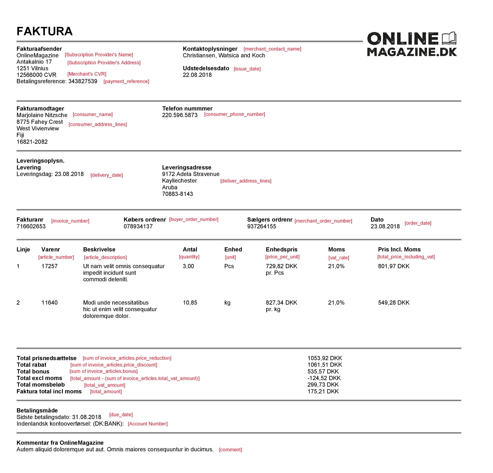

## <a name="invoices"></a>Invoices

### <a name="payment"/> Add invoice details to subscription payment

You can now add invoice details to your payment. These will be shown to the user in the MobilePay app. Also we will generate a PDF file that will also be accessible to the user from the MobilePay.

All you need to do is attach an [invoice object](#invoice_object) to the property (which is optional) of current payment object.

```
POST /api/providers/{providerId}/paymentrequests
```

```json
[
    {
        "agreement_id": "fda31b3c-794e-4148-ac00-77b957a7d47f",
        "amount": "10.99",
        "due_date": "2017-03-09",
        "next_payment_date": "2017-04-09",
        "external_id": "PMT000023",
        "description": "Monthly payment"
        "invoice": {
            "consumer_name": "John Johnson",
            "consumer_phone_number": "+4544667788",
            "total_amount": 10,
            "total_vat_amount": 10,
            "issue_date": "2018-08-22",
            "invoice_number": "58652",
            "order_date": "2018-08-22",
            "due_date": "2018-08-22",
            "consumer_address_lines": [
                "Paradisæblevej 13",
                "CC-1234 Andeby",
                "Wonderland"
            ],
            "invoice_articles": [
                "article_number": "456",
                "article_description": "Lorem ipsum dolor sit amet",
                "vat_rate": 25,
                "total_vat_amount": 25
                "total_price_including_vat": 25,
                "unit": "pcs",
                "quantity": 6,
                "price_per_unit": 60,
                "price_reduction": 1.2,
                "price_discount": 2,
                "bonus": 5
            ],
            "merchant_contact_name": "Some Company",
            "delivery_address_lines": [
                "Østerbrogade 120",
                "CC-1234 Andeb"
            ],
            "payment_reference": "ABCD1234",
            "delivery_date": "2018-08-22",
            "merchant_order_number": "ABCD1234",
            "buyer_order_number": "ABCD1234",
            "comment": "Lorem ipsum dolor sit amet, eros faucibus aliqua erat aliquam odio vitae."
        }
    }
]
```

### <a name="oopexistingagreement"/> Add invoice details to one-off payment on an existing agreement.

You can also add invoice details to a one-off payment. They will be shown to the user in the MobilePay app. Also we will generate a PDF file that will also be accessible to the user from the MobilePay.

All you need to do is attach an [invoice object](#invoice_object) to the property (which is optional) of current one-off payment object.

```
POST /api/providers/{providerId}/agreements/{agreementId}/oneoffpayments
```

```json
{
    "amount": "80",
    "external_id": "OOP00348",
    "description": "Pay now for additional goods",
    "links": [
        {
            "rel": "user-redirect",
            "href": "https://example.com/1b08e244-4aea-4988-99d6-1bd22c6a5b2c"
        }
    ],
    "invoice": {
        "consumer_name": "John Johnson",
        "consumer_phone_number": "+4544667788",
        "total_amount": 10,
        "total_vat_amount": 10,
        "issue_date": "2018-08-22",
        "invoice_number": "58652",
        "order_date": "2018-08-22",
        "due_date": "2018-08-22",
        "consumer_address_lines": [
            "Paradisæblevej 13",
            "CC-1234 Andeby",
            "Wonderland"
        ],
        "invoice_articles": [
            "article_number": "456",
            "article_description": "Lorem ipsum dolor sit amet",
            "vat_rate": 25,
            "total_vat_amount": 25
            "total_price_including_vat": 25,
            "unit": "pcs",
            "quantity": 6,
            "price_per_unit": 60,
            "price_reduction": 1.2,
            "price_discount": 2,
            "bonus": 5
        ],
        "merchant_contact_name": "Some Company",
        "delivery_address_lines": [
            "Østerbrogade 120",
            "CC-1234 Andeb"
        ],
        "payment_reference": "ABCD1234",
        "delivery_date": "2018-08-22",
        "merchant_order_number": "ABCD1234",
        "buyer_order_number": "ABCD1234",
        "comment": "Lorem ipsum dolor sit amet, eros faucibus aliqua erat aliquam odio vitae."
    }
}
```

### <a name="oopnewagreement"/> Add invoice details to one-off payment with a new agreement.

You can also add invoice details to a one-off payment when creating a new agreement. They will be shown to the user in the MobilePay app. Also we will generate a PDF file that will also be accessible to the user from the MobilePay.

All you need to do is attach an invoice object to the property `one_off_payment` (which is optional) of an agreement object.

```
POST /api/providers/{providerId}/agreements
```

```json
{
  "external_id": "AGGR00068",
  "amount": "10",
  "currency": "DKK",
  "description": "Monthly subscription",
  "next_payment_date": "2017-03-09",
  "frequency": 12,
  "links": [
    {
      "rel": "user-redirect",
      "href": "https://example.com/1b08e244-4aea-4988-99d6-1bd22c6a5b2c"
    },
    {
      "rel": "success-callback",
      "href": "https://example.com/1b08e244-4aea-4988-99d6-1bd22c6a5b2c"
    },
    {
      "rel": "cancel-callback",
      "href": "https://example.com/1b08e244-4aea-4988-99d6-1bd22c6a5b2c"
    }
  ],
  "country_code": "DK",
  "plan": "Basic",
  "expiration_timeout_minutes": 5,
  "mobile_phone_number": "4511100118",
  "one_off_payment": 
    {
      "amount": "80",
      "external_id": "OOP00348",
      "description": "Down payment for our services",
      "invoice": {
        "consumer_name": "John Johnson",
        "consumer_phone_number": "+4544667788",
        "total_amount": 10,
        "total_vat_amount": 10,
        "issue_date": "2018-08-22",
        "invoice_number": "58652",
        "order_date": "2018-08-22",
        "due_date": "2018-08-22",
        "consumer_address_lines": [
            "Paradisæblevej 13",
            "CC-1234 Andeby",
            "Wonderland"
        ],
        "invoice_articles": [
            "article_number": "456",
            "article_description": "Lorem ipsum dolor sit amet",
            "vat_rate": 25,
            "total_vat_amount": 25
            "total_price_including_vat": 25,
            "unit": "pcs",
            "quantity": 6,
            "price_per_unit": 60,
            "price_reduction": 1.2,
            "price_discount": 2,
            "bonus": 5
        ],
        "merchant_contact_name": "Some Company",
        "delivery_address_lines": [
            "Østerbrogade 120",
            "CC-1234 Andeb"
        ],
        "payment_reference": "ABCD1234",
        "delivery_date": "2018-08-22",
        "merchant_order_number": "ABCD1234",
        "buyer_order_number": "ABCD1234",
        "comment": "Lorem ipsum dolor sit amet, eros faucibus aliqua erat aliquam odio vitae."
    }
  }
}
```

### <a name="invoice_object"/> Invoice object 

|Parameter|Sub Parameter|Type|Description|
|---------|-------------|----|-----------|
|`consumer_name`||`string`|Full name of the user. We validate it using|
|`consumer_phone_number`||`string`|Mobile phone number of the MobilePay user. Should start with a '+' sign and country phone code. <br/> E.g +4512345678 or +35812345678|                                                           |
|`total_amount`||`decimal`|**Required.** The requested amount to be paid. <br/> >0.00, decimals separated with a dot.|
|`total_vat_amount`||`decimal`|**Required.** VAT amount, decimals separated with a dot.|
|`issue_date`||`date`|**Required.** Issue date of invoice. ISO date format: `YYYY-MM-DD`|
|`invoice_number`||`string`|**Required.** Invoice number.|
|`order_date`||`date`|**Required.** Order date of invoice. ISO date format: `YYYY-MM-DD`|
|`due_date`||`date`|**Required.** Payment due date. Must be between today and 400 days ahead, otherwise the request will be declined. ISO date format: `YYYY-MM-DD`|
|`consumer_address_lines`||`string[]`|Address of consumer receiving the invoice.|
|`invoice_articles`||`array`|**At least one is required.**|
||`article_number`|`string`|**Required.** Article Number, e.g. 123456ABC|
||`article_description`|`string`|**Required.** Article Description.|
||`vat_rate`|`decimal`|**Required.** VAT Rate of article.|
||`total_vat_amount`|`decimal`|**Required.** Total VAT amount of article.|
||`total_price_including_vat`|`decimal`|**Required.** Total price of article including VAT.|
||`unit`|`string`|**Required.** Unit, e.g. Pcs, Coli.|
||`quantity`|`decimal`|**Required.** Quantity of article.|
||`price_per_unit`|`decimal`|**Required.** Price per unit.|
||`price_reduction`|`decimal`|Price reduction.|
||`price_discount`|`decimal`|Price discount.|
||`bonus`|`decimal`|Bonus of article.|
|`merchant_contact_name`||`string`|Contact name for the individual who issued the invoice.|
|`delivery_address_lines`||`string[]`|Delivery address.|
|`payment_reference`||`string(60)`|Reference used on the payment to do reconciliation. If not filled, invoice number will be used as reference.|
|`delivery_date`||`date`|Delivery date of invoice. ISO date format: `YYYY-MM-DD`|
|`merchant_order_number`||`string`|The merchant order number for the invoice used internally by the merchant.|
|`buyer_order_number`||`string`|The buyer order number for the invoice used externally by the merchant.|
|`comment`||`string`|Additional information to the consumer.|

<strong>Note:</strong> All <code>decimal</code> values should be >0 and decimals (no more than 2 digits) should be separated with a dot.


### <a name="pdfexamples"/> PDF invoice examples

These are the examples of how your data will look like to user in the MobilePay, when it is generated to PDF file.

[](assets/images/InvoicesExamples/pdf.jpg)

| Marking from<br>an example | Mapping Subscriptions                                                   | EN                | DK                    | FI                   |
|----------------------------|-------------------------------------------------------------------------|-------------------|-----------------------|----------------------|
|                          1 | Hardcoded                                                               | Invoice           | FAKTURA               | LASKU                |
|                          2 | Subscription provider logo                                              | N/A               | N/A                   | N/A                  |
|                          3 | Subscription provider name                                              | N/A               | N/A                   | N/A                  |
|                          4 | Subscription provider address                                           | N/A               | N/A                   | N/A                  |
|                          5 | Merchant CVR                                                            | Company ID        | CVR                   | Y-tunnus             |
|                          6 | merchant_contact_name                                                   | N/A               | N/A                   | N/A                  |
|                          7 | consumer_name                                                           | N/A               | N/A                   | N/A                  |
|                          8 | consumer_address_lines                                                  | N/A               | N/A                   | N/A                  |
|                          9 | consumer_phone_number                                                   | N/A               | N/A                   | N/A                  |
|                         10 | delivery_address_lines                                                  | Delivery address  | Leveringsadresse      | Toimitusosoite       |
|                         11 | delivery_date                                                           | Delivery date     | Leveringsdato         | Toimituspäivä        |
|                         12 | buyer_order_number                                                      | Buyers order ID   | Købers ordrenummer    | Ostajan tilausnumero |
|                         13 | merchant_order_number                                                   | Merchant order ID | Sælgers ordrenummmer  | Myyjän tilausnumero  |
|                         14 | order_date                                                              | Order date        | Ordredato             | Päivä                |
|                         15 | invoice_number                                                          | Invoice number    | Fakturanummer         | Laskun numero        |
|                         16 | issue_date                                                              | Issue date        | Fakturadato           | Laskun päivä         |
|                         17 | due_date                                                                | Due date          | Betalingsdato         | Eräpäivä             |
|                         18 | payment_reference                                                       | Payment reference | Betalingsreference    | Maksun viite         |
|                         19 | article_number                                                          | Item ID           | Varenummer            | Tuotenumero          |
|                         20 | article_description                                                     | Description       | Beskrivelse           | Kuvaus               |
|                         21 | quantity                                                                | Quantity          | Antal                 | Määrä                |
|                         22 | unit                                                                    | Type              | Enhed                 | Yksikkö              |
|                         23 | price_per_unit                                                          | Quantity price    | Enhedspris            | Yksikköhinta         |
|                         24 | vat_rate                                                                | VAT               | Moms                  | ALV                  |
|                         25 | total_price_including_vat                                               | Total             | Total                 | Yhteensä             |
|                         26 | Sum of price_reduction                                                  | Price deduction   | Total prisnedsættelse | Kokonaishinta        |
|                         27 | Sum of price_discount                                                   | Discount          | Total rabat           | Alennus              |
|                         28 | Sum of bonus                                                            | Bonus             | Total bonus           | Kokonaisbonus        |
|                         29 | Calculated<br>total_amount - (sum of invoice_articles.total_vat_amount) | Total ex VAT      | Total uden moms       | Yhteensä ilman ALV   |
|                         30 | total_vat_amount                                                        | Total VAT         | Moms                  | ALV yhteensä         |
|                         31 | total_amount                                                            | Total             | Total                 | Yhteensä             |
|                         32 | comment                                                                 | Comments          | Kommentar             | Kommentit            |

