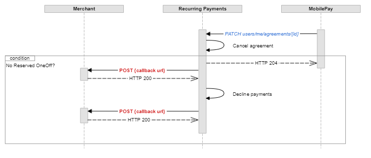

## <a name="overview"></a> Overview - MobilePay Subscriptions  [A deprecated API]

Billing your customers has never been easier before. This document explains how to make a technical integration to the **MobilePay Subscriptions** product. The audience for this document is either technical integrators acting on behalf of merchants, or merchant creating their own integrations. You can find more information on our <a href="https://developer.mobilepay.dk/subscriptions-main">Developer Portal</a>. 

Related links:
- You can read more about the product [here](https://developer.mobilepay.dk/subscriptions-main).
- Billing your customers with MobilePay Subscriptions is easy using our [API](https://developer.mobilepay.dk/product).
- More information about integration steps is [here](https://developer.mobilepay.dk/subscriptions-getting-started).

### <a name="deprecated"></a> Deprecated
This API is `deprecated `, so we recommend you use the Subscriptions API that uses OAuth 2.0 protocol for authentication and authorization and contains endpoints needed to implement MobilePay Subscriptions in your system. 
As an existing subscriptions merchant, you can already now migrate from SSL to OpenID Connect. The SSL API version is scheduled for complete retirement, once all merchants have migrated.

The technical reason for deprecation the SSL is that OpenID Connect supports our increasing focus on ensuring high security. We are not going to release new functionality or integrate new merchants using SSL.

The deadline of migrating to OpenID Connect is 01-01-2020.

Please contact us at developer@mobilepay.dk if you have any questions or need technical assistance.


## <a name="general-notes"></a> General notes 

MobilePay Subscriptions is a full-fledged HTTPS REST api using JSON as request/response communication media.

We provide examples of API calls in this document. In these examples the host is defined as `<mobile-pay-root>`. Depending on the environment, our host is as shown in the table below:

|Environment  |Host                              |
|:------------|:---------------------------------|
|Production   |`https://api.mobilepay.dk`        |
|Sandbox      |`https://api.sandbox.mobilepay.dk`|

All dates and time-stamps use the ISO 8601 format: date format - `YYYY-MM-DD`, date-time format - `YYYY-MM-DDTHH:mm:ssZ`.

Amounts are enquoted with double quotation marks using `0.00` format, decimals separated with a dot.

When doing `POST`, `PATCH` or `PUT` requests, `Content-Type: application/json` HTTP header must be provided.
```console 
$ curl --request POST --header 'Content-Type: application/json' --url https://<mobile-pay-root>/resource --data '{}'
```

API version is set using the `api-version` query parameter.

```console 
$ curl --url https://<mobile-pay-root>/resource?api-version=1.1 --request POST --header 'Content-Type: application/json' --data '{}'
```

#### <a name="general-notes_authentication"></a>Authentication 

All requests to the API must contain a client certificate and at least two authentication headers - `x-ibm-client-id` and `x-ibm-client-secret` in order to authenticate to the API.

```console
$ curl --cert /path/to/cert.pfx --header 'x-ibm-client-id: client-id' --header 'x-ibm-client-secret: client-secret' --url https://<mobile-pay-root>/api/merchants/me/resource
```

##### <a name="client-certificate"></a>Client certificate for mutual SSL

In order to be authenticated to our REST services you have to provide a self-signed client certificate, which can be generated either using `makecert.exe` or `OpenSSL`. __Note, that the certificate is valid for 2 years and will have to be regenerated after it expires.__

Generate two certificates for Sandbox and Production environments:
>* Sandbox: set environment to Sandbox.
>* Production: leave environment blank.

Send the generated *.cer (or *.crt, if you use OpenSSL) files to [developer@mobilepay.dk](mailto:developer@mobilepay.dk) and store the *.pfx file in a secure private key storage on your end. Note: Please zip the certificate, as our e-mail server is quite sensitive. 

##### <a name="client-certificate_makecert"></a>Using makecert.exe to generate client certificate
```
makecert.exe ^
 -n "CN=your-company-name - MobilePay - environment" ^
 -sky exchange ^
 -eku 1.3.6.1.5.5.7.3.2 ^
 -r ^
 -pe ^
 -a sha512 ^
 -len 2048 ^
 -m 24 ^
 -sv environment_MobilePay_your-company-name.pvk ^
 environment_MobilePay_your-company-name.cer
```

Export private key to pfx:
```
pvk2pfx.exe ^ 
 -pvk environment_MobilePay_your-company-name.pvk ^
 -spc environment_MobilePay_your-company-name.cer ^
 -pfx environment_MobilePay_your-company-name.pfx
```

##### <a name="client-certificate_openssl"></a>Using OpenSSL to generate client certificate

```console
$ openssl req -x509 -nodes -sha512 -newkey rsa:2048 -keyout environment_MobilePay_your-company-name.pvk -out environment_MobilePay_your-company-name.crt -days 730
```
Enter `your-company-name - MobilePay - environment` for Common Name, when asked.

Export private key to pfx:
```console
$ openssl pkcs12 -export -in environment_MobilePay_your-company-name.crt -inkey environment_MobilePay_your-company-name.pvk -CSP "Microsoft Enhanced RSA and AES Cryptographic Provider" -out environment_MobilePay_your-company-name.pfx
```

#### <a name="general-notes_errors"></a>Errors

You might encounter the following HTTP errors:

1. `400 - Bad Request` , if request data is invalid.
>    
    ```json
    {
        "error": "BadRequest",
        "error_description": {
            "message": "request.Name is required",
            "error_type": "InputError",
            "correlation_id": "f4b02597-32cc-420f-a468-942307e89a97"
        }
    }
    ```
2. `404 - Not Found` with no response body, if the resource (agreement or payment) is not found.

3. `412 - Precondition Failed` , if business validation rule was violated.
>    
    ```json
    {
        "error": "PreconditionFailed",
        "error_description": {
            "message": "Duplicate payment.",
            "error_type": "PreconditionError",
            "correlation_id": "f4b02597-32cc-420f-a468-942307e89a97"
        }
    }
    ```
4. `500 - Internal Server Error` , if something really bad has happened.
>    
    ```json
    {
        "error": "InternalServerError",
        "error_description": {
            "message": "An error occurred, please try again or contact the administrator.",
            "error_type": "ServerError",
            "correlation_id": "f4b02597-32cc-420f-a468-942307e89a97"
        }
    }
    ```

#### <a name="general-notes_correlation"></a>REST request correlation

_CorrelationId_ is an optional _[Guid](https://en.wikipedia.org/wiki/Globally_unique_identifier)_ header value which can be used to link requests on your back-end system to MobilePay Subscriptions business transaction for a more convenient debugging.

```console
$ curl --header 'CorrelationId: 37b8450b-579b-489d-8698-c7800c65934c' --url https://<mobile-pay-root>/api/merchants/me/agreements
```

#### <a name="general-notes_callback-authentication"></a>REST callback authentication

Use one of these endpoints to set REST callback authentication scheme and credentials:
* `PUT /api/merchants/me/auth/oauth2` - set OAuth2 scheme which conforms to RFC 6749 [section 4.4.](https://tools.ietf.org/html/rfc6749#section-4.4).
* `PUT /api/merchants/me/auth/basic` - set Basic auth scheme using username and password.
* `PUT /api/merchants/me/auth/apikey` - set a value which will be set to the _Authorization_ header. API key must conform to the token68 specification as defined in RFC 7235 [section2.1.](https://tools.ietf.org/html/rfc7235#section-2.1).

#### <a name="general-notes_callback-retries"></a>REST callback retries

In case the REST callback failed, 8 retries will be made using the [exponential back-off algorithm](https://en.wikipedia.org/wiki/Exponential_backoff), where N - next retry time, c - retry attempt number, R - second retry time in seconds (1st retry is an exception and is done after 5 seconds):


* 1st retry – 5 seconds
* 2nd retry – 10 minutes after 1st retry
* 3rd retry – 30 minutes after 2nd retry
* 4th retry – 1h 10 minutes after 3rd retry
* 5th retry – 2h 30 minutes after 4th retry
* 6th retry – 5h 10 minutes after 5th retry
* 7th retry – 10h 30 minutes after 6th retry
* 8th retry – 21h 10 minutes after 7th retry

* * *

## <a name="agreements"></a>Agreements

Once the user is given to choose the payment method on the merchant's signup flow, an additional "*Pay with MobilePay*" button should be shown for the user to be able to click on. When user clicks on this button, merchant's back-end system must call the `POST /api/merchants/me/agreements` endpoint in order to create a *Pending* Subscription **Agreement**, which can only be activated by the MobilePay user through the app. 

```json
{
  "external_id": "AGGR00068",
  "amount": "10",
  "currency": "DKK",
  "description": "Monthly subscription",
  "next_payment_date": "2017-03-09",
  "frequency": 12,
  "links": [
    {
      "rel": "user-redirect",
      "href": "https://example.com/1b08e244-4aea-4988-99d6-1bd22c6a5b2c"
    },
    {
      "rel": "success-callback",
      "href": "https://example.com/1b08e244-4aea-4988-99d6-1bd22c6a5b2c"
    },
    {
      "rel": "cancel-callback",
      "href": "https://example.com/1b08e244-4aea-4988-99d6-1bd22c6a5b2c"
    }
  ],
  "country_code": "DK",
  "plan": "Basic",
  "expiration_timeout_minutes": 5,
  "mobile_phone_number": "4511100118"
}
```

The *Pending* **Agreement**, if not activated, will expire within the value, provided in the _expiration_timeout_minutes_.

#### <a name="agreements_paramters"></a>Request parameters

|Parameter             |Type        |Required |Description                                                      |Valid values|
|:---------------------|:-----------|:--------|:----------------------------------------------------------------|:-----------|
|**amount**            |number(0.00)|         |*__Agreement__ amount, which will be displayed for the user in the MobilePay app.*|>= 0.00, decimals separated with a dot.|
|**currency**          |string(3)   |required |*The __Agreement__ currency code, that will be displayed for the use in the MobilePay app. Currency and country_code must match a valid pair of: DKK->DK, EUR->FI.*|DKK, EUR|
|**country_code**      |string(2)   |required |*Country code, which will be used to differentiate between MobilePay DK and FI apps.*|DK, FI|
|**plan**              |string(30)  |required |*Short __Agreement__ information text, that will be displayed on the __Agreement__ screen. (examples: "Basic" / "Premium").*||
|**description**       |string(60)  |         |*Additional information provided by the merchant to the user, that will be displayed on the __Agreement__ screen.*||
|**next_payment_date** |date        |         |*The date of the first scheduled __Payment Request__. This will be displayed on the __Agreement__ creation screen and on the __Agreement__ details screen if first payment date > current date.*|ISO date format: yyyy-MM-dd|
|**frequency**         |int         |         |*Frequency of __Payment Requests__. This value will be used to divide the amount of days in a year to get a frequency in days (e.g. 365 / 12 = 30.4 - approx. every month.). If not provided will default to 12.*|1, 2, 4, 12, 26|
|**external_id**       |string      |         |*__Agreement__ identifier on the merchant's side. This will be included in the request body of the success / cancel callback. The external_id should be unique to the agreement. Two different agreements should not have the same external_id ||
|**expiration_timeout_minutes**|int |required |*Agreement expiration timeout in minutes.*|Min: 5, max: 20160 (2 weeks)|
|**links**             |string      |required |*Link relation of the __Agreement__ creation sequence. Must contain 3 values for user redirect, success callback and cancel-callback links.*||
|**links[].rel**       |string      |required |*Link relation type.*|user-redirect, success-callback, cancel-callback|
|**links[].href**      |string      |required |*Link relation hyperlink reference.*|https://&lt;merchant's url&gt;|

Detailed info on the non-required parameters:

`mobile_phone_number`
It is not a required parameter, but we recommend you to use it, because then the phone number is pre-filled on our landing page, which means that the user will not have to type the phone number on the page, and therefore more convenient. 

`frequency`
It is not a required parameter. `frequency` provides informational value to the customer, so the customer can see in the app, how many times they can expect to pay Subscription Payment. The `frequency` does not impact, how often the merchant can send payments. If the merchant knows how often they will be sending Subscription Payments, e.g. monthly, then it is recommended to fill out `frequency`. If not provided, the frequency will be set to 12. 

`external_id`
It is meant as a unique identifier, which shouldn’t change. On MobilePay side, we have the `agreement_id`, which never changes, regardless of what happens to the agreement. `agreement_id` is the counterpart to the `external_id` on your side. It should stay the same, so MobilePay can trace the full history of the agreement. The customer can see the "external_id" in the app.
Our recommendation is, that the `external_id` is their `agreement_id` or reference with you. Therefore, it is more clear for the user. In addition, if they have more than one Subscriptions agreement with you, they should be able to see which Subscriptions agreement is connected to which  agreement.
 

<a name="agreements_response"></a>
The response of `POST /api/merchants/me/agreements` contains two values: a unique *id* of the newly created *Pending* **Agreement** and a link *rel* = *mobile-pay*.

```json
{
  "id": "1b08e244-4aea-4988-99d6-1bd22c6a5b2c",
  "links": [
    {
      "rel": "mobile-pay",
      "href": "https://<mobile-pay-landing-page>/?flow=agreement&id=1b08e244-4aea-4988-99d6-1bd22c6a5b2c&redirectUrl=https%3a%2f%2fwww.example.com%2fredirect&countryCode=DK&mobile=4511100118"
    }
  ]
}
```
 
* The *id* value can be used on the merchant's back-end system to map a Subscription agreement with a specific user on the merchant's side, and subsequently to create new **Payment Requests** on behalf of the user who confirmed the agreement in MobilePay. 
* The link *rel = mobile-pay* value contains the hyperlink reference address, which is structured in the following way: _https://&lt;mobile-pay-landing-page&gt;/?**id**=318a0bf9-9039-400c-b5ff-6ec717da2971&**countryCode**=DK_. (The link is not accessible in sandbox, only in production) The _id_ property is of type **guid** and uniquely identifies the pending Subscription **Agreement** for the app to get the details and subsequently do an accept request. The _countryCode_ property is used to differentiate between DK, NO and FI apps.

The link can be used in two ways:

1. Redirect the user automatically using the HTTP response **302** or **303**. Once the user is redirected, the MobilePay app will be opened to activate the *Pending* **Agreement**. In this case, it is recommended to set the *expiration_timeout_minutes* value to 5 minutes.
2. E-mail the generated link to the user. Once the user clicks on the link, the MobilePay app will be opened to activate the *Pending* **Agreement**. In this case, it is recommended to set the *expiration_timeout_minutes* to a higher value (10080 - a week, 20160 - two weeks). Note, that the link will be valid only until the user accepts the agreement or a timeout occurs.

#### Update existing Agreement Request

Use the `PATCH /api/merchants/me/agreements/{agreementId}` endpoint to change agreement request parameters. Its request must match the rules of [RFC 6902 JSON Patch standards](https://tools.ietf.org/html/rfc6902).

- Available operations: **replace**
- Available properties: **amount**, **plan**, **description**, **next_payment_date**, **frequency**, **external_id**, **success-callback**, **cancel-callback**

```json
[
    {
        "value": "10.01",
        "path": "/amount",
        "op": "replace"
    }
]
```

#### Agreement creation

#### <a name="agreements_creation_in_landing_page"></a>New agreement creation in landing page

[](assets/images/RecurringPayments_Agreement_landing_page.png)

#### <a name="agreements_creation_in_app"></a>New agreement creation in APP

[](assets/images/RecurringPayments_Agreement_app.png)

#### <a name="agreements_callback"></a>Callbacks

When the **Agreement's** status changes from *Pending* we will do a callback to the merchant's system (see the sequence diagram below).

The table below shows possible *status*, *status_text* and *status_code* values depending on the **Agreement** status changes.

|New Status|Condition|URL| Callback *status* | Callback *status_text* |Callback *status_code*|
|----------|---------|---|-------------------|------------------------|----------------------|
|Accepted  |_User swiped to accept the Agreement_        |*success-callback* |Accepted  | |0|
|Rejected  |_User tapped the Cancel button during the signup_              |*cancel-callback*  |Rejected|Agreement rejected by user|40000|
|Expired   |_User did not do anything during the agreement timeout period._|*cancel-callback*  |Expired |Pending agreement expired|40001|
|Canceled  |_User canceled an Active agreement_          |*cancel-callback*  |Canceled|Agreement canceled by user|40002|
|Canceled  |_Merchant canceled an Active agreement_      |*cancel-callback*  |Canceled|Agreement canceled by merchant|40003|
|Canceled  |_System canceled an Active agreement because user was Deleted_ |*cancel-callback*  |Canceled|Agreement canceled by system|40004|

User can't cancel agreement if Reserved payment exists.

##### <a name="agreements_state-diagram"></a>Agreement state diagram


            
##### <a name="agreements_callback-properties"></a>Other callback properties

|Name            |Type        |Description                                           |Format|
|----------------|------------|------------------------------------------------------|------|
|**agreement_id**|guid        |Subscription agreement ID on the MobilePay side.||
|**external_id** |string      |Agreement ID on the merchant's side                   ||
|**timestamp**   |datetime    |Timestamp when the status change occurred.            |ISO 8601 UTC date and time format: YYYY-MM-DDThh:mm:ssZ|

##### <a name="agreements_callback-request"></a>Agreement callback request example

```json
{
    "agreement_id" : "63679ab7-cc49-4f75-80a7-86217fc105ea",
    "status" : "Canceled",
    "status_text" : "Canceled by user",
    "status_code" : "40000",
    "external_id" : "SF0000568",
    "timestamp" : "2016-09-29T09:50:39Z"
}
```

##### <a name="agreements_callback-response-propterties"></a>Agreement callback response properties

|Name               |Description|
|-------------------|-----------|
|**agreement_id**   |Subscription agreement ID on the MobilePay side.|
|**status_code**    |Status code on merchant's system|
|**status_text**    |Description of the status.|
|**transaction_id** |Unique identifier of the transaction on the merchant's system.|

*status_code* can have the following values:
* 0 - success (*HTTP response 200 - OK*)
* 1xxx - validation error (*HTTP response 400 - Bad Request*) 
* 2xxx - business error  (*HTTP response 400 - Bad Request*)
* 3xxx - technical error  (*HTTP response 500 - Internal Server Error*)

The callback response properties are optional.
In case of technical errors (HTTP response is not 2xx), we will try to re-POST the callback.

##### <a name="agreements_callback-response-example"></a>Agreement callback response example
```json
{
    "agreement_id" : "63679ab7-cc49-4f75-80a7-86217fc105ea",
    "status_code" : "3000",
    "status_text" : "Server is down",
    "transaction_id" : "63679ab7-cc49-4f75-80a7-86217fc105ea"
}
```

When the **Agreement** activation is complete or canceled, the user will be navigated to the link *rel = user-redirect* to finalize the signup.

#### <a name="agreements_creation-diagram"></a>Agreement creation sequence diagram


#### <a name="agreements_cancel-diagram"></a>When merchant cancels agreement - sequence diagram


#### <a name="agreements_cancel-pending-diagram"></a>When user cancels a Pending agreement during signup - sequence diagram


#### <a name="agreements_cancel-active-diagram"></a>When user cancels an Active agreement - sequence diagram



* * *

## <a name="subscription-payments"></a>Subscription Payments

When the **Agreement** between **Merchant** and MobilePay **User** is established, use the `POST /api/merchants/me/paymentrequests` endpoint to en-queue **Subscription Payments**. This service accepts a JSON array of individual **Subscription Payments** to be processed asynchronously. You can batch payment requests into payloads of maximum 2000 payments. We allow merchants to bundle multiple payment requests into a single HTTP request.
Notice that the **Subscription Payments** payload does not contain a currency code - this will be fetched from the **Agreement** using the provided *agreement_id*.

```json
[
    {
        "agreement_id": "fda31b3c-794e-4148-ac00-77b957a7d47f",
        "amount": "10.99",
        "due_date": "2017-03-09",
        "next_payment_date": "2017-04-09",
        "external_id": "PMT000023",
        "description": "Monthly payment"
    }
]
```

#### <a name="subscription-payments_request-parameters"></a>Request parameters

|Parameter             |Type        |Required  |Description                                                      |Valid values|
|----------------------|------------|----------|-----------------------------------------------------------------|------------|
|**agreement_id**      |guid        | required |*The Subscription __Agreement__ identifier that maps a __Merchant__ to a MobilePay __User__.*||
|**amount**            |number(0.00)| required |*The requested amount to be paid.*|> 0.00, decimals separated with a dot.|
|**due_date**          |date        | required |*Payment due date. Must be at least 1 day in the future, otherwise the __Subscription Payment__ will be declined.*|ISO date format: yyyy-MM-dd|
|**next_payment_date** |date        |          |*Next __Subscription Payment's__ due date, to be shown to the user in the __Agreement__ details.*|ISO date format: yyyy-MM-dd|
|**external_id**       |string      | required |*The identifier of a specific payment in the external merchant's system. Maximum length is 30 characters*||
|**description**       |string(60)  | required |*Additional information of the __Subscription Payment__.*||

<a name="subscription-payments_response"></a>The `POST /api/merchants/me/paymentrequests` service returns HTTP 202 - Accepted response if at least one payment is provided in the request payload.

The response body containts two lists:
* **pending_payments** - a map of newly generated Subscription payment ID and the external ID, that where accepted for processing and now are in a _Pending_ state.
* **rejected_payments** - a list of rejected payments. This can only occur if any of the mandatory fields are missing or do not conform to the format rule. Business logic validations are done asynchronously in the back-end (for example, checking if due-date conforms to 1 day rule).


##### <a name="subscription-payments_response-example"></a>HTTP 202 Response body example
```json
{
    "pending_payments": [{
            "payment_id": "263cfe92-9f8e-4829-8b96-14a5e53c9041",
            "external_id": "PMT000023"
        }
    ],
    "rejected_payments": [{
            "external_id": "PMT000023",
            "error_description": "The Amount field is required."
        }
    ]
}
```

#### <a name="subscription-payments_frequency"></a>Frequency of Payment Requests
 The merchant can send a payment max 32 days prior due date, and at least 1 day before due date. 
 Valid values are 1, 2, 4, 12, 26. This means that the bi-weekly payment (26) is the most frequent. 
When you are requesting a payment, you need to keep the 1 day rule. The user can have a single pending payment on due date. E.g. User can have 3 pending payments but the DueDate of those payments should be different. 
 * **Due Date** Payments cannot be created with the same Due Date. 
* **Multiple Recurring payments**  Multiple recurring payment requests can be created within period [32 before Due Date >= Payment Request Date >= 8 before Due Date]
* **Next Payment Date** If there are multiple pending payments, Next Payment Date is the one closest to Today()
 
 ##### <a name="subscription-payments_grace-example"></a>Example of Frequency
For example: if you have a customer where the frequency of an agreement is set to 4, that means  365 / 4 = 91.25 (approximately payment requests every 3rd month). 

#### Payment screens

[](assets/images/RecurringPayments_Details.png)

#### <a name="subscription-payments_callbacks"></a>Callbacks

Once the payment status changes from *Pending* to *Executed, Declined, Rejected* or *Failed*, a callback will be done to the callback address, which is configurable via `PATCH /api/merchants/me` with path value `/payment_status_callback_url`.

We are sending callbacks in two ways:

1. A batch that runs every 2 mins. It contains Subscription payment(s) with statuses: Declined/Rejected/Failed/Executed/OneOff_Expired. So in theory, there is a possible delay of 2 mins. 
2. Right after the user made an action. It contains OneOff_Reserved/OneOff_Rejected.

Every two minutes we take up to 1000 events (notifications about payment state), group them by merchant and make the calls. Therefore, as for merchant you should get up to 1 call every two minutes.

We will post the integrator or merchant a callback, and expect a HTTP 2xx response. If not we will retry 8 times.

```json
[
    {
        "value": "https://example.com",
        "path": "/payment_status_callback_url",
        "op": "replace"
    }
]
```

|New Status|Condition|When to expect|Callback *status*  | Callback *status_text* | Callback *status_code* |
|----------|---------|--------------|-------------------|------------------------|------------------------|
|Executed  |_The payment was successfully executed on the due-date_| After 03:15 in the morning of the due-date |Executed  | | 0 |
|Failed    |_Payment failed to execute during the due-date._| After 23:59 of the due-date |Failed    | | 50000 |
|Rejected  |_User rejected the Pending payment in MobilePay_       | Any time during the 8-1 days period when user is presented with the Pending payment in the MobilePay activity list. |Rejected  |Rejected by user.| 50001 | 
|Declined  |_Merchant declined the Pending payment via the API_       | Any time during the 8-1 days period when user is presented with the Pending payment in the MobilePay activity list. |Declined  |Declined by merchant.| 50002 | 
|Declined  |_**Agreement** is not in Active state._                | Right after the payment request was received. |Declined  |Declined by system: Agreement is not "Active" state.| 50003 | 
|Declined  |_If the **Agreement's** frequency period has not passed since the last *Pending* or *Executed* **Payment Request** for that Agreement. Monthly agreements have a 1 week tolerance level._| Right after the payment request was received. |Declined  |Declined by system: Another payment is already due.| 50004 | 
|Declined  |When the **Agreement** was canceled by merchant or by system | Any time during the 8-1 days period when user is presented with the Pending payment in the MobilePay activity list.  |Declined  |Declined by system: Agreement was canceled. | 50005 | 
|Rejected  |When the **Agreement** was canceled by user | Any time during the 8-1 days period when user is presented with the Pending payment in the MobilePay activity list.  |Rejected  |Declined by system: Agreement was canceled. | 50005 | 
|Declined  |A catch-all error code when payment was declined by core system.| Right after the payment request was received. |Declined  | Declined by system. | 50006 | 
|Declined  |Declined due to user status.| Right after the payment request was received. |Declined  | Declined due to user status. | 50009 | 
|Declined  |When the **Agreement** does not exist| Right after the payment request was received. |Declined  | Agreement does not exist. | 50010 |
|Declined  |When the due date before rule is violated | Right after the payment request was received. |Declined  | Due date of the payment must be at least 1 day in the future. | 50011 |
|Declined  |When the due date ahead rule is violated | Right after the payment request was received. |Declined  | Due date must be no more than 32 days in the future. | 50012 |

There are validation rules; however, the payments are not validated until they have been created in our system. Therefore, even though you get a response with pending payments, they may not be valid.  When you make a payment request, we will validate the request itself, but not the individual payments. So it only validates if you have the required parameters with the correct types. So the response you get for the payment request, does not say if the payment is pending, but if the payment creation is pending. Then the payments are processed in our system, and they will either be requested (valid) or declined (invalid). Moreover, you will receive a callback to inform whether payments are requested or declined. This will be sent to your payment status callback  


The process on failed payments the DueDate is as follows:

•	06:00 First hiccup is run at 06:00 on the due date. Once done, a notification about completion is returned. Merchant is informed about successful payments and user about failed payment  

•	13:30 Second hiccup is run at 13:30 on the due date. Once done, a notification about completion is returned. Merchant is informed about successful payments and user about failed payment.

•	18:00 20:00 22:30 - hiccups keep running throughout the day. Once done, a notification about completion is returned. Merchant is informed about successful payments and user about failed payment, 
 

##### <a name="subscription-payments_state"></a>Payment state diagram


##### <a name="subscription-payments_callback-properties"></a>Other callback properties

|Name            |Type        |Description                                           |Format|
|----------------|------------|------------------------------------------------------|------|
|**agreement_id**|guid        |Subscription agreement ID on the MobilePay side.||
|**payment_id**  |guid        |Subscription payment ID on the MobilePay side.  ||
|**amount**  	 |number(0.00)|Amount withdrawn from the MobilePay user.             ||
|**currency**  	 |string      |Amount currency (agreement's currency)                ||
|**payment_date**|date        |Date of the batch when the payment was executed.      |ISO 8601 UTC date: YYYY-MM-DD|
|**external_id** |string      |Payment ID on the merchant's side. Maximum length is 30 characters                   ||


##### <a name="subscription-payments_callback-example"></a>Payment callback body example
```json
[
    {
        "agreement_id" : "1b08e244-4aea-4988-99d6-1bd22c6a5b2c",
        "payment_id" : "c710b883-6ed6-4506-9599-490ead89525a",
        "amount" : "10.20",
        "currency" : "DKK",
        "payment_date" : "2016-09-29",
        "status" : "Rejected",
        "status_text" : "Rejected by user.",
        "status_code" : "50001",
        "external_id" : "SFPMT134560"
    }
]
```

##### <a name="subscription-payments_callback-response-properties"></a>Payment callback response properties

An array containing the following properties.

|Name               |Description|
|-------------------|-----------|
|**payment_id**     |Subscription payment ID on the MobilePay side.|
|**status_code**    |Status code on merchant's system|
|**status_text**    |Description of the status.|
|**transaction_id** |Unique identifier of the transaction on the merchant's system.|

*status_code* can have the following values:
* 0 - success (*HTTP response 200 - OK*)
* 1xxx - validation error (*HTTP response 400 - Bad Request*) 
* 2xxx - business error  (*HTTP response 400 - Bad Request*)
* 3xxx - technical error  (*HTTP response 500 - Internal Server Error*)

The callback response properties are optional.
In case of technical errors (HTTP response is not 2xx), we will try to re-POST the callback.

##### <a name="subscription-payments_callback-response-example"></a>Payment callback response example
```json
[
    {
        "payment_id" : "63679ab7-cc49-4f75-80a7-86217fc105ea",
        "status_code" : "3000",
        "status_text" : "Server is down.",
        "transaction_id" : "63679ab7-cc49-4f75-80a7-86217fc105ea"
    }
]
```

#### <a name="subscription-payments_update-existing"></a>Update existing Payment Request

Use the `PATCH /api/merchants/me/paymentrequests/{paymentId}` endpoint to decrease the requested amount to be paid.

```json
[
    {
        "value": "10.01",
        "path": "/amount",
        "op": "replace"
    }
]
```

***
## <a name="oneoffpayments"></a>One-Off Payments

You are able to:
* Create agreements with an initial payment.
* Request arbitrary one-off payments on an existing agreement. These must be manually confirmed by the user. 

Note:  Subscription payments are charged automatically, while one-off are charged when the customer manually swipes accept. OneOff payment does not affect the frequency and grace period. So if you create an agreement with a OneOff, you can request the first subscriptions payment whenever you want. You can also request a OneOff on an existing agreement in between two subscriptions payments, and it will not be affected by the frequency. But if you do it on an existing agreement, the user has to swipe to accept the payment. When you create an agreement with a OneOff, and the user accepts the agreement, the payment will be processed and executed right away. OneOff is an instant payment, and it is not subject to the 1 day rule. 

If you create a OneOff payment, it will have the state requested. If the user then is not able to accept it, due to blocked card or so, it will expire after 1 day. You will receive a callback for that. The payment will be requested, to give the user the option to change card, but it will never be reserved if the user cannot accept it.

If an agreement was requested with a OneOff, and the user cannot accept it, the agreement will never be created. Because the user must accept the OneOff and the agreement at the same time. Therefore, you have to start again if the agreement request expires. But again, the user have the option to change card and accept the agreement.

User cannot cancel the agreement with pending payment reservation, only the merchant can do so. 

By cancelling the agreement with a pending payment reservation, then the merchant also automatically cancels the reservation


#### <a name="oneoffpayments_request-new-agreement"></a>Request One-Off Payment With a New Subscriptions Agreement
Use this when the user wants to setup an agreement and you want to charge upfront, i.e. a newspaper subscription. It starts to be effective from the moment the money is payed. It is initiated by user, which is why a redirect needs to happen, so that the user can accept it.  

Add a `one_off_payment` property to the `POST /api/merchants/me/agreements?api-version=1.1` request payload if you want the agreement being activated only when the user is successfully charged an initial subscription amount.

```json
{
  "external_id": "AGGR00068",
  "amount": "10",
  "currency": "DKK",
  "description": "Monthly subscription",
  "next_payment_date": "2017-03-09",
  "frequency": 12,
  "links": [
    {
      "rel": "user-redirect",
      "href": "https://example.com/1b08e244-4aea-4988-99d6-1bd22c6a5b2c"
    },
    {
      "rel": "success-callback",
      "href": "https://example.com/1b08e244-4aea-4988-99d6-1bd22c6a5b2c"
    },
    {
      "rel": "cancel-callback",
      "href": "https://example.com/1b08e244-4aea-4988-99d6-1bd22c6a5b2c"
    }
  ],
  "country_code": "DK",
  "plan": "Basic",
  "expiration_timeout_minutes": 5,
  "mobile_phone_number": "4511100118",
  "one_off_payment": 
    {
      "amount": "80",
      "external_id": "OOP00348",
      "description": "Down payment for our services"
    }
}
```

*Newly added request parameters*

|Parameter                        |Type        |Required  |Description                                                      |Valid values|
|:--------------------------------|:-----------|:---------|:----------------------------------------------------------------|:-----------|
|**one_off_payment**              |object      |          |*__One-Off Payment__ details.*||
|**one_off_payment.amount**       |number(0.00)|required  |*__One-Off Payment__ amount, which will be displayed for the user in the MobilePay app.*|> 0.00, decimals separated with a dot.|
|**one_off_payment.description**  |string(60)  |          |*Additional information provided by the merchant to the user, that will be displayed on the __One-off Payment__ screen.*||
|**one_off_payment.external_id**  |string(30)  |required  |*__One-Off Payment__ identifier on the merchant's side. This will be included in the request body of the payment callback.*||

<a name="oneoffpayments_response-new"></a>In this case the response of `POST /api/merchants/me/agreements?api-version=1.1` will contain additional `one_off_payment_id` value - id of the newly requested **One-Off Payment**.

```json
{
  "id": "1b08e244-4aea-4988-99d6-1bd22c6a5b2c",
  "one_off_payment_id": "2a5dd31f-32c1-4517-925f-9c60ba19f8ca",
  "links": [
    {
      "rel": "mobile-pay",
      "href": "https://<mobile-pay-landing-page>/?flow=agreement&id=1b08e244-4aea-4988-99d6-1bd22c6a5b2c&redirectUrl=https%3a%2f%2fwww.example.com%2fredirect&countryCode=DK&mobile=4511100118"
    }
  ]
}
```

#### <a name="oneoffpayments_existing-agreement"></a>Request One-off Payment on an Existing Agreement
Use this when your customer has an active subscription agreement, and he wants to order extra services / products. i.e. on top of iTunes subscriptions to rent a movie. It needs to be initiated by the user, and a redirect needs to happen for the user to accept it. 

Use a `POST /api/merchants/me/agreements/{agreementId}/oneoffpayments?api-version=1.1` endpoint in order to charge your customer one time for extra services. 

```json
{
  "amount": "80",
  "external_id": "OOP00348",
  "description": "Pay now for additional goods",
  "links": [
    {
      "rel": "user-redirect",
      "href": "https://example.com/1b08e244-4aea-4988-99d6-1bd22c6a5b2c"
    }
  ]
}
```

__One-off Payment__ will expire in 1 day if it is not accepted or rejected by the user during that time. 

##### <a name="oneoffpayments_request-parameters"></a>Request parameters

|Parameter                     |Type      |Required  |Description                                                      |Valid values|
|:-----------------------------|:---------|:---------|:----------------------------------------------------------------|:-----------|
|**amount**       |number(0.00)|required  |*__One-off Payment__ amount, which will be displayed for the user in the MobilePay app.*|> 0.00, decimals separated with a dot.|
|**description**  |string(60)  |required  |*Additional information provided by the merchant to the user, that will be displayed on the __One-off Payment__ screen.*||
|**external_id**  |string      |required  |*__One-off Payment__ identifier on the merchant's side. This will be included in the request body of the payment callback.*||
|**links**        |string      |required  |*Link relation of the __One-off Payment__ creation sequence. Must contain 1 value for user redirect.*||
|**links[].rel**  |string      |required  |*Link relation type.*|user-redirect|
|**links[].href** |string      |required  |*Link relation hyperlink reference.*|https://&lt;merchant's url&gt;|

<a name="oneoffpayments_response-existing"></a>The response of `POST /ap/merchants/me/agreements/{agreementId}/oneoffpayments?api-version=1.1` contains two values: a unique *id* of the newly requested **One-Off Payment** and a link *rel* = *mobile-pay*.

```json
{
  "id": "07b70fdd-a300-460d-9ba1-aee2c8bb4b63",
  "links": [
    {
      "rel": "mobile-pay",
      "href": "https://<mobile-pay-landing-page>/?flow=agreement&id=1b08e244-4aea-4988-99d6-1bd22c6a5b2c&oneOffPaymentId=07b70fdd-a300-460d-9ba1-aee2c8bb4b63&redirectUrl=https%3a%2f%2fwww.example.com%2fredirect&countryCode=DK&mobile=4511100118"
    }
  ]
}
```
 
* The *id* value can be used on the merchant's back-end system to map a one-off payment with a specific Subscription agreement on the merchant's side, and subsequently to capture a requested **One-Off Payment** when MobilePay user accepts it. 
* The link *rel = mobile-pay* hyperlink reference must be used to redirect the user automatically using an HTTP response 302 or 303. Once the user is redirected, the MobilePay app will be opened to confirm the __One-off Payment__.

##### <a name="oneoffpayments_screens"></a>One-Off payment screens

[](assets/images/One-off-flows.png)

##### <a name="oneoffpayments_callback"></a>Callbacks

Once the one-off payment status changes from *Requested* to *Reserved*, *Rejected* or *Expired*, a callback will be done to the callback address, which is configurable via `PATCH /api/merchants/me` with path value `/payment_status_callback_url`. The same way as with [callbacks](../#subscription-payments_callbacks) for regular payment requests.

|New Status|Condition|When to expect|Callback *status*  | Callback *status_text* | Callback *status_code* |
|----------|---------|--------------|-------------------|------------------------|------------------------|
|Reserved  |_The one-off payment was accepted by user and money is reserved for you on his card. You can now capture the money._| After user accepts the requested one-off payment. |Reserved| Payment successfully reserved. | 0 |
|Rejected  |_User rejected one-off payment request in MobilePay._ | Right after user rejects one-off payment. |Rejected  |Rejected by user.| 50001 |
|Expired   |_One-off payment was neither accepted, nor rejected by user._| 1 day after you requested one-off payment |Expired|Expired by system.| 50008 |

#### <a name="oneoffpayments_state"></a>One-off payment state diagram


#### <a name="oneoffpayments_capture"></a>Capture Reserved One-Off Payment

When you receive a callback about successfully reserved payment, now it's time to capture your money. You can do that by making a call to `POST /api/merchants/me/agreements/{agreementId}/oneoffpayments/{paymentId}/capture?api-version=1.1` endpoint. If the HTTP response is `204 - No Content`, it means that the money was transfered to your account.

#### <a name="oneoffpayments_cancel"></a>Cancel One-Off Payment Request/Reservation

In case you weren't able to deliver goods or any other problem occur, you can always cancel one-off payment until it's not captured or expired. You can do that by making a call to `DELETE /api/merchants/me/agreements/{agreementId}/oneoffpayments/{paymentId}?api-version=1.1` endpoint. If the HTTP response is '204 - No Content', it means that one-off payment request/reservation was canceled.

It is **mandatory** for the merchant to Capture or Cancel one-off payment if it was reserved on a customer account. You need to do so within 14 days


***
## <a name="refunds"></a>Refunds

**Full refund** - 100% of the amount paid is returned to the payer.<br />
**Partial refund** - An amount up to the net (the amount the merchant received) will be returned to the payer. Multiple partial refunds can be made.

#### <a name="refunds_request"></a>Request a Refund
Use the `POST /api/merchants/me/agreements/{agreementId}/payments/{paymentId}/refunds` endpoint to request a **Refund**.

```json
{
    "amount": 10.99,
    "status_callback_url": "https://example.com",
    "external_id": "ABC123"
}
```

#### <a name="refunds_request-parameters"></a>Request parameters

|Parameter             |Type        |Required  |Description                                                      |Valid values|
|----------------------|------------|----------|-----------------------------------------------------------------|------------|
|**amount**            |number(0.01)| optional |*The requested amount to be returned.*|>= 0.01, decimals separated with a dot. If not specified, payment will be fully refunded.|
|**status_callback_url**  |string| required |*Link relation hyperlink reference.*|valid url|
|**external_id**  |string| optional |*Refund's identifier on the merchant’s side. This will be included in the request body of the refund callback.*||

<a name="refunds_response"></a>
The `POST /api/merchants/me/agreements/{agreementId}/payments/{paymentId}/refunds` service returns HTTP 202 and the response contains single value: a unique *id* of the newly created **Refund**.

##### <a name="refunds_response-example"></a>HTTP 202 Response body example
```json
{
    "id": "263cfe92-9f8e-4829-8b96-14a5e53c9041",
    "amount": 10.99,
    "status_callback_url": "http://example.com",
    "external_id": "ABC123"
}
```

#### <a name="refunds_callback"></a>Callbacks

When the **Refund's** status changes from *Requested* we will do a callback to the callback address provided in request parameter `status_callback_url`.

##### <a name="refunds_callback-example"></a>Refund callback body example
```json
{
    "refund_id" : "4bb9b33a-f34a-42e7-9143-d6eabd9aae1d",
    "agreement_id" : "1b08e244-4aea-4988-99d6-1bd22c6a5b2c",
    "payment_id" : "c710b883-6ed6-4506-9599-490ead89525a",
    "amount" : "10.99",
    "currency" : "DKK",
    "status" : "Issued",
    "status_text" : null,
    "status_code" : 0,
    "external_id": "ABC123"
}
```
##### <a name="refunds_callback-response"></a>Refund callback response example
```json
{
    "refund_id" : "4bb9b33a-f34a-42e7-9143-d6eabd9aae1d",
    "agreement_id" : "1b08e244-4aea-4988-99d6-1bd22c6a5b2c",
    "payment_id" : "c710b883-6ed6-4506-9599-490ead89525a",
    "status_code" : "3000",
    "status_text" : "Server is down.",
    "transaction_id" : "63679ab7-cc49-4f75-80a7-86217fc105ea"
}
```
<a name="refunds_status"></a>

|New Status|Condition|When to expect|Callback *status*  | Callback *status_text* | Callback *status_code* |
|----------|---------|--------------|-------------------|------------------------|------------------------|
|Issued    |_The **Refund** was successfully issued_| Right after the refund request was received |Issued  | |  |
|Declined  |_If **Payment** is already fully refunded_           | Right after the refund was requested |Declined    |Payment is already fully refunded. | 60001 |
|Declined  |_If the total sum of previous **Refunds** exceed the original payment amount_           | Right after the refund was requested |Declined  |The total sum of previous **Refunds** cannot exceed the original payment amount.| 60002 | 
|Declined  |_When **Refund** was declined by system_          | Right after the refund was requested |Declined  |Payment was not found.| 60003 | 
|Declined  |_When **Refund** was declined by system_           | Right after the refund was requested |Declined  |Payment cannot be refunded.| 60004 | 
|Declined  |_A catch-all error code when **Refund** was declined by core system._           | Right after the refund was requested |Declined  |Refund was declined by system.| 60005 | 
|Declined  |_When **Refund** was declined by system._           | Right after the refund was requested |Declined  |Cannot refund payments that are older than 30 days.| 60006 | 

<a name="refunds_screens"></a>
Refund screens within mobile application:


