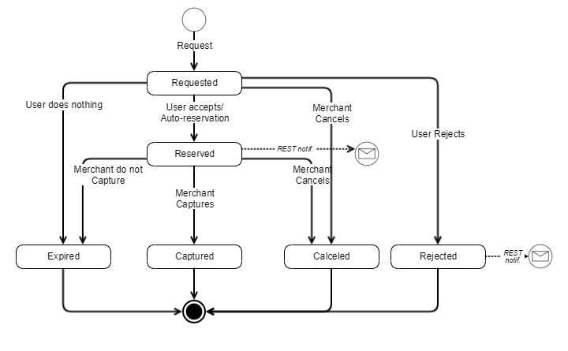

## <a name="oneoffpayments"></a>One-Off Payments

You are able to:
* Create agreements with an initial payment.
* Request arbitrary one-off payments on an existing agreement.

Note: One-off payments are charged when the customer manually swipes accept or `auto_reserve` field was set to __true__ when one-off payment was requested.  

One-off payment does not affect the frequency and grace period. So if you create an agreement with a one-off payment, you can request the first subscription payment whenever you want. You can also request a one-off payment on an existing agreement in between two subscriptions payments, and it will not be affected by the frequency. When you create an agreement with a one-off payment, and the user accepts the agreement, the payment will be created and reserved. 


#### <a name="autoreserve"></a>Auto reserve

Merchants who wants to use  `auto_reserve` field  feature, must apply for this in regards to the onboarding of Subscriptions. Merchants cannot use this feature without being pre-approved to do so. 


#### <a name="requests"></a>Request One-Off Payment With a New Agreement

Add a `one_off_payment` property to the `POST /api/providers/{providerId}/agreements` request payload if you want the agreement being activated only when the user is successfully charged an initial subscription amount.

```json
{
  "external_id": "AGGR00068",
  "amount": "10",
  "currency": "DKK",
  "description": "Monthly subscription",
  "next_payment_date": "2017-03-09",
  "frequency": 12,
  "links": [
    {
      "rel": "user-redirect",
      "href": "https://example.com/1b08e244-4aea-4988-99d6-1bd22c6a5b2c"
    },
    {
      "rel": "success-callback",
      "href": "https://example.com/1b08e244-4aea-4988-99d6-1bd22c6a5b2c"
    },
    {
      "rel": "cancel-callback",
      "href": "https://example.com/1b08e244-4aea-4988-99d6-1bd22c6a5b2c"
    }
  ],
  "country_code": "DK",
  "plan": "Basic",
  "expiration_timeout_minutes": 5,
  "mobile_phone_number": "4511100118",
  "one_off_payment": 
    {
      "amount": "80",
      "external_id": "OOP00348",
      "description": "Down payment for our services"
    }
}
```

#### <a name="oneoff_request-parameters"></a> Request parameters

|Parameter                        |Type        |Required  |Description                                                      |Valid values|
|:--------------------------------|:-----------|:---------|:----------------------------------------------------------------|:-----------|
|**one_off_payment**              |object      |          |*__One-Off Payment__ details.*||
|**one_off_payment.amount**       |number(0.00)|required  |*__One-Off Payment__ amount, which will be displayed for the user in the MobilePay app.*|> 0.00, decimals separated with a dot.|
|**one_off_payment.description**  |string(60)  |required  |*Additional information provided by the merchant to the user, that will be displayed on the __One-off Payment__ screen.*||
|**one_off_payment.external_id**  |string(30) |required |*__One-Off Payment__ identifier on the merchant's side. This will be included in the request body of the payment callback.*||

<a name="oneoffpayments_response-new"></a>In this case the response of `POST /api/providers/{providerId}/agreements` will contain additional `one_off_payment_id` value - id of the newly requested **One-Off Payment**.

```json
{
  "id": "1b08e244-4aea-4988-99d6-1bd22c6a5b2c",
  "one_off_payment_id": "2a5dd31f-32c1-4517-925f-9c60ba19f8ca",
  "links": [
    {
      "rel": "mobile-pay",
      "href": "https://<mobile-pay-landing-page>/?flow=agreement&id=1b08e244-4aea-4988-99d6-1bd22c6a5b2c&redirectUrl=https%3a%2f%2fwww.example.com%2fredirect&countryCode=DK&mobile=4511100118"
    }
  ]
}
```

#### <a name="oneoffpayments_existing-agreement"></a>Request One-off Payment on an Existing Agreement

Use a `POST /api/providers/{providerId}/agreements/{agreementId}/oneoffpayments` endpoint in order to charge your customer one time for extra services. 


```json
{
  "amount": "80",
  "external_id": "OOP00348",
  "description": "Pay now for additional goods",
  "links": [
    {
      "rel": "user-redirect",
      "href": "https://example.com/1b08e244-4aea-4988-99d6-1bd22c6a5b2c"
    }
  ],
  "auto_reserve": true
}
```

__One-off Payment__ will expire in 1 day if it is not accepted or rejected by the user during that time or automatic reservation failed and user didn't take any action afterwards.

##### <a name="oneoffpayments_request-parameters"></a>Request parameters

|Parameter                     |Type      |Required  |Description                                                      |Valid values|
|:-----------------------------|:---------|:---------|:----------------------------------------------------------------|:-----------|
|**amount**       |number(0.00)|required  |*__One-off Payment__ amount, which will be displayed for the user in the MobilePay app.*|> 0.00, decimals separated with a dot.|
|**description**  |string(60)  |required  |*Additional information provided by the merchant to the user, that will be displayed on the __One-off Payment__ screen.*||
|**external_id**  |string      |required   |*__One-off Payment__ identifier on the merchant's side. This will be included in the request body of the payment callback.*||
|**links**        |string      |required  |*Link relation of the __One-off Payment__ creation sequence. Must contain 1 value for user redirect.*||
|**links[].rel**  |string      |required  |*Link relation type.*|user-redirect|
|**links[].href** |string      |required  |*Link relation hyperlink reference.*|https://&lt;merchant's url&gt;|
|**auto_reserve** |boolean     |optional  |*When this field is set to __true__, we will attempt to automatically reserve the payment without user's interaction. If you do not wish payment to be automatically reserved, you can omit this field or set it to __false__.*|true/false|

<a name="oneoffpayments_response-existing"></a>The response of `POST /api/providers/{providerId}/agreements/{agreementId}/oneoffpayments` contains two values: a unique *id* of the newly requested **One-Off Payment** and a link *rel* = *mobile-pay*.

```json
{
  "id": "07b70fdd-a300-460d-9ba1-aee2c8bb4b63",
  "links": [
    {
      "rel": "mobile-pay",
      "href": "https://<mobile-pay-landing-page>/?flow=agreement&id=1b08e244-4aea-4988-99d6-1bd22c6a5b2c&oneOffPaymentId=07b70fdd-a300-460d-9ba1-aee2c8bb4b63&redirectUrl=https%3a%2f%2fwww.example.com%2fredirect&countryCode=DK&mobile=4511100118"
    }
  ]
}
```
 
* The *id* value can be used on the merchant's back-end system to map a one-off payment with a specific Subscription agreement on the merchant's side, and subsequently to capture a requested **One-Off Payment** when MobilePay user accepts it. 
* The link *rel = mobile-pay* hyperlink reference must be used to redirect the user automatically using an HTTP response 302 or 303. Once the user is redirected, the MobilePay app will be opened to confirm the __One-off Payment__. This applies only if `auto_reserve` field is omitted or set to __false__.

#### <a name="oneoffpayments_screens"></a>One-Off payment screens

[](assets/images/One-off-flows.svg)

When `auto_reserve` field is set to __true__:

[](assets/images/One-off-flows-without-swipe.svg)

#### <a name="oneoffpayments_callback"></a>Callbacks

Once the one-off payment status changes from *Requested* to *Reserved*, *Rejected* or *Expired*, a callback will be done to the callback address, which is configurable via `PATCH /api/providers/{providerId}` with path value `/payment_status_callback_url`. The same way as with [callbacks](https://github.com/MobilePayDev/MobilePay-Subscriptions/blob/master/docs/payments.md#callbacks) for regular payment requests.

|New Status|Condition|When to expect|Callback *status*  | Callback *status_text* | Callback *status_code* |
|----------|---------|--------------|-------------------|------------------------|------------------------|
|Reserved  |_The one-off payment was accepted by user or was automatically reserved with `auto_reserve` flag and money is reserved for you on his card. You can now capture the money._| Right after payment was successfully reserved. |Reserved| Payment successfully reserved. | 0 |
|Rejected  |_User rejected one-off payment request in MobilePay._ | Right after user rejects one-off payment. |Rejected  |Rejected by user.| 50001 |
|Expired   |_1. One-off payment was neither accepted, nor rejected by user.<br/> 2. User didn't any action after automatic reservation failed._| 1 day after you requested one-off payment |Expired|Expired by system.| 50008 |

#### <a name="oneoffpayments_callbackagreement"></a>Callbacks about OneOff and Agreement 

You will get callbacks about the payment to your callback address. Moreover, you will get callbacks about the agreement to either success or failure url, that you have set upon agreement creation. However, you will not get callbacks for either, before their status changes. So you should expect a callback when the agreement is *accepted* / *rejected* / *expired* and a callback when the OneOff is either accepted/rejected/expired.


##### <a name="oneoffpayments_callback-example"></a> One-off callback body example
```json
[
    {
        "agreement_id": "8380f9e4-10a6-4f6d-b2f4-cdb7f80a4d7f",
        "payment_id": "022a08d8-73c6-4393-aeda-d0c8ae5172a5",
        "amount": "19.45",
        "currency": "DKK",
        "payment_date": "2019-09-18",
        "status": "Reserved",
        "status_text": "Payment successfully reserved.",
        "status_code": 0,
        "external_id": "3280100",
        "payment_type": "OneOff"
    }
]
```

#### <a name="oneoffpayments_state"></a>One-off payment state diagram



#### <a name="capture"></a>Capture Reserved One-Off Payment

When you receive a callback about successfully reserved payment, now it's time to capture your money. You can do that by making a call to `POST /api/providers/{providerId}/agreements/{agreementId}/oneoffpayments/{paymentId}/capture` endpoint. If the HTTP response is `204 - No Content`, it means that the money was transfered to your account.

You can capture a payment only once for an order, and the payment can't be more than the order's authorized amount. This means that your customers can't add to an existing order. If they want to add more products after an order has been placed, then they need to make a new order.


#### <a name="oneoffpayments_cancel"></a>Cancel One-Off Payment Request/Reservation

In case you weren't able to deliver goods or any other problem occur, you can always cancel one-off payment until it's not captured or expired. You can do that by making a call to `DELETE /api/providers/{providerId}/agreements/{agreementId}/oneoffpayments/{paymentId}` endpoint. If the HTTP response is '204 - No Content', it means that one-off payment request/reservation was canceled.

The enduserser cannot cancel the agreement with pending payment reservation, only the merchant can do so. 

By cancelling the agreement with a pending payment reservation, then the merchant also automatically cancels the reservation

It is **mandatory** for the merchant to Capture or Cancel one-off payment if it was reserved on a customer account. It results in bad end-user experience, if the amount is reserved on the customer’s account for too long, without them receiving their product. It might also result in increased calls to support unit, which is to be avoided at all cost.


***
