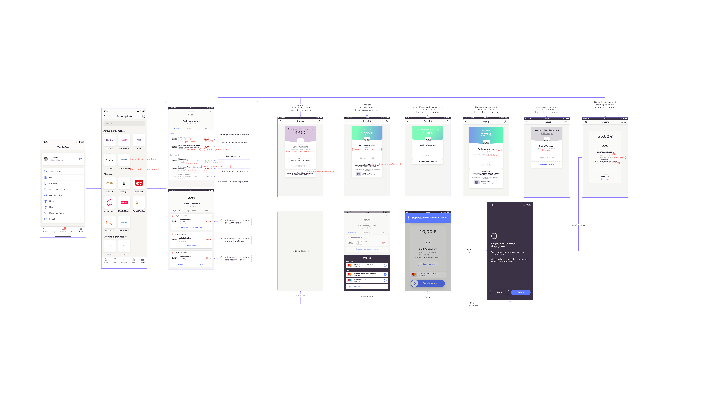
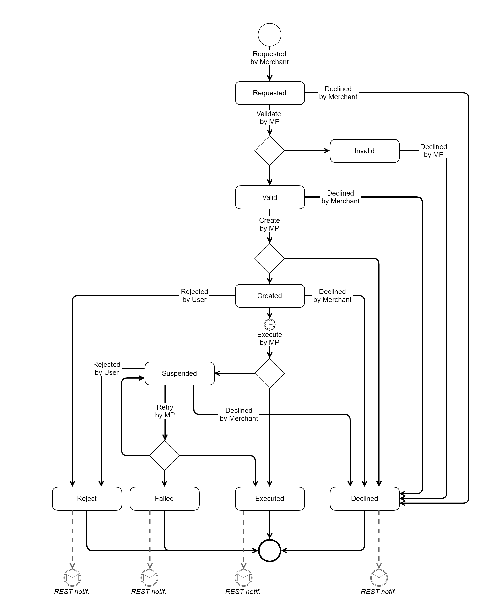

## <a name="subscription-payments"></a>Subscription Payments

When the **Agreement** between **Merchant** and MobilePay **User** is established, use the `POST /api/providers/{providerId}/paymentrequests` endpoint to en-queue **Subscription Payments**. This service accepts a JSON array of individual **Subscription Payments** to be processed asynchronously. You can batch payment requests into payloads of maximum 2000 payments. We allow merchants to bundle multiple payment requests into a single HTTP request.
Notice that the **Subscription Payments** payload does not contain a currency code - this will be fetched from the **Agreement** using the provided *agreement_id*.

#### <a name="requests"></a>Create Payment Request
```json
[
    {
        "agreement_id": "fda31b3c-794e-4148-ac00-77b957a7d47f",
        "amount": "10.99",
        "due_date": "2017-03-09",
        "next_payment_date": "2017-04-09",
        "external_id": "PMT000023",
        "description": "Monthly payment",
        "grace_period_days": 3
    }
]
```

#### <a name="subscription-payments_update-existing"></a>Update existing Payment Request

Once created, Recurring Payment Request can be updated (until it expires or is executed), Use the `PATCH /api/providers/{providerId}/agreements/{agreementId}/paymentrequests/{paymentId}` endpoint to decrease the requested amount to be paid. It is possible to decrease the amount. However, it is not possible to increase it. We only validate based on original amount set, we don't track the history. If you have sent a payment request with a too high amount by mistake, you then can delete that payment request, and send another payment request with the correct amount.  

```json
[
    {
        "value": "10.01",
        "path": "/amount",
        "op": "replace"
    }
]
```

* * *

### <a name="subscription-payments_function"></a>How do Subscription Payments work? 

- *Billing Cycle*: You can send your payments to us max *126 days* prior due date and min *1 day* prior due date. When creating new subscriptions payments, the Merchant is responsible for configuring the billing cycle so it matches their and customers needs. We support both fixed dates (for example, the 1st of the next month) and variable dates. 
- It is flexible to change when existing subscription payment is billed next time. The customer just needs to have at least 1 day to evaluate the payment. The customer can evaluate the payment by opening the MobilePay app. In the activity list the customer is presented with the Pending payment. 
- For example: if you send the payment 1st of June before midnight, the earliest DueDate can be 3rd of June. The customer can see the payment in the MobilePay app from 2nd of June. 
- *Amount* :  The Merchant decides the amount on each Payment Request. For example: electricity will vary to a certain extent, depending on how much electricity the customer is using, which is why an electric bill will fluctuate each month. You simply specify the amount each time you send a Payment Request. This is useful in cases where you want to charge your customers a granular amount based on their consumption of your service during the billing cycle, instead of explicitly setting a fixed amount. For example, Window Wash Company can use metered billing to offer a service where they wash their customer’s windows as needed, and charge at the end of the month for the total number of washes.
- We recommend that you send the payments before 00:00:00 so that you are sure that it will be included in our payment processing.
- The MobilePay user will be able to see Payments in the app from 8 days to 1 day before due date depending on when you sent the payment. 
- If a payment changes status e.g. declined by users, a callback on the specific payment will be made to `/payment_status_callback_url`
- On due date we process the payments starting from 02:00. If some payments weren't successfully completed, we will then try again approx. every 2 hours. When `grace_period_days` field is not set or is set to __1__, we will keep retrying to complete the payment up until 23:59 of the same day. When `grace_period_days` is set to more than __1__, we will be trying to complete the payment for specified number of days.
- User will get at notification approx. at 08:30 that we cannot process the payment and that they can complete it manually (by swiping). Notification will be sent every day on the same time for the whole grace period if `grace_period_days` is specified.
- On 23:59 we will decline the transaction and revert back with a callback  
- Subscriptions payments are collected automatically, so there is no need for the customer to swipe.
- Reserve and Capture is managed by MobilePay. 

Agreement disable_notification_management push notification. Merchant can set if their customer should be able to manage push notifications for an agreement or not. If the merchant choses so, then the push notification is not displayed when signing new agreement and when browsing agreement information. 

#### <a name="request-parameters"></a>Request parameters

|Parameter             |Type        |Required  |Description                                                      |Valid values|
|----------------------|------------|----------|-----------------------------------------------------------------|------------|
|**agreement_id**      |guid        | required |*The Subscription __Agreement__ identifier that maps a __Merchant__ to a MobilePay __User__.*||
|**amount**            |number(0.00)| required |*The requested amount to be paid.*|Min 0.00, Max (FI) 2000.00 or Max (DK) 60000.00, decimals separated with a dot.|
|**due_date**          |date        | required |*Payment due date. Must be at least 1 day in the future, otherwise the __Subscription Payment__ will be declined.*|ISO date format: yyyy-MM-dd|
|**next_payment_date** |date        |          |*Next __Subscription Payment's__ due date, to be shown to the user in the __Agreement__ details.*|ISO date format: yyyy-MM-dd|
|**external_id**       |string(64)*      | required |*The identifier of a specific payment in the external merchant's system. Maximum length is 64 characters The external_id is visible on the __Subscription Payment__ screen.*||
|**description**       |string(60)  | required |*Additional information of the __Subscription Payment__ that is visible for the customer in the MobilePay app*||
|**grace_period_days** |int  | optional |*Number of days to keep retrying the payment if it was not successful.*|1, 2, 3|

<div class="note">
    <strong>Note:</strong>
    <p>
        * Recommendation for "external_id" is to use up to 30 symbols. For instant transfers "external_id" is used as payment reference and will be truncated down to 30 symbols if it contains more. Truncated payment reference will be visible in bank statement.
    </p>
</div>

<a name="subscription-payments_response"></a>
The `POST /api/providers/{providerId}/paymentrequests` service returns HTTP 202 - Accepted response if at least one payment is provided in the request payload.

The response body containts two lists:
* **pending_payments** - a map of newly generated Subscription payment ID and the external ID, that where accepted for processing and now are in a _Pending_ state.
* **rejected_payments** - a list of rejected payments. This can only occur if any of the mandatory fields are missing or do not conform to the format rule. Business logic validations are done asynchronously in the back-end (for example, checking if due-date conforms to 1 day rule).

##### <a name="subscription-payments_response-example"></a>HTTP 202 Response body example

```json
{
    "pending_payments": [{
            "payment_id": "263cfe92-9f8e-4829-8b96-14a5e53c9041",
            "external_id": "PMT000023"
        }
    ],
    "rejected_payments": [{
            "external_id": "PMT000023",
            "error_description": "The Amount field is required."
        }
    ]
}
```

#### <a name="subscription-payments_frequency"></a>Frequency of Payment Requests

 The merchant can send a payment max 126 days prior due date, and at least 1 day before due date. Valid values are 1, 2, 4, 12, 26, 52, 365, 0. This means that the daily payment (365) is the most frequent. When you are requesting a payment, you need to keep the 1 day rule. The user can have a single pending payment on due date. E.g. User can have 3 pending payments but the DueDate of those payments should be different.

- **Due Date** Payments cannot be created with the same Due Date.
- **Multiple Recurring payments**  Multiple recurring payment requests can be created within period [126 before Due Date >= Payment Request Date >= 1 before Due Date].
- **Next Payment Date** If there are multiple pending payments, Next Payment Date is the one closest to Today().

##### <a name="subscription-payments_grace-example"></a>Example of Frequency

For example: if you have a customer where the frequency of an agreement is set to 4, that means  365 / 4 = 91.25 (approximately payment requests every 3rd month), if agreement frequency is set to 52, then 365 / 52 (payment requests every week) and in case frequency is set to 0 - payment can be requested in flexible recurrence.

#### Payment screens

[](assets/images/Agreement_payments_3_new.png)
  
#### <a name="subscription-payments_callbacks"></a>Callbacks

Once the payment status changes from *Pending* to *Executed, Declined, Rejected* or *Failed*, a callback will be done to the callback address, which is configurable via `PATCH /api/providers/{providerId}` with path value `/payment_status_callback_url`. The `/payment_status_callback_url` should be a HTTPS. If you try to configure it to HTTP, you will get a bad request with the following error message: "The hyperlink reference must use https scheme"

We are sending callbacks in two ways:

1. A batch that runs every 2 mins. It contains Subscription payments with status: Declined/Rejected/Failed/Executed/OneOff_Expired. So in theory, there is a possible delay of 2 mins.
2. Right after the user made an action. It contains OneOff_Reserved/OneOff_Rejected.

Every two minutes we take up to 1000 events (notifications about payment state), group them by merchant and make the calls. Therefore, as for merchant you should get up to 1 call every two minutes.

We will post the integrator or merchant a callback, and expect a HTTP 2xx response. If not we will retry 8 times.


```json
[
    {
        "value": "https://example.com",
        "path": "/payment_status_callback_url",
        "op": "replace"
    }
]
```

|New Status|Condition|When to expect|Callback *status*  | Callback *status_text* | Callback *status_code* |
|----------|---------|--------------|-------------------|------------------------|------------------------|
|Executed  |_The payment was successfully executed on the due-date_| After 03:15 in the morning of the due-date |Executed  | | 0 |
|Failed    |_Payment failed to execute during the due-date or at the end of grace period._| After 23:59 of the due-date, or the last day of grace period. |Failed    | | 50000 |
|Rejected  |_User rejected the Pending payment in MobilePay_       | Any time during the 8-1 days period when user is presented with the Pending payment in the MobilePay activity list. |Rejected  |Rejected by user.| 50001 | 
|Declined  |_Merchant declined the Pending payment via the API_       | Any time during the 8-1 days period when user is presented with the Pending payment in the MobilePay activity list. |Declined  |Declined by merchant.| 50002 | 
|Declined  |_**Agreement** is not in Active state._                | Right after the payment request was received. |Declined  |Declined by system: Agreement is not "Active" state.| 50003 | 
|Declined  |_Another payment is already scheduled on that day for the user_| Right after the payment request was received. |Declined  |Declined by system: Another payment is already due.| 50004 | 
|Declined  |When the **Agreement** was canceled by merchant or by system | Any time unless retention period is set and active.  |Declined  |Declined by system: Agreement was canceled. | 50005 | 
|Rejected  |When the **Agreement** was canceled by user | Any time unless retention period is set and active. |Rejected  |Declined by system: Agreement was canceled. | 50005 | 
|Declined  |A catch-all error code when payment was declined by core system.| Right after the payment request was received. |Declined  | Declined by system. | 50006 | 
|Declined  |Declined due to user status.| Right after the payment request was received. |Declined  | Declined due to user status. | 50009 | 
|Declined  |When the **Agreement** does not exist| Right after the payment request was received. |Declined  | Agreement does not exist. | 50010 |
|Declined  |When the due date before rule is violated | Right after the payment request was received. |Declined  | Due date of the payment must be at least 1 day in the future. | 50011 |
|Declined  |When the due date ahead rule is violated | Right after the payment request was received. |Declined  | Due date must be no more than 126 days in the future. | 50012 |

#### PaymentStates


#### Payment Validation

There are validation rules, that are applied asynchronously to each individual payment after you send an API request . Therefore, even though you get a response with pending payments, they may not be valid.  When you make a payment request, we will validate the request body itself, but we won't apply business rules to individual payments. So it only validates if you have the required parameters with the correct types. So the response you get for the payment request, does not say if the payment is pending, but if the payment creation is pending. Then the payments are processed in our system, and they will either be requested (valid) or declined (invalid).
You will receive a callback if certain business rules are not met and payment is declined. This will be sent to your payment status callback url. 

#### Failed Payments

The process on failed payments the DueDate is as follows:

•	06:00 First hiccup is run at 06:00 on the due date. Once done, a notification about completion is returned. Merchant is informed about successful payments and user about failed payment  

•	13:30 Second hiccup is run at 13:30 on the due date. Once done, a notification about completion is returned. Merchant is informed about successful payments and user about failed payment.

•	18:00 20:00 22:30 - hiccups keep running throughout the day. Once done, a notification about completion is returned. Merchant is informed about successful payments and user about failed payment, 

> Note: The flow will be processed for the number of days that can specified in `grace_period_days`, otherwise the flow will be processed once. Merchant will be notified about failed payment on the last day of grace period.
 

##### <a name="subscription-payments_state"></a>Payment state diagram



##### <a name="subscription-payments_callback-properties"></a>Other callback properties

|Name            |Type        |Description                                           |Format|
|----------------|------------|------------------------------------------------------|------|
|**agreement_id**|guid        |Subscription agreement ID on the MobilePay side.||
|**payment_id**  |guid        |Subscription payment ID on the MobilePay side.  ||
|**amount**  	 |number(0.00)|Amount withdrawn from the MobilePay user.             ||
|**currency**  	 |string      |Amount currency (agreement's currency)                ||
|**payment_date**|date        |Date of the batch when the payment was executed.      |ISO 8601 UTC date: YYYY-MM-DD|
|**external_id** |string      |Payment ID on the merchant's side. Maximum length is 64 characters                   ||
|**payment_type**|string      |Indicates whether it is Regular subscription payment or one-off payment.|_Regular_ or _OneOff_|


##### <a name="subscription-payments_callback-example"></a>Payment callback body example
```json
[
    {
        "agreement_id" : "1b08e244-4aea-4988-99d6-1bd22c6a5b2c",
        "payment_id" : "c710b883-6ed6-4506-9599-490ead89525a",
        "amount" : "10.20",
        "currency" : "DKK",
        "payment_date" : "2016-09-29",
        "status" : "Rejected",
        "status_text" : "Rejected by user.",
        "status_code" : "50001",
        "external_id" : "SFPMT134560",
        "payment_type" : "Regular"
    }
]
```
#### <a name="subscriptionpayments_usernotifications"></a> User notifications

As a MobilePay app user, the user can be informed about payment issues, depending on how the user has configured their Push Notification settings.  Push Notifications window: 08:30 - 22:00 DK time. We send push notifications to customers smartphone. When a payment requires additional steps, such as customer authentication or exchange of card, the customer will be notified via push notifications. Upon receiving the push notification, the customer is prompted to complete the required action.


|Description|When|Text| Buttons | Depends on these Notification settings  |Type|
|----------|---------|---|-------------------|------------------------|----------------------|
|**Expired card:** Card is expired or about to expire before the due date.   |_8 -1 days before the due date, 08:30_        |For at betale til [Merchant] skal du opdatere dine kortinformationer.  |**Text**: Opdater **Navigation**: Agreement Payments  |  OS, App|Subscription Payments|
|**General Reminder**   |_One day before the due date at 08:30_              |I morgen betales [Amount] [Currency] til [Merchant]  | **Text**: Vis **Navigation**: Payment Overview|OS, App|Subscription Payments|
| Daily limit exceeded, increase to NemID  | When customer has exceeded daily limit       |Din daglige beløbsgrænse er nået - klik her for at forhøje den  | **Text**: Fortsæt **Navigation**: Agreement Payments|OS, App|Subscription Payments|
|Attached payment card is expired, the customer should change the card  |When the card is expired  | Vi kan ikke gennemføre din betaling - dit betalingskort er udløbet  | **Text**: Skift dit betalingskort **Navigation**: Agreement Payments|OS, App|Subscription Payments|
|Payment in other hiccup state - user can approve manually.   | When payment is in hiccup state. Other issues with Payment card, blocked, insufficient funds  | Vi kan ikke gennemføre din betaling - klik her for at hjælpe os  |**Text**: Vis **Navigation**: Agreement payments|OS, App| Subscription Payments
|Payment failed  | When payment is in hiccup state  | Vi kunne ikke gennemføre din betaling til [Merchant]  |**Text**: Vis **Navigation**: Agreement payments|OS, App| Subscription Payments


`Suspended` 

It means that the you can not withdraw the money from the customers payment card, and then the payment gets suspended. There can be various reasons why it can he suspended. If the problem persists, and there is not sufficient funds on the customers card, or/and if the card is expired or/and blocked, then the payment will fail. Suspended is a status internally for MobilePay to mark hiccupped payments, which is why it is not a part of the callback table above. 

Solution : MobilePay sends the customer a push notification, if there was an error with the card, in order to catch errors. If there were insufficient funds on the customers card, we also push the customer to execute the payment manually. The Merchant should contact the customer, and have it cleared out with the customer. 

We also send sms message each day at 10:00 in Denmark and 11:00 in Finland for customers who have suspended payments (one sms for each payment). This is the messages we send out:


***
