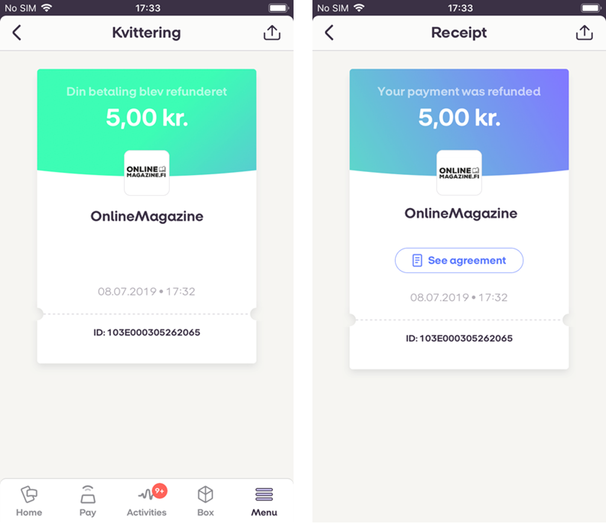

## <a name="refunds"></a>Refunds

**Full refund** - 100% of the amount paid is returned to the payer.If the amount is not specified, the payment will be fully refunded
<br />
**Partial refund** - An amount up to the net (the amount the merchant received) will be returned to the payer. Multiple partial refunds can be made.If the amount is specified, it has to be less than or equal to the amount payed. No refund otherwise. A payment can be refunded partially several times, until the amount is 0 (zero).

<div class="note">
Note: MP Subscriptions recurring or one-off payment refund CANNOT be made without original payment. Payment ID must be the same for both actions.
</div>

<div class="note">
Note: Refunds CANNOT be made for **Instant** transfer payments. Only **Daily** transfer payment can be refunded.
</div>

#### <a name="requests"></a>Request a Refund
Use the `POST /api/providers/{providerId}/agreements/{agreementId}/payments/{paymentId}/refunds` endpoint to request a **Refund**.

```json
{
    "amount": 10.99,
    "status_callback_url" : "https://example.com",
    "external_id": "ABC123"
}
```

#### <a name="refunds_request-parameters"></a>Request parameters

|Parameter             |Type        |Required  |Description                                                      |Valid values|
|----------------------|------------|----------|-----------------------------------------------------------------|------------|
|**amount**            |number(0.01)| optional |*The requested amount to be returned.*|>= 0.01, decimals separated with a dot. If not specified, payment will be fully refunded.|
|**status_callback_url**  |string| required |*Link relation hyperlink reference.*|https://&lt;merchant's url&gt;|
|**external_id**  |string| optional |*Refund's identifier on the merchant’s side. This will be included in the request body of the refund callback.*||

<a name="refunds_response"></a>
The `POST /api/providers/{providerId}/agreements/{agreementId}/payments/{paymentId}/refunds` service returns HTTP 202 and the response contains single value: a unique *id* of the newly created **Refund**.

##### <a name="refunds_response-example"></a>HTTP 202 Response body example
```json
{
    "id": "263cfe92-9f8e-4829-8b96-14a5e53c9041",
    "amount": 10.99,
    "status_callback_url": "http://example.com",
    "external_id": "ABC123"
}
```

#### <a name="refunds_callback"></a>Callbacks

When the **Refund's** status changes from *Requested* we will do a callback to the callback address provided in request parameter `status_callback_url`.

##### <a name="refunds_callback-example"></a>Refund callback body example
```json
{
    "refund_id" : "4bb9b33a-f34a-42e7-9143-d6eabd9aae1d",
    "agreement_id" : "1b08e244-4aea-4988-99d6-1bd22c6a5b2c",
    "payment_id" : "c710b883-6ed6-4506-9599-490ead89525a",
    "amount" : "10.99",
    "currency" : "DKK",
    "status" : "Issued",
    "status_text" : null,
    "status_code" : 0,
    "external_id": "ABC123"
}
```

<a name="refunds_status"></a>

|New Status|Condition|When to expect|Callback *status*  | Callback *status_text* | Callback *status_code* |
|----------|---------|--------------|-------------------|------------------------|------------------------|
|Issued    |_The **Refund** was successfully issued_| Right after the refund request was received |Issued  | |  |
|Declined  |_If **Payment** is fully refunded_           | Right after the refund was requested |Declined    |Payment is fully refunded. | 60001 |
|Declined  |_If the total sum of previous **Refunds** exceed the original payment amount_           | Right after the refund was requested |Declined  |The total sum of previous **Refunds** cannot exceed the original payment amount.| 60002 |
|Declined  |_When **Refund** was declined by system_          | Right after the refund was requested |Declined  |Payment was not found.| 60003 |
|Declined  |_When **Refund** was declined by system_           | Right after the refund was requested |Declined  |Payment cannot be refunded.| 60004 |
|Declined  |_A catch-all error code when **Refund** was declined by core system._           | Right after the refund was requested |Declined  |Refund was declined by system.| 60005 |
|Declined  |_When **Refund** was declined by system._           | Right after the refund was requested |Declined  |Cannot refund payments that are older than 30 days.| 60006 |
|Declined  |_When **Refund** was declined by system._           | Right after the refund was requested |Declined  |Cannot refund instantly transferred payments.| 60007 |

##### <a name="refunds_screens"></a> Refund screens within mobile application


