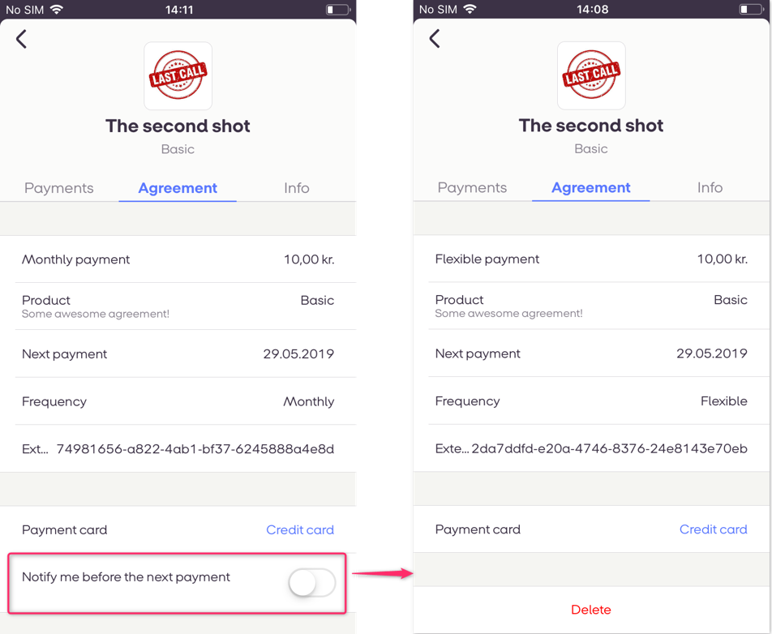
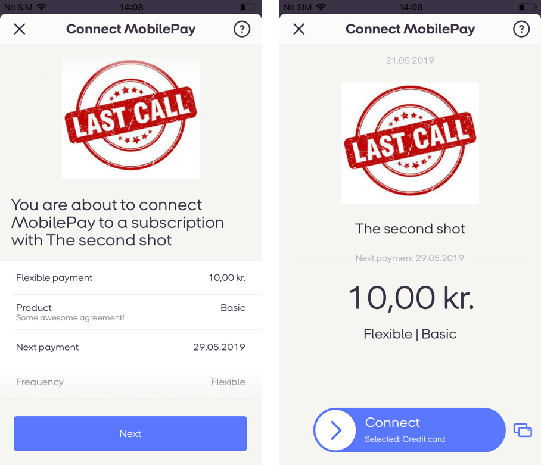
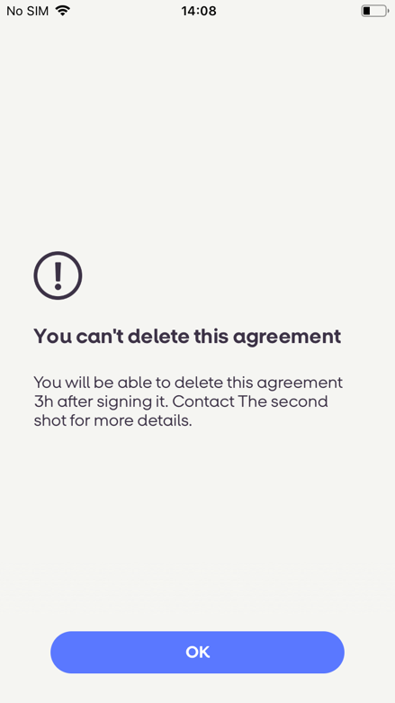

# Subscriptions API Release Notes
<div class='post-date'>04 November 2020 - Invoice fields</div> 
Merchants can add [invoice](invoice) for susbscription payments without user's information.
Properties that are now optional: consumer_name, consumer_phone_number, consumer_address_lines.
If the fields are not filled, they are not displayed in PDF.
Can be negative: total_vat_amount, total_price_including_vat, price_per_unit, price_discount.
Up to 10 digits after the decimal seperator allowed for: quantity, price_per_unit.

<div class='post-date'>18 September 2020 - amount</div> 
For DK merchants [payment](payments#request-parameters) amount limit is 60000. If the customer is identified via NemID or picture ID (drivers license, passport and etc) then the monthly payment limit for Subscriptions is 60.000 kr. 
For example: If all payment requests share the same DueDate, and thereby exceed the normal payment limit of 15.000 kr.,   the customer can still pay all their Subscription payments, as long as the total amount does not exceed 60.000 kr. on a monthly basis. 
If the customer is only identified via CPR-number, then Subscription payments count as a part of the daily payments to stores, and the daily payment limit is therefore 3.000 kr. 


<div class='post-date'>14 September 2020 - amount</div> 
For FI merchants [payment](payments#request-parameters) amount limit is 2000.

<div class='post-date'>26 August 2020 - frequency</div> 
Default `frequency` for agreement was changed from 12 to 0.

<div class='post-date'>20 August 2020 - payment-due-date</div> 
Maximum `payment-due-date` was increased from 32 days to 126 days for [subscription](payments#subscription-payments_frequency) payment requests.

<div class='post-date'>12 August 2020 - expiration_timeout_minutes</div> 
Maximum `expiration_timeout_minutes` was increased from 2 weeks (20160 minutes) to 18 weeks (181440 minutes) for both [agreements](agreement#agreements_paramters) and [one-off](oneoffs#request-parameters) payment requests as well as [one-off with agreement](oneoffs#agreement-request-parameters) payment requests.

<div class='post-date'>28 July 2020 - external_id</div> 
Due to restrictions in external systems we added recommendation to keep `external_id` up to 30 symbols for [subscription](payments#request-parameters) and [one-off](oneoffs#request-parameters) payment requests.

<div class='post-date'>09 July 2020 - payment_transaction_id</div> 
We received feature request to include payment_transaction_id for all payments: recurring; one-off; refund. By including the payment_transaction_id, It is easier to conduct reconciliation through the Transaction Reporting API. The payment_transaction_id  is visible on the receipt screen. Note, in the technical documentation it is called payment_transaction_id in all API responses with additional property.

Note: this is not a breaking change.

<div class='post-date'>10 June 2020 - `cancel-redirect` </div>
The feature to attach `cancel-redirect` url to an agreement has been released. If this url is set, users, who want to cancel their agreement, will be redirected to your defined link only if they use MobilePay app version **4.22 or higher**.

<div class='post-date'>25 May 2020</div>

- Addded support for agreement cancelation redirect Url. For new agreements, use endpoint `POST /api/providers/{providerId}/agreements` with `cancel-redirect` link. A new link allows agreement to be cancelled in merchant own environmnet. Merchant should ensure easy access to information and support. By making it possible for customers to cancel the agreement in merchant own environment, you can get more control of your possible leaving customers. If `cancel-redirect` is used, then MobilePay redirects customer to merchant environment, and thus making Canceling funcionality not available for the user in the app.  MobilePay validates the link, as it should be https:// and not http://. The `cancel-redirect` is not mandatory, and merchant can only use `cancel-redirect` if they have a self-service environment.


- Currently feature is available to test in Sandbox and in Production.

#### <a name="requests"></a>Sample create agreement request
```json
{
  "external_id": "AGGR00068",
  "amount": "10",
  "currency": "DKK",
  "description": "Monthly subscription",
  "next_payment_date": "2017-03-09",
  "frequency": 12,
  "links": [
    {
      "rel": "user-redirect",
      "href": "https://example.com/1b08e244-4aea-4988-99d6-1bd22c6a5b2c"
    },
    {
      "rel": "success-callback",
      "href": "https://example.com/1b08e244-4aea-4988-99d6-1bd22c6a5b2c"
    },
    {
      "rel": "cancel-callback",
      "href": "https://example.com/1b08e244-4aea-4988-99d6-1bd22c6a5b2c"
    },
        {
      "rel": "cancel-redirect",
      "href": "https://example.com/1b08e244-4aea-4988-99d6-1bd22c6a5b2c"
    }
  ],
  "country_code": "DK",
  "plan": "Basic",
  "expiration_timeout_minutes": 5,
  "mobile_phone_number": "4511100118",
  "retention_period_hours": 0,
  "disable_notification_management": false,
}
```

In order to updated existing agreements use `PATCH /api/providers/{providerId}/{agreementId}` endpoint with payload:
 `
```json
[
    {
        "value": "https://example.com/1b08e244-4aea-4988-99d6-1bd22c6a5b2c",
        "path": "/cancel-redirect",
        "op": "replace"
    }
]
```

<div class='post-date'>09 Apr 2020</div>

- Added ability to set `expiration_timeout_minutes` parameter for one-off payments. It can be done when requesting one-off payment or when requesting agreement with one-off payment. It is optional to `expiration_timeout_minutes`. Min: 1, max: 20160 (2 weeks), default: 1440 (24 hours)


<div class='post-date'>27 Feb 2020</div>

- Increased length of `external_id` for Subscriptions Payments. Maximum length is 64 characters  


<div class='post-date'>24 Feb 2020</div>

- Updated `GET /api/providers/{providerId}/agreements` endpoint documentation. Removing obsolete **paginationState** argument and replacing with **pageNumber**.  We recommend you always explicitly set the **pageSize** to ensure you know how many results per page you'll get.

<div class='post-date'>2 Jul 2019</div>

- New parameter added into payment request - `grace_period_days` which lets merchants to configure how many days we will try to complete unsuccessful payment. More information can be found [here](payments#requests).


<div class='post-date'>30 May 2019</div>

- New Refund callback Status Code introduced - **60007**. This allows to better inform merchants abount Refund limitations for instant transfer payments. An updated Status Code table can be found [here](refund#callbacks).


<div class='post-date'>14 May 2019</div>
 
 # New Agreement parameters introduced for Merchants:

- Agreement `disable_notification_management` push notification. Merchant can set if their customer should be able to manage push notifications for an agreement or not. If the merchant choses so, then the push notification is not displayed when signing new agreement and when browsing agreement information. This parameter is not required, and the default value is 'false' [See more](https://github.com/MobilePayDev/MobilePay-Subscriptions/blob/master/docs/agreement.md#request-parameters)
  
  
- Agreement frequency. We are now able to handle more agreement frequency parameters. Merchant can set new frequency: *daily*, *weekly*, or *flexible*. Flexible is also known as on demand  [See more](https://github.com/MobilePayDev/MobilePay-Subscriptions/blob/master/docs/agreement.md#request-parameters).
  
  
- Agreement `retention_period_hours` Merchant can set for how long agreement can't be Cancelled by the user, after the user accepted the agreement, for up to 24 hours. This is an advantage in relation to street sales and when/if merchants offer cheaper prices, if the customer establishes a subscription agreement with the merchant. Before retention period has passed, then the cusomer will not be able to cancel an agreement	
   

- Subscription payment 8 days rule validation on payment creation is changed to 1 day. The merchant can send a payment max 32 days prior due date, and at least 1 day before due date. Valid values are 1, 2, 4, 12, 26, 52, 365, 0. This means that the daily payment (365) is the most frequent. When you are requesting a payment, you need to keep the 1 day rule. [See more](https://github.com/MobilePayDev/MobilePay-Subscriptions/blob/master/docs/payments.md#frequency-of-payment-requests).

- Merchants also has the possibility to notify end users about “future payments” from 8 days to 1 day before due date.  On due date all end users receive a receipt for the payment

- One-off payment without confirmation. Merchant can send one-off payment, which MobilePay will attempt to automatically reserve, without user's confirmation. One-off without swipe omits the MobilePay landing page and is instantly executed. Existing functionality of one-off with confirmation will still be available. It is valid for One-offs without new agreements. Updated request can be found [here](https://github.com/MobilePayDev/MobilePay-Subscriptions/blob/master/docs/oneoffs.md#request-one-off-payment-on-an-existing-agreement).


New functionality will be available for all users from APP version 4.12.0.

We have deprecated Subscriptions (Mutual SSL) 2.0.11.We are not going to release new functionality to those, who are using Mutual SSL. The features are available for those, who have integrated using OpenID Connect


<div class='post-date'>16 January 2019</div>

[Add invoice details to subscription payment.](invoice)
Invoices are now available for subscription payments.
Merchants can send details, which we will use to generate a PDF and show it to customers in the app. This makes easy for merchants to have invoices available to customers. For technical questions about integrating via OpenID Connect, refer to the Integration docs on the Developer Portal [Here](https://developer.mobilepay.dk/faq/oidc). The deadline for migrating to OpenID Connect is 01-01-2020

 


<div class='post-date'>23 August 2018</div>

We are excited to announce **Subscriptions Integrator 1.1** that is already available in [Sandbox](https://sandbox-developer.mobilepay.dk/).

ETA in production is **December 2018**.
