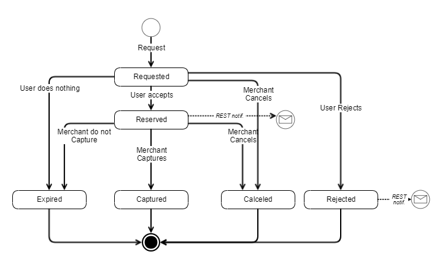

## <a name="whatsnew"></a>What's New In MobilePay Subscriptions 1.1

We introduce a new feature called "Pay Now". You will be able to create a new agreement and request a one-off payment from the user at the same time or request an one-off payment on already existing active agreement.

***
### How To Use API Version 1.1

When making all calls to our MobilePay Subscriptions REST api, add the query parameter `api-version=1.1`.

E.g. `POST /api/merchants/me/agreements?api-version=1.1`

***
### Request One-Off Payment With a New Agreement

If you want to charge your customer at the same time as he accepts the agreement, you should add an additional property called `one_off_payment` to the json of request body when calling `POST /api/merchants/me/agreements?api-version=1.1` endpoint:

```json
{
  "external_id": "AGGR00068",
  "amount": "10",
  "currency": "DKK",
  "description": "Monthly subscription",
  "next_payment_date": "2017-03-09",
  "frequency": 12,
  "links": [
    {
      "rel": "user-redirect",
      "href": "https://example.com/1b08e244-4aea-4988-99d6-1bd22c6a5b2c"
    },
    {
      "rel": "success-callback",
      "href": "https://example.com/1b08e244-4aea-4988-99d6-1bd22c6a5b2c"
    },
    {
      "rel": "cancel-callback",
      "href": "https://example.com/1b08e244-4aea-4988-99d6-1bd22c6a5b2c"
    }
  ],
  "country_code": "DK",
  "plan": "Basic",
  "expiration_timeout_minutes": 5,
  "mobile_phone_number": "4511100118",
  "one_off_payment": [
    {
      "amount": "80",
      "external_id": "OOP00348",
      "description": "Down payment for our services"
    }
  ]
}
```

*Newly added request parameters*

|Parameter                        |Type        |Required  |Description                                                      |Valid values|
|:--------------------------------|:-----------|:---------|:----------------------------------------------------------------|:-----------|
|**one_off_payment**              |object      |          |*__One-Off Payment__ details.*||
|**one_off_payment.amount**       |number(0.00)|required  |*__One-Off Payment__ amount, which will be displayed for the user in the MobilePay app.*|>= 0.00, decimals separated with a dot.|
|**one_off_payment.description**  |string(60)  |          |*Additional information provided by the merchant to the user, that will be displayed on the __One-off Payment__ screen. If description is not provided, the description will be set to agreement plan.*||
|**one_off_payment.external_id**  |string      |          |*__One-Off Payment__ identifier on the merchant's side. This will be included in the request body of the success / cancel callback.*||

In this case the response of `POST /api/merchants/me/agreements?api-version=1.1` will contain additional value: a unique *id* of the newly requested **One-Off Payment** and the old data.

```json
{
  "id": "1b08e244-4aea-4988-99d6-1bd22c6a5b2c",
  "one_off_payment_id": "2a5dd31f-32c1-4517-925f-9c60ba19f8ca",
  "links": [
    {
      "rel": "mobile-pay",
      "href": "https://<mobile-pay-landing-page>/?flow=agreement&id=1b08e244-4aea-4988-99d6-1bd22c6a5b2c&redirectUrl=https%3a%2f%2fwww.example.com%2fredirect&countryCode=DK&mobile=4511100118"
    }
  ]
}
```
***
### Request One-off Payment on an Existing Agreement

If you and the user already have an active MobilePay Subscriptions agreement and you need to charge the user one time for some extra services, now there is a way to do that. When user clicks the "*Pay with MobilePay*" button, merchant's backend system must call the `POST /ap/merchants/me/agreements/{agreementId}/oneoffpayments?api-version=1.1` to request a one-off payment which can only be activated by the MobilePay user through the app.

```json
{
  "amount": "80",
  "external_id": "OOP00348",
  "description": "Pay now for additional goods",
  "mobile_phone_number": "4511100118",
  "links": [
    {
      "rel": "user-redirect",
      "href": "https://example.com/1b08e244-4aea-4988-99d6-1bd22c6a5b2c"
    }
  ]
}
```
If requested __One-off Payment__ won't be accepted or rejected by the user, it will expire in 1 day (you will be notified about that).

*Request parameters*

|Parameter                     |Type      |Required  |Description                                                      |Valid values|
|:-----------------------------|:---------|:---------|:----------------------------------------------------------------|:-----------|
|**amount**       |number(0.00)|required  |*__One-off Payment__ amount, which will be displayed for the user in the MobilePay app.*|>= 0.00, decimals separated with a dot.|
|**description**  |string(60)  |required  |*Additional information provided by the merchant to the user, that will be displayed on the __One-off Payment__ screen.*||
|**external_id**  |string      |          |*__One-off Payment__ identifier on the merchant's side. This will be included in the request body of the success / cancel callback.*||
|**links**        |string      |required  |*Link relation of the __One-off Payment__ creation sequence. Must contain 1 value for user redirect.*||
|**links[].rel**  |string      |required  |*Link relation type.*|user-redirect|
|**links[].href** |string      |required  |*Link relation hyperlink reference.*|https://&lt;merchant's url&gt;|

The response of `POST /ap/merchants/me/agreements/{agreementId}/oneoffpayments?api-version=1.1` contains two values: a unique *id* of the newly requested **One-Off Payment** and a link *rel* = *mobile-pay*.

```json
{
  "id": "07b70fdd-a300-460d-9ba1-aee2c8bb4b63",
  "links": [
    {
      "rel": "mobile-pay",
      "href": "https://<mobile-pay-landing-page>/?flow=agreement&id=1b08e244-4aea-4988-99d6-1bd22c6a5b2c&oneOffPaymentId=07b70fdd-a300-460d-9ba1-aee2c8bb4b63&redirectUrl=https%3a%2f%2fwww.example.com%2fredirect&countryCode=DK&mobile=4511100118"
    }
  ]
}
```
 
* The *id* value can be used on the merchant's back-end system to map an one-off payment with a specific Subscription agreement on the merchant's side, and subsequently to capture a requested **One-Off Payment** when MobilePay user accepts it. 
* The link *rel = mobile-pay*. It can be used the same way as in the new agreement creation flow.

#### Callbacks

Once the one-off payment status changes from *Requested* to *Reserved*, *Rejected* or *Expired*, a callback will be done to the callback address, which is configurable via `PATCH /api/merchants/me` with path value `/payment_status_callback_url`. The same way as with [callbacks](../#subscription-payments_callbacks) for regular payment requests.

|New Status|Condition|When to expect|Callback *status*  | Callback *status_text* | Callback *status_code* |
|----------|---------|--------------|-------------------|------------------------|------------------------|
|Reserved  |_The one-off payment was accepted by user and money is reserved for you on his card. You can now capture the money._| After user accepts the requested one-off payment. |Reserved| Payment successfully reserved. | 0 |
|Rejected  |_User rejected one-off payment request in MobilePay._ | Right after user rejects one-off payment. |Rejected  |Rejected by user.| 50001 |
|Expired   |_One-off payment was neither accepted, nor rejected by user._| 1 day after you requested one-off payment |Expired|Expired by system.| 50008 |

#### One-off payment state diagram



***
### Capture Reserved One-Off Payment

When you receive a callback about successfully reserved payment, now it's time to capture your money. You can do that by making a call to `POST /api/merchants/me/agreements/{agreementId}/oneoffpayments/{paymentId}/capture?api-version=1.1` endpoint. If the HTTP response is `204 - No Content`, it means that the money was transfered to your account.

***
### Cancel One-Off Payment Request/Reservation

In case you weren't able to deliver goods or any other problems occur, you can always cancel one-off payment until it's not captured or expired. You can do that by making a call to `DELETE /api/merchants/me/agreements/{agreementId}/oneoffpayments/{paymentId}?api-version=1.1` endpoint. If the HTTP response is '204 - No Content', it means that one-off payment request/reservation was canceled.

It is **mandatory** for the merchant to Capture/Cancel one-off payment if it was reserved on a customer account.
